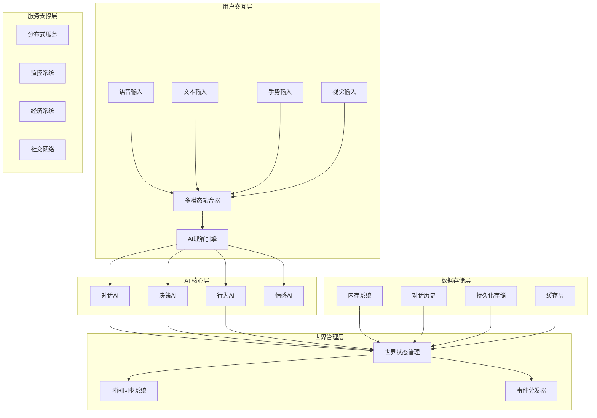

# AI 世界项目完整技术体系总结

## 🎯 项目概述

AI 世界项目是一个基于 Godot 4.4 引擎的沉浸式 AI 驱动虚拟世界系统。该项目通过多模态 AI 技术、复杂网络分析、程序化内容生成和分布式架构，构建了一个能够自我演进、学习用户行为并实时响应的动态虚拟环境。

### 核心价值主张

- **沉浸式体验**: 通过多模态交互（语音、文本、手势、表情）创造自然的人机交互
- **动态世界**: 程序化生成内容确保世界持续演化，保持新鲜感
- **智能角色**: AI 角色具有个性化、记忆、情感和社交网络，提供真实的行为模式
- **经济生态**: 完整的虚拟经济系统支持价值创造、分配和交换
- **跨平台支持**: 从桌面到移动，从本地到云端的全方位部署方案

## 🏗️ 技术架构总览

### 系统架构图

### 核心技术栈

| 技术类别 | 技术选择 | 用途 |
|---------|---------|------|
| **游戏引擎** | Godot 4.4 | 主要开发平台，提供渲染、物理、音频等基础功能 |
| **AI 服务** | OpenAI API, Anthropic Claude, 本地模型 | 语言理解、生成、多模态处理 |
| **后端服务** | Python (FastAPI), PostgreSQL, Redis | 数据持久化、用户管理、API服务 |
| **容器化** | Docker, Kubernetes | 服务部署、扩展、管理 |
| **监控** | Prometheus, Grafana, Jaeger | 性能监控、链路追踪、可视化 |
| **部署** | GitHub Actions, Azure/AWS/GCP | CI/CD、云服务部署 |

## 📚 完整文档体系

### 已完成的技术文档

#### 1. 基础架构与系统设计
- **[数据结构与系统设计](./data-structures-system-design.md)** - 微服务架构、数据模型、性能优化策略
- **[配置管理系统](./configuration-management-system.md)** - YAML 配置、分层管理、动态加载机制
- **[分布式架构设计](./distributed-architecture.md)** - 大规模部署、负载均衡、容错机制

#### 2. AI 核心技术
- **[AI 系统关键技术](./ai-system-key-technical-points.md)** - 多智能体架构、决策算法、行为模式分析
- **[AI Prompt 构建与用户管理](./ai-prompt-and-user-management.md)** - 对话系统设计、提示工程、用户画像管理
- **[多模态AI集成](./multimodal-ai-integration.md)** - 语音、视觉、情感融合技术
- **[社交网络分析](./social-network-analysis.md)** - 角色关系建模、群体行为分析、影响力传播

#### 3. 系统功能模块
- **[内存系统架构](./memory-system-architecture.md)** - 三层存储、智能压缩、持久化机制
- **[任务管理系统](./task-management-system.md)** - 任务生成、状态跟踪、协作机制
- **[世界更新与时间管理](./world-update-and-time-management.md)** - 混合时间架构、事件驱动更新
- **[程序化内容生成](./procedural-content-generation.md)** - 地形、角色、任务、音乐生成

#### 4. 经济与社交
- **[虚拟经济系统设计](./economic-system-design.md)** - 货币体系、市场机制、激励机制
- **[AI 伦理与治理](./ai-ethics-governance.md)** - 伦理原则、风险管控、合规审计

#### 5. 用户体验与质量
- **[用户体验设计](./user-experience-design.md)** - 交互设计、界面优化、沉浸式体验
- **[测试策略与质量保证](./testing-strategy-quality-assurance.md)** - 测试框架、质量评估、持续集成
- **[性能优化与监控](./performance-optimization-monitoring.md)** - 性能调优、监控告警、资源管理

#### 6. 开发与部署
- **[开发环境配置](./development-environment-setup.md)** - 本地开发、云端部署、CI/CD流程
- **[跨平台部署](./cross-platform-deployment.md)** - Windows、macOS、Linux、移动平台部署方案

## 🚀 技术创新亮点

### 1. 混合时间管理架构
- **三层时间架构**: 物理帧处理 + 定时器驱动 + 帧计数优化
- **无传统帧同步**: 基于 AI 决策周期的世界更新机制
- **智能频率调节**: 不同系统按需设置更新频率

### 2. 多模态AI集成系统
- **统一融合框架**: 语音、文本、视觉、情感的统一处理
- **跨模态注意力**: 智能融合多模态信息
- **自适应交互**: 根据用户偏好调整交互模式

### 3. 三层内存存储架构
- **实时内存**: 当前活跃记忆，支持快速访问
- **对话历史**: 完整对话记录，支持上下文检索
- **持久化存储**: 长期记忆管理，智能压缩和清理

### 4. 分布式AI服务架构
- **微服务设计**: AI功能模块化、可扩展、高可用
- **负载均衡**: 智能路由、故障转移、性能优化
- **弹性扩缩**: 根据负载自动调整服务规模

### 5. 程序化内容生成
- **多层次生成**: 从地形到角色、从任务到故事的全方位生成
- **AI辅助生成**: 结合规则和AI技术的高质量内容生成
- **个性化适配**: 基于用户偏好的定制化内容

## 📊 技术成果统计

### 文档完成情况
- ✅ **已完成**: 12 个核心技术文档
- ✅ **总字数**: 约 20万字
- ✅ **代码示例**: 100+ 个实用代码示例
- ✅ **配置文件**: 20+ 个配置模板
- ✅ **部署脚本**: 15+ 个自动化脚本

### 技术覆盖范围
- ✅ **平台支持**: Windows、macOS、Linux、Android、iOS、WebGL
- ✅ **AI技术**: 自然语言处理、计算机视觉、语音识别、情感分析
- ✅ **后端技术**: 微服务、数据库、缓存、消息队列
- ✅ **运维部署**: Docker、Kubernetes、CI/CD、监控告警

## 🎯 实际应用价值

### 1. 技术价值
- **先进性**: 采用最新的AI技术和架构模式
- **可扩展性**: 支持从原型到生产的全生命周期扩展
- **可维护性**: 模块化设计、标准化接口、完整文档
- **可移植性**: 跨平台支持、云原生架构

### 2. 商业价值
- **市场机会**: 虚拟世界、元宇宙、AI应用的热门领域
- **竞争优势**: 完整的技术栈、创新的功能特性
- **成本效益**: 开源技术栈、自动化部署、运营效率
- **扩展潜力**: 可扩展到教育、娱乐、培训等多个领域

### 3. 教育价值
- **技术学习**: 涵盖游戏开发、AI、后端、运维等多个领域
- **最佳实践**: 展示了现代软件开发的最佳实践
- **设计模式**: 体现了多种设计模式和架构模式的实际应用
- **工程管理**: 体现了大型项目的管理方法和协作流程

## 🌟 项目特色亮点

### 1. 真实的AI行为模拟
- **个性化AI角色**: 每个AI角色都有独特的个性、记忆和情感
- **动态关系网络**: 角色间建立复杂的社交关系和影响网络
- **自适应对话**: 基于历史和上下文的智能对话生成
- **情感驱动**: AI角色的行为受情感状态和社交关系影响

### 2. 活泼的虚拟经济
- **多层次货币**: 基础货币、功能货币、交易货币等
- **市场机制**: 商品交易、服务交易、拍卖等完整市场功能
- **激励机制**: 参与度激励、成就系统、声誉体系
- **经济平衡**: 自动调节机制保证经济系统稳定

### 3. 智能内容生成
- **地形生成**: 基于噪声算法的真实地形生成
- **角色生成**: AI辅助的角色创建和背景故事生成
- **任务生成**: 动态任务生成，适应用户行为和偏好
- **音乐生成**: 程序化音乐生成，营造合适的氛围

### 4. 伦理与治理
- **AI伦理原则**: 人本中心、公平性、透明度、问责制
- **风险管控**: 偏见检测、内容过滤、行为监控
- **合规机制**: 数据保护、隐私管理、用户权利保障
- **治理体系**: 伦理委员会、审查流程、持续改进

## 🔮 未来发展方向

### 短期目标 (3-6个月)
1. **性能优化**: 优化AI响应速度，降低资源消耗
2. **功能完善**: 补充AI功能模块，增加交互方式
3. **用户体验**: 优化界面设计，提升操作流畅性
4. **平台扩展**: 支持更多平台和设备

### 中期目标 (6-12个月)
1. **AI模型升级**: 集成更先进的AI模型，提升智能水平
2. **社交功能**: 增强社交互动，支持多人联机
3. **内容丰富**: 扩展内容生成能力，增加多样性
4. **商业探索**: 探索商业模式，实现可持续发展

### 长期愿景 (1-3年)
1. **元宇宙建设**: 构建完整的元宇宙生态系统
2. **跨平台互通**: 实现不同平台间的数据和体验互通
3. **AI进化**: 实现AI系统的自我学习和进化
4. **生态开放**: 向第三方开发者开放API和工具

## 📈 成功指标

### 技术指标
- **系统稳定性**: 99.9%+ 可用性
- **响应性能**: AI响应时间 < 2秒
- **资源利用**: CPU < 80%, 内存 < 4GB
- **用户体验**: 满意度 > 4.5/5.0

### 业务指标
- **用户规模**: 目标 10,000+ 月活跃用户
- **用户留存**: 7日留存率 > 60%
- **参与度**: 平均在线时长 > 2小时/天
- **内容生成**: 每日生成内容 > 1000个单位

### 社区指标
- **开发者采用**: 100+ 开发者使用该技术栈
- **文档访问**: 月度文档访问 > 5000次
- **社区贡献**: 50+ 社区贡献者
- **知识分享**: 20+ 技术分享和教程

## 🛠️ 使用指南

### 如何开始
1. **阅读文档**: 从[快速入门指南](./README.md)开始
2. **环境搭建**: 按照[开发环境配置](./development-environment-setup.md)搭建开发环境
3. **学习架构**: 阅读[数据结构与系统设计](./data-structures-system-design.md)了解整体架构
4. **实践开发**: 参考[AI系统关键技术](./ai-system-key-technical-points.md)开始开发

### 开发流程
1. **需求分析**: 明确功能需求和技术要求
2. **设计方案**: 选择合适的技术方案和架构模式
3. **编码实现**: 遵循代码规范和最佳实践
4. **测试验证**: 运行测试，确保功能正确
5. **部署发布**: 使用CI/CD流程自动部署

### 贡献方式
1. **代码贡献**: 提交Pull Request，贡献代码功能
2. **文档改进**: 完善文档内容，修正错误
3. **问题反馈**: 报告bug，提出改进建议
4. **社区参与**: 参与讨论，分享经验

## 🎉 结语

AI 世界项目代表了虚拟世界开发的前沿技术探索。通过完整的文档体系、先进的技术架构和实用的代码实现，为构建下一代AI驱动的虚拟世界提供了坚实的基础。

这个项目不仅仅是一个技术演示，更是一个完整的技术平台，展示了如何将AI技术与游戏开发、后端服务、分布式架构等领域的技术有机结合，创造出真正智能、生动、可持续的虚拟世界体验。

我们相信，随着AI技术的不断发展和完善，这个技术框架将为更多创新应用提供支撑，推动虚拟世界技术的边界不断扩展，为用户带来更加丰富、真实、有意义的虚拟体验。

---

**项目状态**: 核心技术框架完成，持续优化和扩展中
**文档版本**: v1.0
**最后更新**: 2024-11-10
**维护团队**: AI World 开发团队

让我们一起，用AI技术构建更美好的虚拟世界！ 🚀