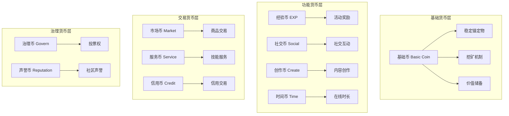

# 虚拟经济系统设计

## 📋 概述

虚拟经济系统是 AI 世界中价值创造、分配和交换的核心机制。本设计涵盖了从货币体系到市场机制、从资源管理到价值网络的完整经济生态，旨在创造一个动态平衡、可持续发展的虚拟经济环境。

### 🎯 设计目标

- **价值创造**: 建立多元化的价值生成机制
- **公平分配**: 确保价值在参与者间合理分配
- **市场平衡**: 维护供需关系的动态平衡
- **激励机制**: 设计有效的参与和贡献激励机制
- **可持续发展**: 保证经济系统的长期稳定运行

## 💰 货币体系设计

### 1. 多层次货币架构



### 2. 货币发行与调控机制

```gdscript
# script/economics/currency_system.gd
class_name CurrencySystem
extends Node

signal currency_issued(currency_type: String, amount: float, reason: String)
signal exchange_executed(from_currency: String, to_currency: String, amount: float, rate: float)
signal market_alert(alert_type: String, details: Dictionary)

enum CurrencyType {
    BASIC,      # 基础货币
    EXP,        # 经验货币
    SOCIAL,     # 社交货币
    CREATE,     # 创作货币
    TIME,       # 时间货币
    MARKET,     # 市场货币
    SERVICE,    # 服务货币
    CREDIT,     # 信用货币
    GOVERN,     # 治理货币
    REPUTATION  # 声誉货币
}

var currency_manager: CurrencyManager
var exchange_rate_manager: ExchangeRateManager
var monetary_policy: MonetaryPolicy

func _ready():
    currency_manager = CurrencyManager.new()
    exchange_rate_manager = ExchangeRateManager.new()
    monetary_policy = MonetaryPolicy.new()

    add_child(currency_manager)
    add_child(exchange_rate_manager)
    add_child(monetary_policy)

    # 初始化货币供应量
    _initialize_currency_supply()

func issue_currency(currency_type: CurrencyType, amount: float,
                  recipient: String, reason: String) -> bool:
    """发行货币"""
    # 检查发行限额
    if not monetary_policy.can_issue(currency_type, amount):
        market_alert.emit("issuance_limit_reached", {
            "currency": CurrencyType.keys()[currency_type],
            "requested_amount": amount,
            "available_amount": monetary_policy.get_available_supply(currency_type)
        })
        return false

    # 执行发行
    var success = currency_manager.add_balance(recipient, currency_type, amount)

    if success:
        # 记录发行
        currency_issued.emit(CurrencyType.keys()[currency_type], amount, reason)

        # 更新统计数据
        monetary_policy.record_issuance(currency_type, amount)

        # 触发通胀检查
        _check_inflation_pressure()

    return success

func exchange_currency(from_type: CurrencyType, to_type: CurrencyType,
                      amount: float, user_id: String) -> Dictionary:
    """货币兑换"""
    # 检查用户余额
    if currency_manager.get_balance(user_id, from_type) < amount:
        return {"success": false, "error": "insufficient_balance"}

    # 获取汇率
    var exchange_rate = exchange_rate_manager.get_rate(from_type, to_type)
    if exchange_rate <= 0:
        return {"success": false, "error": "invalid_exchange_rate"}

    # 计算兑换数量
    var exchanged_amount = amount * exchange_rate

    # 执行兑换
    var deducted = currency_manager.deduct_balance(user_id, from_type, amount)
    if deducted:
        var added = currency_manager.add_balance(user_id, to_type, exchanged_amount)

        if added:
            exchange_executed.emit(
                CurrencyType.keys()[from_type],
                CurrencyType.keys()[to_type],
                amount,
                exchange_rate
            )

            return {
                "success": true,
                "from_amount": amount,
                "to_amount": exchanged_amount,
                "rate": exchange_rate
            }
        else:
            # 回滚扣除
            currency_manager.add_balance(user_id, from_type, amount)
            return {"success": false, "error": "add_balance_failed"}
    else:
        return {"success": false, "error": "deduct_balance_failed"}

func _check_inflation_pressure():
    """检查通胀压力"""
    for currency_type in CurrencyType.values():
        var inflation_rate = monetary_policy.calculate_inflation_rate(currency_type)

        if inflation_rate > 0.05:  # 5%通胀阈值
            market_alert.emit("inflation_warning", {
                "currency": CurrencyType.keys()[currency_type],
                "inflation_rate": inflation_rate,
                "recommended_action": monetary_policy.get_inflation_response(currency_type)
            })

# 货币管理器
class CurrencyManager extends Node:
    var user_balances: Dictionary = {}
    var total_supply: Dictionary = {}

    func add_balance(user_id: String, currency_type: CurrencyType, amount: float) -> bool:
        """增加用户余额"""
        if user_id not in user_balances:
            user_balances[user_id] = {}

        var currency_key = CurrencyType.keys()[currency_type]
        user_balances[user_id][currency_key] = user_balances[user_id].get(currency_key, 0.0) + amount

        # 更新总供应量
        total_supply[currency_key] = total_supply.get(currency_key, 0.0) + amount

        return true

    func deduct_balance(user_id: String, currency_type: CurrencyType, amount: float) -> bool:
        """扣除用户余额"""
        if user_id not in user_balances:
            return false

        var currency_key = CurrencyType.keys()[currency_type]
        var current_balance = user_balances[user_id].get(currency_key, 0.0)

        if current_balance < amount:
            return false

        user_balances[user_id][currency_key] = current_balance - amount

        # 更新总供应量
        total_supply[currency_key] = total_supply.get(currency_key, 0.0) - amount

        return true

    func get_balance(user_id: String, currency_type: CurrencyType) -> float:
        """获取用户余额"""
        if user_id not in user_balances:
            return 0.0

        var currency_key = CurrencyType.keys()[currency_type]
        return user_balances[user_id].get(currency_key, 0.0)

    func get_total_supply(currency_type: CurrencyType) -> float:
        """获取货币总供应量"""
        var currency_key = CurrencyType.keys()[currency_type]
        return total_supply.get(currency_key, 0.0)

# 货币政策管理器
class MonetaryPolicy extends Node:
    var issuance_limits: Dictionary = {}
    var inflation_targets: Dictionary = {}
    var supply_rules: Dictionary = {}

    func _ready():
        _initialize_monetary_policy()

    func _initialize_monetary_policy():
        """初始化货币政策"""
        issuance_limits = {
            "BASIC": 1000000.0,      # 基础货币限额
            "EXP": float('inf'),      # 经验货币无限制
            "SOCIAL": 500000.0,      # 社交货币限额
            "CREATE": 300000.0,      # 创作货币限额
            "TIME": float('inf'),     # 时间货币无限制
            "MARKET": 200000.0,      # 市场货币限额
            "SERVICE": 150000.0,     # 服务货币限额
            "CREDIT": 100000.0,      # 信用货币限额
            "GOVERN": 50000.0,       # 治理货币限额
            "REPUTATION": 100000.0   # 声誉货币限额
        }

        inflation_targets = {
            "BASIC": 0.02,    # 2%年通胀目标
            "MARKET": 0.03,   # 3%年通胀目标
            "SERVICE": 0.025, # 2.5%年通胀目标
            "CREDIT": 0.04    # 4%年通胀目标
        }

    func can_issue(currency_type: CurrencyType, amount: float) -> bool:
        """检查是否可以发行货币"""
        var currency_key = CurrencyType.keys()[currency_type]
        var limit = issuance_limits.get(currency_key, float('inf'))

        if limit == float('inf'):
            return true

        var current_supply = get_total_supply(currency_type)
        return current_supply + amount <= limit

    func calculate_inflation_rate(currency_type: CurrencyType) -> float:
        """计算通胀率"""
        # 简化实现：基于货币供应量增长计算
        var currency_key = CurrencyType.keys()[currency_type]
        var current_supply = get_total_supply(currency_type)
        var target_supply = get_target_supply(currency_type)

        if target_supply == 0:
            return 0.0

        return (current_supply - target_supply) / target_supply

    func get_target_supply(currency_type: CurrencyType) -> float:
        """获取目标供应量"""
        var currency_key = CurrencyType.keys()[currency_type]
        var base_supply = 10000.0  # 基础供应量
        var growth_factor = 1.0 + get_inflation_target(currency_key)

        return base_supply * growth_factor

    func get_inflation_target(currency_type: CurrencyType) -> float:
        """获取通胀目标"""
        var currency_key = CurrencyType.keys()[currency_type]
        return inflation_targets.get(currency_key, 0.02)
```

## 🏪 市场机制设计

### 1. 商品与服务市场

```gdscript
# script/economics/market_system.gd
class_name MarketSystem
extends Node

signal item_listed(item_id: String, seller_id: String, price: float, quantity: int)
signal item_sold(item_id: String, buyer_id: String, seller_id: String, price: float)
signal price_changed(item_id: String, old_price: float, new_price: float)

var item_database: ItemDatabase
var auction_house: AuctionHouse
var price_discovery: PriceDiscovery

enum MarketType {
    COMMODITY,      # 商品市场
    SERVICE,        # 服务市场
    REAL_ESTATE,    # 房地产市场
    DIGITAL_ASSETS, # 数字资产市场
    LABOR           # 劳动力市场
}

func _ready():
    item_database = ItemDatabase.new()
    auction_house = AuctionHouse.new()
    price_discovery = PriceDiscovery.new()

    add_child(item_database)
    add_child(auction_house)
    add_child(price_discovery)

    # 启动价格发现机制
    price_discovery.start_price_discovery()

func list_item(item_data: Dictionary, seller_id: String, price: float,
               quantity: int = 1, market_type: MarketType = MarketType.COMMODITY) -> String:
    """上架商品"""
    var item_id = _generate_item_id()

    var listing = {
        "id": item_id,
        "seller_id": seller_id,
        "item_data": item_data,
        "price": price,
        "quantity": quantity,
        "market_type": market_type,
        "listed_at": Time.get_unix_time_from_system(),
        "status": "active"
    }

    # 验证商品
    if not _validate_item_listing(listing):
        return ""

    # 添加到市场
    var market = _get_market(market_type)
    market.add_listing(listing)

    # 更新价格参考
    price_discovery.update_price_reference(item_data["item_type"], price)

    item_listed.emit(item_id, seller_id, price, quantity)

    return item_id

func purchase_item(item_id: String, buyer_id: String, quantity: int = 1) -> Dictionary:
    """购买商品"""
    # 查找商品
    var listing = _find_listing(item_id)
    if not listing:
        return {"success": false, "error": "item_not_found"}

    # 检查商品状态
    if listing["status"] != "active":
        return {"success": false, "error": "item_not_available"}

    # 检查数量
    if listing["quantity"] < quantity:
        return {"success": false, "error": "insufficient_quantity"}

    # 计算总价
    var total_price = listing["price"] * quantity

    # 执行交易
    var transaction_result = _execute_transaction(listing, buyer_id, quantity, total_price)

    if transaction_result["success"]:
        # 更新商品状态
        _update_listing_after_sale(listing, quantity)

        # 记录销售
        item_sold.emit(item_id, buyer_id, listing["seller_id"], total_price)

        # 更新市场价格
        price_discovery.record_transaction(listing["item_data"]["item_type"], total_price, quantity)

    return transaction_result

func _execute_transaction(listing: Dictionary, buyer_id: String,
                         quantity: int, total_price: float) -> Dictionary:
    """执行交易"""
    var currency_system = get_node("/root/EconomicSystem/CurrencySystem")
    var seller_id = listing["seller_id"]

    # 扣除买家货币
    var deducted = currency_system.currency_manager.deduct_balance(
        buyer_id, CurrencySystem.CurrencyType.MARKET, total_price
    )

    if not deducted:
        return {"success": false, "error": "insufficient_funds"}

    # 转账给卖家
    var added = currency_system.currency_manager.add_balance(
        seller_id, CurrencySystem.CurrencyType.MARKET, total_price
    )

    if not added:
        # 回滚买家扣款
        currency_system.currency_manager.add_balance(
            buyer_id, CurrencySystem.CurrencyType.MARKET, total_price
        )
        return {"success": false, "error": "transfer_failed"}

    # 转移商品所有权
    _transfer_item_ownership(listing, buyer_id, quantity)

    return {
        "success": true,
        "item_id": listing["id"],
        "buyer_id": buyer_id,
        "seller_id": seller_id,
        "quantity": quantity,
        "total_price": total_price,
        "transaction_time": Time.get_unix_time_from_system()
    }

# 价格发现机制
class PriceDiscovery extends Node:
    var price_history: Dictionary = {}
    var price_models: Dictionary = {}
    var market_indicators: Dictionary = {}

    func start_price_discovery():
        """启动价格发现"""
        # 启动定期价格更新
        var price_update_timer = Timer.new()
        price_update_timer.wait_time = 300  # 5分钟更新一次
        price_update_timer.timeout.connect(_update_market_prices)
        add_child(price_update_timer)
        price_update_timer.start()

    func update_price_reference(item_type: String, price: float):
        """更新价格参考"""
        if item_type not in price_history:
            price_history[item_type] = []

        price_history[item_type].append({
            "price": price,
            "timestamp": Time.get_unix_time_from_system()
        })

        # 保持历史记录大小
        if price_history[item_type].size() > 1000:
            price_history[item_type] = price_history[item_type].slice(-500)

    func record_transaction(item_type: String, price: float, quantity: int):
        """记录交易数据"""
        update_price_reference(item_type, price)

        # 计算交易量
        var volume = price * quantity

        # 更新市场指标
        if item_type not in market_indicators:
            market_indicators[item_type] = {
                "volume_24h": 0.0,
                "transactions_24h": 0,
                "avg_price": 0.0,
                "price_volatility": 0.0
            }

        var indicators = market_indicators[item_type]
        indicators["volume_24h"] += volume
        indicators["transactions_24h"] += 1

    func _update_market_prices():
        """更新市场价格"""
        for item_type in price_history.keys():
            var price_data = price_history[item_type]
            if price_data.size() < 2:
                continue

            # 计算移动平均价格
            var recent_prices = price_data.slice(-20)  # 最近20个价格点
            var avg_price = sum(p.price for p in recent_prices) / recent_prices.size()

            # 计算价格波动性
            var variance = sum((p.price - avg_price) ** 2 for p in recent_prices) / recent_prices.size()
            var volatility = sqrt(variance) / avg_price

            # 更新指标
            market_indicators[item_type]["avg_price"] = avg_price
            market_indicators[item_type]["price_volatility"] = volatility

            # 触发价格变化事件
            if price_data.size() > 1:
                var old_price = price_data[-2]["price"]
                var new_price = price_data[-1]["price"]
                if abs(new_price - old_price) / old_price > 0.05:  # 5%以上变化
                    price_changed.emit(item_type, old_price, new_price)

    func get_market_price(item_type: String) -> float:
        """获取市场价格"""
        if item_type not in market_indicators:
            return 0.0

        return market_indicators[item_type]["avg_price"]

    func get_price_trend(item_type: String) -> String:
        """获取价格趋势"""
        if item_type not in price_history or price_history[item_type].size() < 2:
            return "stable"

        var recent_prices = price_history[item_type].slice(-10)
        var first_price = recent_prices[0]["price"]
        var last_price = recent_prices[-1]["price"]

        var change_rate = (last_price - first_price) / first_price

        if change_rate > 0.1:
            return "strongly_rising"
        elif change_rate > 0.02:
            return "rising"
        elif change_rate < -0.1:
            return "strongly_falling"
        elif change_rate < -0.02:
            return "falling"
        else:
            return "stable"
```

### 2. 劳动力市场

```gdscript
# script/economics/labor_market.gd
extends Node

class_name LaborMarket

signal job_posted(job_id: String, employer_id: String, requirements: Dictionary)
signal job_accepted(job_id: String, worker_id: String, employer_id: String)
signal work_completed(job_id: String, worker_id: String, payment: float)

var skill_registry: SkillRegistry
var job_board: JobBoard
var contract_system: ContractSystem

enum JobType {
    CREATIVE,        # 创意工作
    SOCIAL,          # 社交工作
    TECHNICAL,       # 技术工作
    SERVICE,         # 服务工作
    ENTERTAINMENT,   # 娱乐工作
    EDUCATION        # 教育工作
}

func _ready():
    skill_registry = SkillRegistry.new()
    job_board = JobBoard.new()
    contract_system = ContractSystem.new()

    add_child(skill_registry)
    add_child(job_board)
    add_child(contract_system)

func post_job(employer_id: String, job_data: Dictionary) -> String:
    """发布工作"""
    var job_id = _generate_job_id()

    var job = {
        "id": job_id,
        "employer_id": employer_id,
        "title": job_data["title"],
        "description": job_data["description"],
        "job_type": job_data["job_type"],
        "requirements": job_data["requirements"],
        "payment": job_data["payment"],
        "duration": job_data.get("duration", 3600),  # 默认1小时
        "location": job_data.get("location", "any"),
        "posted_at": Time.get_unix_time_from_system(),
        "status": "open"
    }

    # 验证工作发布
    if not _validate_job_posting(job):
        return ""

    # 添加到工作板
    job_board.add_job(job)

    job_posted.emit(job_id, employer_id, job["requirements"])

    return job_id

func apply_for_job(job_id: String, worker_id: String, application: Dictionary) -> bool:
    """申请工作"""
    var job = job_board.get_job(job_id)
    if not job or job["status"] != "open":
        return false

    # 检查技能匹配
    var worker_skills = skill_registry.get_worker_skills(worker_id)
    var required_skills = job["requirements"]["skills"]

    var match_score = _calculate_skill_match(worker_skills, required_skills)

    if match_score < 0.6:  # 60%匹配度阈值
        return false

    # 创建申请记录
    var application_record = {
        "worker_id": worker_id,
        "job_id": job_id,
        "match_score": match_score,
        "application": application,
        "applied_at": Time.get_unix_time_from_system(),
        "status": "pending"
    }

    job_board.add_application(job_id, application_record)

    # 如果是高匹配度，自动通知雇主
    if match_score > 0.8:
        _notify_employer(job["employer_id"], job_id, worker_id, match_score)

    return true

func accept_job_application(job_id: String, worker_id: String, employer_id: String) -> bool:
    """接受工作申请"""
    var job = job_board.get_job(job_id)
    if not job or job["employer_id"] != employer_id or job["status"] != "open":
        return false

    # 检查申请是否存在
    var application = job_board.get_application(job_id, worker_id)
    if not application or application["status"] != "pending":
        return false

    # 创建工作合同
    var contract = contract_system.create_contract(job, worker_id)

    if contract:
        # 更新工作状态
        job["status"] = "in_progress"
        job["worker_id"] = worker_id
        job["contract_id"] = contract["id"]
        job["started_at"] = Time.get_unix_time_from_system()

        # 更新申请状态
        application["status"] = "accepted"

        job_accepted.emit(job_id, worker_id, employer_id)

        return true

    return false

func complete_work(job_id: String, worker_id: String, work_results: Dictionary) -> Dictionary:
    """完成工作"""
    var job = job_board.get_job(job_id)
    if not job or job["worker_id"] != worker_id or job["status"] != "in_progress":
        return {"success": false, "error": "invalid_job"}

    # 验证工作质量
    var quality_score = _evaluate_work_quality(job, work_results)
    if quality_score < 0.5:  # 50%质量阈值
        return {"success": false, "error": "quality_too_low"}

    # 计算报酬
    var base_payment = job["payment"]
    var quality_bonus = base_payment * quality_score * 0.2  # 20%质量奖金
    var total_payment = base_payment + quality_bonus

    # 执行支付
    var currency_system = get_node("/root/EconomicSystem/CurrencySystem")
    var paid = currency_system.issue_currency(
        CurrencySystem.CurrencyType.SERVICE,
        total_payment,
        worker_id,
        "job_completion"
    )

    if paid:
        # 更新工作状态
        job["status"] = "completed"
        job["completed_at"] = Time.get_unix_time_from_system()
        job["quality_score"] = quality_score
        job["final_payment"] = total_payment

        # 更新工人技能经验
        skill_registry.add_experience(worker_id, job["requirements"]["skills"], quality_score)

        work_completed.emit(job_id, worker_id, total_payment)

        return {
            "success": true,
            "payment": total_payment,
            "quality_score": quality_score,
            "bonus": quality_bonus
        }

    return {"success": false, "error": "payment_failed"}

# 技能注册表
class SkillRegistry extends Node:
    var worker_skills: Dictionary = {}
    var skill_definitions: Dictionary = {}

    func _ready():
        _initialize_skill_definitions()

    func _initialize_skill_definitions():
        """初始化技能定义"""
        skill_definitions = {
            "conversation": {
                "name": "对话技巧",
                "category": "social",
                "max_level": 100,
                "experience_multiplier": 1.0
            },
            "creativity": {
                "name": "创意能力",
                "category": "creative",
                "max_level": 100,
                "experience_multiplier": 1.2
            },
            "technical": {
                "name": "技术能力",
                "category": "technical",
                "max_level": 100,
                "experience_multiplier": 0.8
            },
            "empathy": {
                "name": "共情能力",
                "category": "social",
                "max_level": 100,
                "experience_multiplier": 1.1
            },
            "entertainment": {
                "name": "娱乐技能",
                "category": "entertainment",
                "max_level": 100,
                "experience_multiplier": 1.0
            }
        }

    func get_worker_skills(worker_id: String) -> Dictionary:
        """获取工人技能"""
        return worker_skills.get(worker_id, {})

    func add_experience(worker_id: String, required_skills: Dictionary, quality_score: float):
        """添加技能经验"""
        if worker_id not in worker_skills:
            worker_skills[worker_id] = {}

        var skills = worker_skills[worker_id]

        for skill_name in required_skills.keys():
            var required_level = required_skills[skill_name]
            var skill_def = skill_definitions.get(skill_name)

            if not skill_def:
                continue

            # 计算经验值
            var base_experience = 10.0
            var quality_multiplier = quality_score
            var level_multiplier = required_level / 10.0
            var experience = base_experience * quality_multiplier * level_multiplier

            # 应用技能经验加成
            experience *= skill_def["experience_multiplier"]

            # 添加经验
            if skill_name not in skills:
                skills[skill_name] = {
                    "level": 1,
                    "experience": 0.0
                }

            skills[skill_name]["experience"] += experience

            # 检查升级
            while skills[skill_name]["experience"] >= _get_experience_required(skills[skill_name]["level"] + 1):
                skills[skill_name]["level"] += 1
                skills[skill_name]["experience"] = 0

    func _get_experience_required(level: int) -> float:
        """计算所需经验值"""
        return level * level * 10.0  # 简化的经验公式
```

## 🎯 激励机制设计

### 1. 参与度激励系统

```gdscript
# script/economics/incentive_system.gd
extends Node

class_name IncentiveSystem

signal incentive_earned(user_id: String, incentive_type: String, reward: Dictionary)
signal milestone_reached(user_id: String, milestone: String, rewards: Dictionary)

var activity_tracker: ActivityTracker
var achievement_system: AchievementSystem
var reward_distributor: RewardDistributor

enum IncentiveType {
    DAILY_BONUS,     # 每日奖励
    STREAK_BONUS,    # 连续奖励
    ACHIEVEMENT,     # 成就奖励
    SOCIAL_BONUS,    # 社交奖励
    CREATIVE_BONUS,  # 创作奖励
    CONTRIBUTION,    # 贡献奖励
    LEADERSHIP,      # 领导力奖励
    MENTORSHIP       # 导师奖励
}

func _ready():
    activity_tracker = ActivityTracker.new()
    achievement_system = AchievementSystem.new()
    reward_distributor = RewardDistributor.new()

    add_child(activity_tracker)
    add_child(achievement_system)
    add_child(reward_distributor)

    # 启动定期检查
    _start_incentive_checks()

func track_user_activity(user_id: String, activity_type: String, activity_data: Dictionary):
    """跟踪用户活动"""
    activity_tracker.record_activity(user_id, activity_type, activity_data)

    # 检查即时奖励
    var immediate_rewards = _check_immediate_rewards(user_id, activity_type, activity_data)
    for reward in immediate_rewards:
        reward_distributor.distribute_reward(user_id, reward)

    # 检查成就进度
    achievement_system.update_progress(user_id, activity_type, activity_data)

func _start_incentive_checks():
    """启动激励检查"""
    # 每日奖励检查
    var daily_timer = Timer.new()
    daily_timer.wait_time = 86400  # 24小时
    daily_timer.timeout.connect(_check_daily_incentives)
    add_child(daily_timer)
    daily_timer.start()

    # 每小时检查连续性奖励
    var hourly_timer = Timer.new()
    hourly_timer.wait_time = 3600  # 1小时
    hourly_timer.timeout.connect(_check_streak_incentives)
    add_child(hourly_timer)
    hourly_timer.start()

func _check_daily_incentives():
    """检查每日激励"""
    var active_users = activity_tracker.get_daily_active_users()

    for user_id in active_users:
        var daily_data = activity_tracker.get_daily_activity(user_id)

        # 计算每日活跃度得分
        var activity_score = _calculate_daily_activity_score(daily_data)

        # 确定奖励等级
        var reward_tier = _determine_reward_tier(activity_score)

        # 生成奖励
        var reward = _generate_daily_reward(reward_tier)

        # 分发奖励
        reward_distributor.distribute_reward(user_id, reward)

        incentive_earned.emit(user_id, "daily_bonus", reward)

func _check_streak_incentives():
    """检查连续性激励"""
    var active_users = activity_tracker.get_all_users()

    for user_id in active_users:
        var streak_data = activity_tracker.get_streak_data(user_id)

        # 检查连续天数
        if streak_data["current_streak"] > 0:
            var streak_reward = _generate_streak_reward(streak_data["current_streak"])
            reward_distributor.distribute_reward(user_id, streak_reward)

            incentive_earned.emit(user_id, "streak_bonus", streak_reward)

        # 检查里程碑
        if streak_data["current_streak"] in [7, 30, 100, 365]:
            var milestone_reward = _generate_milestone_reward(streak_data["current_streak"])
            reward_distributor.distribute_reward(user_id, milestone_reward)

            milestone_reached.emit(user_id, "streak_milestone", milestone_reward)

func _generate_daily_reward(tier: int) -> Dictionary:
    """生成每日奖励"""
    var reward_tiers = {
        1: {  # 基础奖励
            "currency_type": "BASIC",
            "amount": 50,
            "experience": 10
        },
        2: {  # 中等奖励
            "currency_type": "BASIC",
            "amount": 100,
            "experience": 25,
            "bonus_item": "daily_gift_box"
        },
        3: {  # 高级奖励
            "currency_type": "BASIC",
            "amount": 200,
            "experience": 50,
            "bonus_items": ["daily_gift_box", "rare_material"]
        },
        4: {  # 顶级奖励
            "currency_type": "BASIC",
            "amount": 500,
            "experience": 100,
            "currency_bonus": {"EXP": 200, "SOCIAL": 50},
            "bonus_items": ["daily_gift_box", "rare_material", "special_title"]
        }
    }

    return reward_tiers.get(tier, reward_tiers[1])

# 成就系统
class AchievementSystem extends Node:
    var achievements: Dictionary = {}
    var user_progress: Dictionary = {}

    func _ready():
        _initialize_achievements()

    func _initialize_achievements():
        """初始化成就"""
        achievements = {
            "social_butterfly": {
                "name": "社交达人",
                "description": "与100个不同角色进行对话",
                "category": "social",
                "requirements": {
                    "unique_conversations": 100
                },
                "rewards": {
                    "SOCIAL": 500,
                    "title": "社交达人",
                    "badge": "social_master"
                }
            },
            "creator": {
                "name": "创作者",
                "description": "创作50个原创内容",
                "category": "creative",
                "requirements": {
                    "created_content": 50
                },
                "rewards": {
                    "CREATE": 1000,
                    "title": "创作者",
                    "tool_unlock": "advanced_editor"
                }
            },
            "helper": {
                "name": "助人者",
                "description": "帮助其他用户解决问题100次",
                "category": "community",
                "requirements": {
                    "help_actions": 100
                },
                "rewards": {
                    "SERVICE": 800,
                    "REPUTATION": 200,
                    "title": "助人者"
                }
            },
            "explorer": {
                "name": "探索者",
                "description": "访问世界中的所有区域",
                "category": "exploration",
                "requirements": {
                    "unique_locations": 50
                },
                "rewards": {
                    "TIME": 500,
                    "title": "探索者",
                    "special_item": "explorer_compass"
                }
            }
        }

    func update_progress(user_id: String, activity_type: String, activity_data: Dictionary):
        """更新成就进度"""
        if user_id not in user_progress:
            user_progress[user_id] = {}

        var progress = user_progress[user_id]

        # 根据活动类型更新相关成就
        match activity_type:
            "conversation":
                if activity_data.get("is_unique", false):
                    progress["unique_conversations"] = progress.get("unique_conversations", 0) + 1
                    _check_achievement_progress(user_id, "social_butterfly", progress)

            "content_creation":
                progress["created_content"] = progress.get("created_content", 0) + 1
                _check_achievement_progress(user_id, "creator", progress)

            "help_action":
                progress["help_actions"] = progress.get("help_actions", 0) + 1
                _check_achievement_progress(user_id, "helper", progress)

            "location_visit":
                progress["unique_locations"] = progress.get("unique_locations", 0) + 1
                _check_achievement_progress(user_id, "explorer", progress)

    func _check_achievement_progress(user_id: String, achievement_id: String, progress: Dictionary):
        """检查成就进度"""
        if achievement_id not in achievements:
            return

        var achievement = achievements[achievement_id]
        var requirements = achievement["requirements"]
        var completed = true

        # 检查所有要求
        for requirement_name, required_value in requirements:
            var current_value = progress.get(requirement_name, 0)
            if current_value < required_value:
                completed = false
                break

        # 如果完成，发放奖励
        if completed:
            _award_achievement(user_id, achievement_id, achievement["rewards"])

    func _award_achievement(user_id: String, achievement_id: String, rewards: Dictionary):
        """发放成就奖励"""
        var reward_distributor = get_parent().reward_distributor

        # 分发货币奖励
        for currency_type, amount in rewards.items():
            if currency_type in ["BASIC", "EXP", "SOCIAL", "CREATE", "TIME", "SERVICE", "REPUTATION"]:
                reward_distributor.distribute_currency(user_id, currency_type, amount)

        # 记录成就完成
        if user_id not in user_progress:
            user_progress[user_id] = {}

        if "completed_achievements" not in user_progress[user_id]:
            user_progress[user_id]["completed_achievements"] = []

        user_progress[user_id]["completed_achievements"].append(achievement_id)

        # 发送成就通知
        get_parent().milestone_reached.emit(user_id, "achievement", {
            "achievement_id": achievement_id,
            "rewards": rewards
        })
```

## 📊 经济分析与监控

### 1. 经济指标监控系统

```python
# systems/economics/economic_analytics.py
from typing import Dict, List, Any, Optional
from dataclasses import dataclass
from datetime import datetime, timedelta
import numpy as np

@dataclass
class EconomicIndicators:
    gdp: float                    # 虚拟GDP
    inflation_rate: float         # 通胀率
    unemployment_rate: float      # 失业率
    money_supply: Dict[str, float] # 货币供应量
    consumer_price_index: float   # 消费价格指数
    market_activity: Dict[str, float] # 市场活跃度
    wealth_distribution: Dict     # 财富分配
    trade_volume: float          # 交易量

class EconomicAnalytics:
    def __init__(self):
        self.indicators_history = []
        self.data_collectors = {}
        self.analysis_models = {}
        self.alert_thresholds = {}

    async def start_monitoring(self):
        """启动经济监控"""
        # 启动定期数据收集
        import asyncio
        asyncio.create_task(self._collect_economic_data())

        # 启动指标计算
        asyncio.create_task(self._calculate_indicators())

        # 启动异常检测
        asyncio.create_task(self._detect_economic_anomalies())

    async def _collect_economic_data(self):
        """收集经济数据"""
        while True:
            try:
                # 收集各类经济数据
                transaction_data = await self._collect_transaction_data()
                labor_data = await self._collect_labor_data()
                market_data = await self._collect_market_data()
                currency_data = await self._collect_currency_data()

                # 整合数据
                economic_data = {
                    "timestamp": datetime.now(),
                    "transactions": transaction_data,
                    "labor": labor_data,
                    "markets": market_data,
                    "currencies": currency_data
                }

                # 存储数据
                await self._store_economic_data(economic_data)

            except Exception as e:
                print(f"Data collection error: {e}")

            await asyncio.sleep(300)  # 5分钟收集一次

    async def _calculate_indicators(self):
        """计算经济指标"""
        while True:
            try:
                # 获取最近的经济数据
                recent_data = await self._get_recent_data(hours=24)

                if recent_data:
                    indicators = await self._compute_economic_indicators(recent_data)
                    self.indicators_history.append(indicators)

                    # 保持历史记录大小
                    if len(self.indicators_history) > 1000:
                        self.indicators_history = self.indicators_history[-500:]

                    # 检查阈值告警
                    await self._check_indicator_thresholds(indicators)

            except Exception as e:
                print(f"Indicator calculation error: {e}")

            await asyncio.sleep(600)  # 10分钟计算一次

    async def _compute_economic_indicators(self, data: List[Dict]) -> EconomicIndicators:
        """计算经济指标"""
        if not data:
            return EconomicIndicators(0, 0, 0, {}, 0, {}, {}, 0)

        # 计算虚拟GDP
        gdp = self._calculate_gdp(data)

        # 计算通胀率
        inflation_rate = self._calculate_inflation_rate(data)

        # 计算失业率
        unemployment_rate = self._calculate_unemployment_rate(data)

        # 货币供应量
        money_supply = self._calculate_money_supply(data)

        # 消费价格指数
        cpi = self._calculate_cpi(data)

        # 市场活跃度
        market_activity = self._calculate_market_activity(data)

        # 财富分配
        wealth_distribution = self._calculate_wealth_distribution(data)

        # 交易量
        trade_volume = self._calculate_trade_volume(data)

        return EconomicIndicators(
            gdp=gdp,
            inflation_rate=inflation_rate,
            unemployment_rate=unemployment_rate,
            money_supply=money_supply,
            consumer_price_index=cpi,
            market_activity=market_activity,
            wealth_distribution=wealth_distribution,
            trade_volume=trade_volume
        )

    def _calculate_gdp(self, data: List[Dict]) -> float:
        """计算虚拟GDP"""
        total_value = 0.0

        for data_point in data:
            # 消费支出
            if "transactions" in data_point:
                for transaction in data_point["transactions"]:
                    total_value += transaction.get("value", 0)

            # 服务价值
            if "labor" in data_point:
                for job in data_point["labor"]:
                    total_value += job.get("payment", 0)

            # 创作价值
            if "markets" in data_point:
                for market in data_point["markets"]:
                    for item in market.get("items", []):
                        total_value += item.get("value", 0)

        return total_value

    def _calculate_inflation_rate(self, data: List[Dict]) -> float:
        """计算通胀率"""
        if len(data) < 2:
            return 0.0

        # 获取价格指数
        current_prices = self._get_price_index(data[-1])
        previous_prices = self._get_price_index(data[-2])

        if previous_prices == 0:
            return 0.0

        inflation_rate = (current_prices - previous_prices) / previous_prices
        return inflation_rate

    def _calculate_wealth_distribution(self, data: List[Dict]) -> Dict:
        """计算财富分配"""
        user_wealth = {}

        # 收集用户财富数据
        for data_point in data:
            if "currencies" in data_point:
                for user_id, balances in data_point["currencies"].items():
                    if user_id not in user_wealth:
                        user_wealth[user_id] = 0
                    total_wealth = sum(balances.values())
                    user_wealth[user_id] = total_wealth

        if not user_wealth:
            return {}

        # 计算分配指标
        wealth_values = list(user_wealth.values())
        wealth_values.sort()

        total_wealth = sum(wealth_values)
        if total_wealth == 0:
            return {}

        # 计算基尼系数
        n = len(wealth_values)
        if n == 0:
            return {"gini_coefficient": 0}

        cum_wealth = np.cumsum(wealth_values)
        sum_cum_wealth = np.sum(cum_wealth)
        gini = (n + 1 - 2 * sum_cum_wealth / sum_cum_wealth) / n

        # 计算分位数
        percentiles = {}
        for p in [20, 40, 60, 80]:
            index = int(n * p / 100)
            percentiles[f"p{p}"] = wealth_values[min(index, n-1)] / total_wealth

        return {
            "gini_coefficient": gini,
            "percentiles": percentiles,
            "total_users": n,
            "average_wealth": total_wealth / n
        }

    async def generate_economic_report(self, report_period: str) -> Dict:
        """生成经济报告"""
        # 获取期间数据
        period_data = await self._get_period_data(report_period)
        if not period_data:
            return {"error": "No data available for period"}

        # 计算指标
        indicators = await self._compute_economic_indicators(period_data)

        # 分析趋势
        trend_analysis = self._analyze_trends(indicators)

        # 生成预测
        forecasts = self._generate_forecasts(indicators)

        # 识别风险
        risks = self._identify_economic_risks(indicators)

        # 提供建议
        recommendations = self._generate_policy_recommendations(indicators, risks)

        return {
            "period": report_period,
            "generated_at": datetime.now().isoformat(),
            "indicators": indicators.__dict__,
            "trend_analysis": trend_analysis,
            "forecasts": forecasts,
            "risks": risks,
            "recommendations": recommendations
        }

    def _analyze_trends(self, indicators: EconomicIndicators) -> Dict:
        """分析经济趋势"""
        if len(self.indicators_history) < 2:
            return {"status": "insufficient_data"}

        # 获取历史指标
        historical_indicators = self.indicators_history[-10:]  # 最近10个数据点

        trends = {}

        # 分析各指标趋势
        for field_name in indicators.__dataclass_fields__:
            if field_name == "money_supply" or field_name == "wealth_distribution":
                continue  # 跳过复杂数据类型

            values = [getattr(ind, field_name) for ind in historical_indicators]
            if len(values) >= 2:
                # 计算趋势斜率
                x = list(range(len(values)))
                slope = np.polyfit(x, values, 1)[0]

                trends[field_name] = {
                    "direction": "increasing" if slope > 0 else "decreasing" if slope < 0 else "stable",
                    "slope": slope,
                    "volatility": np.std(values) / np.mean(values) if np.mean(values) != 0 else 0
                }

        return trends

    def _identify_economic_risks(self, indicators: EconomicIndicators) -> List[Dict]:
        """识别经济风险"""
        risks = []

        # 高通胀风险
        if indicators.inflation_rate > 0.1:  # 10%通胀率阈值
            risks.append({
                "type": "high_inflation",
                "severity": "high" if indicators.inflation_rate > 0.2 else "medium",
                "description": f"通胀率过高: {indicators.inflation_rate:.2%}",
                "impact": "货币贬值，购买力下降"
            })

        # 高失业率风险
        if indicators.unemployment_rate > 0.15:  # 15%失业率阈值
            risks.append({
                "type": "high_unemployment",
                "severity": "high" if indicators.unemployment_rate > 0.25 else "medium",
                "description": f"失业率过高: {indicators.unemployment_rate:.2%}",
                "impact": "社会不稳定，消费能力下降"
            })

        # 财富不平等风险
        if indicators.wealth_distribution:
            gini = indicators.wealth_distribution.get("gini_coefficient", 0)
            if gini > 0.4:  # 基尼系数阈值
                risks.append({
                    "type": "wealth_inequality",
                    "severity": "high" if gini > 0.5 else "medium",
                    "description": f"财富分配不均，基尼系数: {gini:.3f}",
                    "impact": "社会分化，市场效率下降"
                })

        # 流动性风险
        if indicators.money_supply:
            total_supply = sum(indicators.money_supply.values())
            if total_supply > indicators.gdp * 2:  # 货币供应量超过GDP的2倍
                risks.append({
                    "type": "excess_liquidity",
                    "severity": "medium",
                    "description": "流动性过剩",
                    "impact": "资产泡沫，通胀压力"
                })

        return risks

    def _generate_policy_recommendations(self, indicators: EconomicIndicators,
                                       risks: List[Dict]) -> List[str]:
        """生成政策建议"""
        recommendations = []

        # 基于风险生成建议
        for risk in risks:
            risk_type = risk["type"]
            if risk_type == "high_inflation":
                recommendations.extend([
                    "收紧货币政策，减少货币供应",
                    "提高利率，抑制过度投资",
                    "增加商品供应，缓解供需矛盾"
                ])
            elif risk_type == "high_unemployment":
                recommendations.extend([
                    "增加政府支出，创造就业机会",
                    "降低企业税负，鼓励招聘",
                    "提供职业培训，提高就业能力"
                ])
            elif risk_type == "wealth_inequality":
                recommendations.extend([
                    "实施累进税制，调节财富分配",
                    "增加公共服务，保障基本需求",
                    "支持中小企业，促进机会均等"
                ])

        # 基于指标生成建议
        if indicators.trade_volume < indicators.gdp * 0.1:  # 交易量过低
            recommendations.append("刺激市场交易，降低交易成本")

        if indicators.market_activity:
            low_activity_markets = [k for k, v in indicators.market_activity.items() if v < 0.1]
            if low_activity_markets:
                recommendations.append(f"激活{', '.join(low_activity_markets)}市场活力")

        return list(set(recommendations))  # 去重
```

## 🔮 经济模型预测

### 1. 经济预测模型

```python
# systems/economics/forecasting_models.py
from typing import Dict, List, Any, Optional
import numpy as np
from sklearn.linear_model import LinearRegression
from sklearn.ensemble import RandomForestRegressor
from dataclasses import dataclass
import pandas as pd

@dataclass
class EconomicForecast:
    indicator: str
    current_value: float
    forecast_values: List[float]
    confidence_intervals: List[tuple]
    time_horizon: int  # 预测期数
    model_accuracy: float

class EconomicForecaster:
    def __init__(self):
        self.models = {}
        self.training_data = {}
        self.feature_importance = {}

    def train_models(self, historical_data: List[Dict]):
        """训练预测模型"""
        # 准备训练数据
        df = pd.DataFrame(historical_data)

        # 为每个指标训练模型
        indicators = ['gdp', 'inflation_rate', 'unemployment_rate', 'trade_volume']

        for indicator in indicators:
            if indicator in df.columns:
                self._train_indicator_model(df, indicator)

    def _train_indicator_model(self, df: pd.DataFrame, indicator: str):
        """训练单个指标的预测模型"""
        # 准备特征
        features = self._prepare_features(df, indicator)

        if len(features) < 10:  # 数据不足
            return

        X = features.drop(columns=[indicator])
        y = features[indicator]

        # 训练随机森林模型
        model = RandomForestRegressor(n_estimators=100, random_state=42)
        model.fit(X, y)

        self.models[indicator] = model
        self.feature_importance[indicator] = dict(zip(X.columns, model.feature_importances_))

    def _prepare_features(self, df: pd.DataFrame, target_indicator: str) -> pd.DataFrame:
        """准备特征数据"""
        features = pd.DataFrame()

        # 滞后特征
        for lag in [1, 2, 3, 7]:  # 1天、2天、3天、7天前
            features[f'{target_indicator}_lag_{lag}'] = df[target_indicator].shift(lag)

        # 移动平均特征
        for window in [3, 7, 14]:
            features[f'{target_indicator}_ma_{window}'] = df[target_indicator].rolling(window).mean()

        # 其他指标作为特征
        other_indicators = ['gdp', 'inflation_rate', 'unemployment_rate', 'trade_volume', 'money_supply_total']
        for indicator in other_indicators:
            if indicator in df.columns and indicator != target_indicator:
                features[indicator] = df[indicator]
                features[f'{indicator}_lag_1'] = df[indicator].shift(1)

        # 时间特征
        features['day_of_week'] = pd.to_datetime(df['timestamp']).dt.dayofweek
        features['month'] = pd.to_datetime(df['timestamp']).dt.month

        # 添加目标变量
        features[target_indicator] = df[target_indicator]

        # 删除包含NaN的行
        features = features.dropna()

        return features

    def generate_forecast(self, indicator: str, horizon_days: int = 30) -> EconomicForecast:
        """生成经济预测"""
        if indicator not in self.models:
            raise ValueError(f"No trained model for indicator: {indicator}")

        model = self.models[indicator]

        # 获取最新数据
        latest_data = self._get_latest_features(indicator)

        if not latest_data:
            raise ValueError("Insufficient data for forecasting")

        # 生成预测
        forecast_values = []
        confidence_intervals = []

        current_features = latest_data.copy()

        for day in range(horizon_days):
            # 预测下一个值
            prediction = model.predict(current_features.reshape(1, -1))[0]
            forecast_values.append(prediction)

            # 计算置信区间（简化实现）
            std_error = self._calculate_prediction_error(indicator)
            confidence_interval = (
                prediction - 1.96 * std_error,
                prediction + 1.96 * std_error
            )
            confidence_intervals.append(confidence_interval)

            # 更新特征为下一次预测做准备
            current_features = self._update_features_for_next_period(
                current_features, indicator, prediction
            )

        # 计算模型准确性
        accuracy = self._calculate_model_accuracy(indicator)

        return EconomicForecast(
            indicator=indicator,
            current_value=latest_data[indicator],
            forecast_values=forecast_values,
            confidence_intervals=confidence_intervals,
            time_horizon=horizon_days,
            model_accuracy=accuracy
        )

    def simulate_policy_impact(self, policy_changes: Dict, days: int = 90) -> Dict:
        """模拟政策影响"""
        baseline_forecasts = {}
        policy_forecasts = {}

        # 生成基准预测
        for indicator in ['gdp', 'inflation_rate', 'unemployment_rate']:
            if indicator in self.models:
                baseline_forecasts[indicator] = self.generate_forecast(indicator, days)

        # 应用政策变化并重新预测
        for indicator in baseline_forecasts.keys():
            modified_forecast = self._apply_policy_changes(
                baseline_forecasts[indicator], policy_changes
            )
            policy_forecasts[indicator] = modified_forecast

        # 计算政策影响
        policy_impacts = {}
        for indicator in baseline_forecasts.keys():
            baseline_values = baseline_forecasts[indicator].forecast_values
            policy_values = policy_forecasts[indicator].forecast_values

            impacts = [policy - baseline for baseline, policy in zip(baseline_values, policy_values)]
            average_impact = np.mean(impacts)
            total_impact = np.sum(impacts)

            policy_impacts[indicator] = {
                "average_daily_impact": average_impact,
                "total_impact": total_impact,
                "impact_percentage": (total_impact / baseline_forecasts[indicator].current_value) * 100,
                "daily_impacts": impacts
            }

        return {
            "policy_changes": policy_changes,
            "time_horizon_days": days,
            "baseline_forecasts": baseline_forecasts,
            "policy_forecasts": policy_forecasts,
            "policy_impacts": policy_impacts
        }

    def _apply_policy_changes(self, forecast: EconomicForecast, policy_changes: Dict) -> EconomicForecast:
        """应用政策变化到预测"""
        modified_values = []

        for i, value in enumerate(forecast.forecast_values):
            modified_value = value

            # 应用货币政策影响
            if "interest_rate_change" in policy_changes:
                rate_change = policy_changes["interest_rate_change"]
                if forecast.indicator == "inflation_rate":
                    modified_value += rate_change * 0.5  # 利率变化对通胀的简化影响
                elif forecast.indicator == "gdp":
                    modified_value -= rate_change * 0.3  # 利率变化对GDP的简化影响

            # 应用财政政策影响
            if "fiscal_stimulus" in policy_changes:
                stimulus = policy_changes["fiscal_stimulus"]
                if forecast.indicator == "gdp":
                    modified_value += stimulus * 0.8  # 财政刺激对GDP的简化影响
                elif forecast.indicator == "unemployment_rate":
                    modified_value -= stimulus * 0.4  # 财政刺激对失业的简化影响

            # 应用贸易政策影响
            if "trade_policy_change" in policy_changes:
                trade_change = policy_changes["trade_policy_change"]
                if forecast.indicator == "trade_volume":
                    modified_value += trade_change * 0.6

            modified_values.append(modified_value)

        return EconomicForecast(
            indicator=forecast.indicator,
            current_value=forecast.current_value,
            forecast_values=modified_values,
            confidence_intervals=forecast.confidence_intervals,
            time_horizon=forecast.time_horizon,
            model_accuracy=forecast.model_accuracy * 0.9  # 政策影响预测准确性降低
        )
```

## 📈 实施路线图

### 阶段一：基础货币与市场 (1-2个月)

```yaml
# implementation/phase1_economics.yaml
phase_1_foundation:
  timeline: "1-2个月"
  objectives:
    - "建立基础货币体系"
    - "实现基本市场功能"
    - "搭建交易系统"
    - "启动经济监控"

  deliverables:
    currency_system:
      - "多层次货币架构"
      - "货币发行机制"
      - "汇率管理系统"
      - "货币政策工具"

    market_system:
      - "商品交易市场"
      - "服务交易市场"
      - "价格发现机制"
      - "交易撮合引擎"

    monitoring_system:
      - "经济数据收集"
      - "基础指标计算"
      - "异常检测告警"
      - "可视化面板"

  success_metrics:
    - "货币系统稳定运行"
    - "日交易量达到目标"
    - "价格发现机制有效"
    - "监控覆盖率100%"
```

### 阶段二：激励与经济生态 (3-4个月)

```yaml
# implementation/phase2_ecosystem.yaml
phase_2_ecosystem:
  timeline: "3-4个月"
  objectives:
    - "完善激励机制"
    - "建立劳动力市场"
    - "优化经济平衡"
    - "增强用户参与"

  deliverables:
    incentive_system:
      - "参与度激励机制"
      - "成就系统"
      - "奖励分发系统"
      - "用户等级体系"

    labor_market:
      - "技能认证系统"
      - "工作发布平台"
      - "服务交易机制"
      - "声誉评价系统"

    economic_balance:
      - "自动平衡机制"
      - "供需调节工具"
      - "经济政策工具"
      - "风险控制系统"

  success_metrics:
    - "用户活跃度提升50%"
    - "劳动力市场交易量达标"
    - "经济指标保持稳定"
    - "用户满意度85%+"
```

### 阶段三：高级经济功能 (5-6个月)

```yaml
# implementation/phase3_advanced.yaml
phase_3_advanced:
  timeline: "5-6个月"
  objectives:
    - "实现经济预测"
    - "建立政策模拟"
    - "优化市场效率"
    - "扩展经济生态"

  deliverables:
    forecasting_system:
      - "经济预测模型"
      - "政策影响模拟"
      - "风险评估工具"
      - "决策支持系统"

    advanced_markets:
      - "金融衍生品市场"
      - "投资理财产品"
      - "保险机制"
      - "信用系统"

    ecosystem_integration:
      - "跨平台经济互通"
      - "外部API接口"
      - "第三方开发者支持"
      - "经济数据开放"

  success_metrics:
    - "预测准确率85%+"
    - "高级市场活跃度"
    - "生态系统完整性"
    - "开发者采用率"
```

## 📊 关键绩效指标

### 1. 经济健康指标

| 指标类别 | 具体指标 | 目标值 | 测量频率 |
|---------|---------|-------|---------|
| **经济增长** | 虚拟GDP增长率 | 5-10%/季度 | 季度 |
| | 交易量增长率 | 15-20%/季度 | 月度 |
| | 用户活跃度 | 70%+ | 实时 |
| **价格稳定** | 通胀率 | 2-5%/年 | 月度 |
| | 价格波动率 | <10%/月 | 月度 |
| | 汇率稳定性 | <5%/月 | 周度 |
| **市场效率** | 市场流动性 | 高 | 实时 |
| | 交易成功率 | >95% | 实时 |
| | 价格发现效率 | 高 | 月度 |
| **财富分配** | 基尼系数 | <0.4 | 季度 |
| | 贫富差距比例 | <10:1 | 季度 |
| | 社会流动性 | 中等以上 | 季度 |

### 2. 用户参与指标

| 指标类别 | 具体指标 | 目标值 | 测量频率 |
|---------|---------|-------|---------|
| **参与度** | 日活跃用户数 | 持续增长 | 日度 |
| | 平均在线时长 | 2小时+/天 | 日度 |
| | 交易频率 | 3次+/天 | 日度 |
| **满意度** | 经济系统满意度 | >4.0/5.0 | 月度 |
| | 交易体验评分 | >4.2/5.0 | 月度 |
| | 激励机制满意度 | >4.5/5.0 | 季度 |
| **留存率** | 7日留存率 | >60% | 周度 |
| | 30日留存率 | >40% | 月度 |
| | 用户生命周期价值 | 持续增长 | 月度 |

---

**文档版本**: v1.0
**最后更新**: 2024-11-10
**维护者**: AI World 开发团队

这份虚拟经济系统设计文档为构建复杂、可持续的AI世界经济生态提供了完整的技术框架和实施指南。通过多层次的货币体系、动态平衡的市场机制和智能化的经济分析系统，确保虚拟世界经济的健康发展。