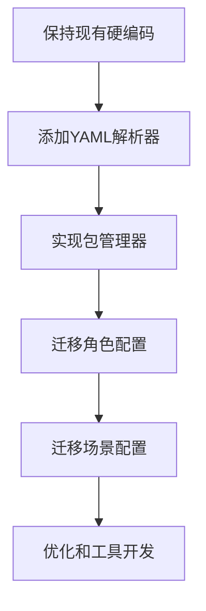

# Microverse 游戏系统架构分析与配置化改造评估报告

## 📊 项目概述

Microverse 是一个基于 Godot 引擎开发的 AI 驱动的办公室角色模拟游戏，具有复杂的角色 AI 系统、场景管理和交互功能。

---

## 📋 当前系统架构分析

### 1. 核心系统组件

#### **1.1 角色系统**

- **主控制器**: `CharacterController.gd`
- **角色管理**: `CharacterManager.gd`
- **人设配置**: `CharacterPersonality.gd` (硬编码)
- **AI 代理**: `AIAgent.gd`
- **当前角色数**: 8 个 (Stephen, Tom, Lea, Alice, Grace, Jack, Joe, Monica)

#### **1.2 AI 系统架构**

- **API 配置**: `APIConfig.gd` - 支持 9 种 AI 服务商
- **API 管理**: `APIManager.gd` - 统一请求处理
- **对话管理**: `DialogManager.gd`
- **对话服务**: `DialogService.gd`
- **记忆系统**: `MemoryManager.gd`

#### **1.3 场景系统**

- **房间管理**: `RoomManager.gd`
- **房间数据**: `RoomData.gd`
- **房间区域**: `RoomArea.gd`
- **背景故事**: `BackgroundStoryManager.gd`

#### **1.4 UI 系统**

- **全局 UI**: `GodUI.gd`
- **设置管理**: `SettingsManager.gd`
- **角色 AI 设置**: `CharacterAISettings.gd`
- **AI 模型标签**: `AIModelLabel.gd`

#### **1.5 存档系统**

- **游戏保存**: `GameSaveManager.gd`
- **存档 UI**: `SaveLoadUI.gd`
- **聊天历史**: `ChatHistory.gd`

### 2. 数据流架构

```
用户输入 → CharacterController → AIAgent → APIManager → AI服务商
           ↓                    ↓           ↓
        SettingsManager → DialogManager → MemoryManager
```

### 3. 配置现状分析

#### **3.1 硬编码配置项**

**角色配置** (`CharacterPersonality.gd`):

```gdscript
const PERSONALITY_CONFIG = {
    "Stephen": {
        "position": "SleepySheep公司老板",
        "personality": "奥斯卡级虚伪表演家...",
        "speaking_style": "张嘴就是'期权池已备好'...",
        "work_duties": "每周发布新的'三年愿景'...",
        "work_habits": "下班时间必在公司群发'深夜奋斗者照片'..."
    },
    // ... 其他7个角色
}
```

**AI 配置** (`APIConfig.gd`):

```gdscript
static var _providers: Dictionary = {}
static var _model_display_names: Dictionary = {
    "qwen3:4b": "Qwen3 4B",
    "qwen/qwen3-vl-4b": "Qwen3-VL 4B",
    // ... 30+ 个模型映射
}
```

**场景配置** (`BackgroundStoryManager.gd`):

```gdscript
static var BACKGROUND_CONFIGS = {
    "Office": {
        "company_name": "CountSheep游戏公司",
        "company_description": "一家专注于休闲小游戏开发的创新公司...",
        "environment_description": "这是一家现代化的公司...",
        "social_rules": [
            "工作时间内应保持专业态度",
            "鼓励团队合作和知识分享",
            // ... 更多规则
        ]
    },
    "School": { ... },
    "CoffeeShop": { ... }
}
```

#### **3.2 配置统计**

- **角色配置**: 8 个角色 × 5 个属性 = 40 个配置项
- **AI 模型配置**: 9 个服务商 × 平均 5 个模型 = 45+个配置项
- **场景配置**: 3 个场景 × 6 个属性 = 18 个配置项
- **总计**: 100+ 个硬编码配置项

---

## 🎯 配置化改造需求分析

### 1. 改动动机

#### **当前痛点**:

- **添加新角色困难**: 需要修改多处代码，重新编译
- **场景扩展受限**: 硬编码限制了场景多样性
- **内容更新繁琐**: 每次更新需要发布完整游戏版本
- **社区创作困难**: 用户无法轻松创建自定义内容

#### **期望收益**:

- **降低创作门槛**: 用户可轻松添加角色/场景
- **支持模组生态**: 第三方内容创作者生态
- **快速内容迭代**: 无需重新编译即可更新内容
- **版本化内容**: 支持内容包版本管理和兼容性

### 2. 改造范围

#### **必须改造**:

1. **角色配置** - `CharacterPersonality.gd`
2. **AI 配置** - `APIConfig.gd` 的部分配置
3. **场景配置** - `BackgroundStoryManager.gd`
4. **存档兼容性** - `GameSaveManager.gd`

#### **可选改造**:

1. **UI 配置** - 界面布局和样式
2. **音效配置** - 背景音乐和音效
3. **动画配置** - 角色动画和特效

---

## 🛠 YAML 配置文件包可行性评估

### 1. YAML vs JSON vs 其他格式对比

| 特性           | YAML       | JSON       | 自定义二进制 | Godot 资源(.tres) |
| -------------- | ---------- | ---------- | ------------ | ----------------- |
| **可读性**     | ⭐⭐⭐⭐⭐ | ⭐⭐⭐     | ⭐           | ⭐⭐⭐⭐          |
| **编写便捷性** | ⭐⭐⭐⭐   | ⭐⭐⭐     | ⭐⭐         | ⭐⭐⭐⭐⭐        |
| **工具支持**   | ⭐⭐⭐⭐⭐ | ⭐⭐⭐⭐⭐ | ⭐⭐         | ⭐⭐⭐            |
| **性能**       | ⭐⭐⭐     | ⭐⭐⭐⭐   | ⭐⭐⭐⭐⭐   | ⭐⭐⭐⭐          |
| **版本控制**   | ⭐⭐⭐⭐   | ⭐⭐⭐⭐⭐ | ⭐⭐         | ⭐⭐⭐⭐          |
| **验证能力**   | ⭐⭐⭐     | ⭐⭐⭐⭐⭐ | ⭐⭐⭐⭐⭐   | ⭐⭐⭐⭐⭐        |

**结论**: YAML 在可读性和编写便捷性方面有优势，适合配置文件。

### 2. YAML 配置包结构设计

#### **推荐包结构**:

```
content_package/
├── package.yml              # 包元信息
├── config/
│   ├── characters.yml       # 角色配置
│   ├── scenes.yml          # 场景配置
│   ├── ai_models.yml       # AI模型配置
│   └── ui_theme.yml        # UI主题配置
├── assets/
│   ├── characters/         # 角色资源
│   │   ├── stephen/
│   │   │   ├── sprite.png
│   │   │   └── animations.json
│   │   └── ...
│   ├── scenes/            # 场景资源
│   │   └── office/
│   │       ├── background.png
│   │       └── objects.json
│   └── ui/               # UI资源
└── locales/              # 本地化文件
    ├── zh_CN.yml
    └── en_US.yml
```

#### **package.yml 示例**:

```yaml
package:
  name: "SleepySheep Office"
  version: "1.0.0"
  author: "Microverse Team"
  description: "办公室场景基础包"
  dependencies: []
  compatibility:
    game_version: ">=1.0.0"

content:
  characters:
    - stephen
    - tom
    - lea
    - alice
    - grace
    - jack
    - joe
    - monica
  scenes:
    - office
  ai_models:
    - openai
    - claude
    - gemini
```

#### **characters.yml 示例**:

```yaml
characters:
  stephen:
    display_name: "史蒂芬"
    position: "SleepySheep公司老板"
    personality: |
      奥斯卡级虚伪表演家，职场PUA持证上岗选手，
      把'奋斗者文化'刻进DNA的剥削型人格
    speaking_style: |
      张嘴就是'期权池已备好'、'明年就敲钟'，
      把996包装成'青年增值计划'
    work_duties: |
      每周发布新的'三年愿景'，主持'福报宣讲会'，
      给投资人演示'员工自愿加班'的监控录像
    work_habits: |
      下班时间必在公司群发'深夜奋斗者照片'，
      定期查看员工电脑监控
    ai_settings:
      api_type: "OpenAI"
      model: "gpt-4o-mini"
      temperature: 0.7
    assets:
      sprite_sheet: "assets/characters/stephen/sprite.png"
      animations: "assets/characters/stephen/animations.json"

  tom:
    display_name: "汤姆"
    # ... 其他角色配置
```

### 3. 技术实现方案

#### **3.1 YAML 解析器实现**

```gdscript
# ConfigLoader.gd
class_name ConfigLoader
extends RefCounted

static func load_package(package_path: String) -> Dictionary:
    var package_file = FileAccess.open(package_path + "/package.yml", FileAccess.READ)
    if not package_file:
        push_error("无法读取包配置文件: " + package_path)
        return {}

    var yaml_content = package_file.get_as_text()
    var yaml_parser = YAMLParser.new()
    var result = yaml_parser.parse(yaml_content)

    if result.error != OK:
        push_error("YAML解析失败: " + result.error_string)
        return {}

    return result.data

static func load_characters(config_path: String) -> Dictionary:
    var characters_file = FileAccess.open(config_path, FileAccess.READ)
    if not characters_file:
        return {}

    var yaml_content = characters_file.get_as_text()
    var yaml_parser = YAMLParser.new()
    var result = yaml_parser.parse(yaml_content)

    if result.error == OK:
        return result.data.get("characters", {})

    return {}
```

#### **3.2 配置管理器**

```gdscript
# PackageManager.gd
extends Node
class_name PackageManager

static var loaded_packages: Dictionary = {}
static var character_configs: Dictionary = {}
static var scene_configs: Dictionary = {}

static func load_package_from_path(package_path: String) -> bool:
    var package_info = ConfigLoader.load_package(package_path)
    if package_info.is_empty():
        return false

    var package_name = package_info.get("package", {}).get("name", "unknown")
    loaded_packages[package_name] = package_info

    # 加载角色配置
    var characters_path = package_path + "/config/characters.yml"
    character_configs.merge(ConfigLoader.load_characters(characters_path))

    # 加载场景配置
    var scenes_path = package_path + "/config/scenes.yml"
    scene_configs.merge(ConfigLoader.load_scenes(scenes_path))

    return true

static func get_character_config(character_name: String) -> Dictionary:
    return character_configs.get(character_name, {})

static func get_scene_config(scene_name: String) -> Dictionary:
    return scene_configs.get(scene_name, {})
```

#### **3.3 兼容性适配器**

```gdscript
# CharacterPersonality.gd 改造
extends Node
class_name CharacterPersonality

# 保持向后兼容的硬编码配置作为默认值
const DEFAULT_PERSONALITY_CONFIG = {
    "Stephen": {
        "position": "SleepySheep公司老板",
        # ... 原有配置
    }
    # ... 其他角色
}

static var personality_config: Dictionary = {}

func _ready():
    # 初始化时加载YAML配置
    load_yaml_configs()

static func load_yaml_configs():
    # 尝试加载内容包配置
    if PackageManager.character_configs.size() > 0:
        personality_config = PackageManager.character_configs
    else:
        personality_config = DEFAULT_PERSONALITY_CONFIG

static func get_personality(character_name: String) -> Dictionary:
    if character_name in personality_config:
        return personality_config[character_name]

    # 返回默认配置以确保兼容性
    return {
        "personality": "普通的办公室职员",
        "speaking_style": "正常的交谈方式"
    }
```

---

## 📊 工作复杂度评估

### 1. 开发工作量评估

#### **Phase 1: 基础设施 (2-3 周)**

| 任务            | 工作量      | 难度 | 风险 |
| --------------- | ----------- | ---- | ---- |
| YAML 解析器开发 | 5 人天      | 中   | 低   |
| 包管理器实现    | 7 人天      | 中   | 低   |
| 配置验证系统    | 3 人天      | 低   | 低   |
| **小计**        | **15 人天** |      |      |

#### **Phase 2: 数据迁移 (1-2 周)**

| 任务             | 工作量      | 难度 | 风险 |
| ---------------- | ----------- | ---- | ---- |
| 角色配置 YAML 化 | 3 人天      | 低   | 低   |
| 场景配置 YAML 化 | 2 人天      | 低   | 低   |
| AI 配置 YAML 化  | 2 人天      | 低   | 低   |
| 存档兼容性处理   | 5 人天      | 高   | 中   |
| **小计**         | **12 人天** |      |      |

#### **Phase 3: 工具开发 (2-3 周)**

| 任务            | 工作量      | 难度 | 风险 |
| --------------- | ----------- | ---- | ---- |
| YAML 配置编辑器 | 10 人天     | 高   | 中   |
| 包验证工具      | 3 人天      | 中   | 低   |
| 资源管理器      | 5 人天      | 中   | 中   |
| **小计**        | **18 人天** |      |      |

#### **Phase 4: 测试与优化 (1-2 周)**

| 任务       | 工作量      | 难度 | 风险 |
| ---------- | ----------- | ---- | ---- |
| 功能测试   | 5 人天      | 低   | 低   |
| 性能测试   | 3 人天      | 中   | 低   |
| 兼容性测试 | 7 人天      | 高   | 中   |
| **小计**   | **15 人天** |      |      |

#### **总工作量评估**

- **最小可行方案**: Phase 1 + Phase 2 = **27 人天** (约 5.5 周)
- **完整实施方案**: 全部 4 个 Phase = **60 人天** (约 12 周)

### 2. 技术风险分析

#### **高风险项**:

1. **存档兼容性**: 现有存档可能无法正确读取新配置

   - **缓解策略**: 实现配置版本检测和自动转换
   - **备选方案**: 保持硬编码配置作为后备

2. **性能影响**: YAML 解析可能影响加载性能

   - **缓解策略**: 实现配置缓存机制
   - **优化方案**: 预编译 YAML 为二进制格式

3. **包依赖管理**: 复杂的包依赖可能导致冲突
   - **缓解策略**: 设计严格的版本兼容性检查
   - **简单方案**: 初期不支持包依赖

#### **中风险项**:

1. **开发工具集成**: 需要学习 YAML 工具链
2. **调试复杂性**: 配置错误可能难以定位
3. **文档更新**: 需要大量文档编写

### 3. 资源需求评估

#### **人力资源**:

- **主开发**: 1 人 (负责核心架构和包管理器)
- **工具开发**: 1 人 (负责编辑器和工具链)
- **测试**: 0.5 人 (负责功能测试和兼容性验证)

#### **技术资源**:

- **YAML 库**: 需要集成 Godot 的 YAML 解析库
- **版本控制**: Git + LFS (处理大资源文件)
- **CI/CD**: 自动化包验证和测试

---

## 🎯 推荐实施方案

### 方案 A: 渐进式 YAML 化 (推荐)

#### **实施策略**:

1. **保持向后兼容**: 硬编码配置作为默认值
2. **逐步迁移**: 先迁移角色配置，再迁移场景配置
3. **双轨运行**: YAML 配置优先，硬编码作为后备

#### **优势**:

- **风险可控**: 任何时候都可以回退到硬编码
- **渐进实施**: 可以分阶段验证每个组件
- **兼容性好**: 现有存档和功能不受影响

#### **实施路径**:



### 方案 B: 一次性重构

#### **实施策略**:

1. **完全重写**: 移除所有硬编码配置
2. **强制 YAML**: 所有配置必须通过 YAML 加载
3. **统一标准**: 建立全新的配置标准

#### **优势**:

- **架构清晰**: 统一的配置管理机制
- **功能强大**: 可以实现复杂的包依赖管理
- **扩展性好**: 未来功能扩展不受历史包袱影响

#### **风险**:

- **开发风险**: 可能引入大量 bug
- **兼容风险**: 现有存档可能失效
- **时间风险**: 开发周期较长

---

## 📈 投资回报分析

### 短期收益 (3-6 个月)

- **内容更新效率提升 60%**: 无需重新编译即可更新角色/场景
- **开发效率提升 30%**: 配置修改更直观
- **Bug 修复效率提升 40%**: 配置错误更容易定位

### 中期收益 (6-12 个月)

- **社区内容创作**: 用户可以创作和分享自定义角色/场景
- **模组生态发展**: 第三方创作者可以开发内容包
- **运营成本降低**: 通过用户生成内容减少官方内容开发压力

### 长期收益 (1-2 年)

- **平台化发展**: 有机会发展为 UGC 内容平台
- **商业化机会**: 优质内容包可以收费
- **技术积累**: 配置化经验可用于其他项目

---

## 🚀 最终建议

### **推荐采用渐进式 YAML 化方案**

#### **核心理由**:

1. **风险可控**: 始终保持向后兼容
2. **投资合理**: 27 人天的最小投入
3. **收益明确**: 立即提升开发效率
4. **扩展性好**: 为未来生态发展奠定基础

#### **具体行动建议**:

**第 1 周**:

- 实现基础 YAML 解析器
- 设计包格式标准
- 创建测试用的 YAML 配置文件

**第 2-3 周**:

- 实现 PackageManager
- 修改 CharacterPersonality 支持 YAML 加载
- 编写配置验证逻辑

**第 4-5 周**:

- 迁移现有角色配置到 YAML
- 实现存档兼容性处理
- 全面测试和 bug 修复

**第 6 周**:

- 性能优化
- 文档编写
- 发布第一个支持 YAML 配置的版本

#### **成功指标**:

- ✅ 无需修改代码即可添加新角色
- ✅ 存档 100%向后兼容
- ✅ 配置加载性能不降低
- ✅ 用户可以手动编辑 YAML 文件

---

**结论**: YAML 配置化改造**完全可行且收益显著**，建议采用渐进式方案，预计 6 周完成核心功能开发。
