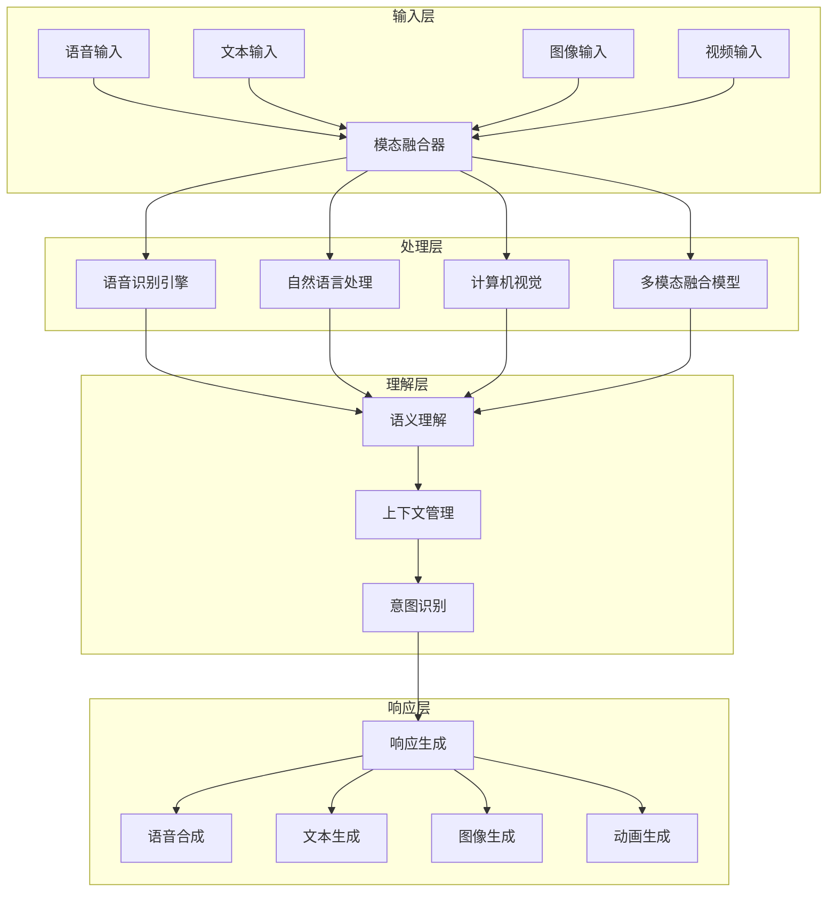

# 多模态 AI 集成指南

## 📋 概述

多模态 AI 集成是构建沉浸式 AI 世界的关键技术，通过融合文本、语音、图像、视频等多种感知模态，为用户提供更自然、更丰富的交互体验。本指南涵盖从基础架构到高级应用的完整技术栈。

### 🎯 核心价值

- **自然交互**: 接近人类的多模态交流方式
- **丰富体验**: 结合视觉、听觉、触觉等多重感官
- **智能理解**: 跨模态的信息融合与理解
- **个性化**: 基于用户偏好和行为模式的自适应

## 🏗️ 技术架构

### 1. 多模态系统架构



### 2. 核心组件设计

#### 2.1 模态管理器 (ModalManager)

```gdscript
# script/ai/multimodal/ModalManager.gd
class_name ModalManager
extends Node

signal modality_received(modality: String, data: Dictionary)
signal fusion_completed(result: Dictionary)

enum ModalityType {
    TEXT,
    VOICE,
    IMAGE,
    VIDEO,
    GESTURE,
    EMOTION
}

var active_modalities: Array[ModalityType] = []
var fusion_model: MultimodalFusion
var context_manager: ContextManager

func _ready():
    fusion_model = MultimodalFusion.new()
    context_manager = ContextManager.new()
    add_child(fusion_model)
    add_child(context_manager)

func receive_modality_input(modality: ModalityType, data: Dictionary):
    """接收多模态输入"""
    var processed_data = _preprocess_modality(modality, data)
    active_modalities.append(modality)
    modality_received.emit(ModalityType.keys()[modality], processed_data)

    # 检查是否可以开始融合
    if _can_start_fusion():
        _start_fusion_process()

func _preprocess_modality(modality: ModalityType, data: Dictionary) -> Dictionary:
    """预处理模态数据"""
    match modality:
        ModalityType.VOICE:
            return _process_voice_input(data)
        ModalityType.IMAGE:
            return _process_image_input(data)
        ModalityType.TEXT:
            return _process_text_input(data)
        _:
            return data

func _start_fusion_process():
    """启动多模态融合过程"""
    var fusion_data = {
        "modalities": active_modalities,
        "context": context_manager.get_current_context(),
        "timestamp": Time.get_unix_time_from_system()
    }

    var result = await fusion_model.fuse_modalities(fusion_data)
    fusion_completed.emit(result)

    # 清理活跃模态
    active_modalities.clear()
```

#### 2.2 语音处理系统

```gdscript
# script/ai/multimodal/VoiceProcessor.gd
class_name VoiceProcessor
extends Node

signal speech_recognized(text: String, confidence: float)
signal emotion_detected(emotions: Dictionary)
signal voice_synthesized(audio: AudioStream)

var whisper_api: WhisperAPI
var emotion_detector: EmotionDetector
var tts_engine: TextToSpeech

func _ready():
    whisper_api = WhisperAPI.new()
    emotion_detector = EmotionDetector.new()
    tts_engine = TextToSpeech.new()

func recognize_speech(audio_data: PackedByteArray) -> String:
    """语音识别"""
    var result = await whisper_api.transcribe(audio_data)

    # 情感分析
    var emotions = await emotion_detector.analyze_emotion(audio_data)
    emotion_detected.emit(emotions)

    speech_recognized.emit(result.text, result.confidence)
    return result.text

func synthesize_speech(text: String, voice_profile: Dictionary = {}) -> AudioStream:
    """语音合成"""
    var audio = await tts_engine.generate(text, voice_profile)
    voice_synthesized.emit(audio)
    return audio
```

#### 2.3 视觉理解系统

```gdscript
# script/ai/multimodal/VisionProcessor.gd
class_name VisionProcessor
extends Node

signal objects_detected(objects: Array)
signal scene_understood(description: String)
signal facial_emotions(emotions: Dictionary)

var vision_model: VisionModel
var object_detector: ObjectDetector
var face_analyzer: FaceAnalyzer

func analyze_image(image: Image) -> Dictionary:
    """图像分析"""
    var results = {}

    # 物体检测
    var objects = await object_detector.detect(image)
    results.objects = objects
    objects_detected.emit(objects)

    # 场景理解
    var scene_desc = await vision_model.describe_scene(image)
    results.scene_description = scene_desc
    scene_understood.emit(scene_desc)

    # 面部表情分析
    if _has_faces(image):
        var emotions = await face_analyzer.analyze_emotions(image)
        results.facial_emotions = emotions
        facial_emotions.emit(emotions)

    return results
```

## 🔧 实现技术栈

### 1. 语音技术

#### 1.1 语音识别 (ASR)

**OpenAI Whisper API**:
```python
# python/services/whisper_service.py
import openai
import asyncio
from typing import Dict, Optional

class WhisperService:
    def __init__(self, api_key: str):
        openai.api_key = api_key
        self.model = "whisper-1"

    async def transcribe(self, audio_data: bytes, language: str = "zh") -> Dict:
        """语音转文字"""
        try:
            import io
            from pydub import AudioSegment

            # 转换音频格式
            audio = AudioSegment.from_file(io.BytesIO(audio_data))
            audio.export("temp.wav", format="wav")

            with open("temp.wav", "rb") as audio_file:
                transcript = await openai.Audio.atranscribe(
                    model=self.model,
                    file=audio_file,
                    language=language,
                    response_format="verbose_json"
                )

            return {
                "text": transcript.text,
                "confidence": self._calculate_confidence(transcript),
                "duration": transcript.duration,
                "language": transcript.language
            }
        except Exception as e:
            return {"error": str(e)}
```

**本地 Whisper 模型**:
```python
# python/services/local_whisper.py
import whisper
import torch
import numpy as np
from typing import Dict

class LocalWhisperService:
    def __init__(self, model_size: str = "base"):
        self.model = whisper.load_model(model_size)
        self.device = "cuda" if torch.cuda.is_available() else "cpu"

    def transcribe(self, audio_data: np.ndarray, language: str = None) -> Dict:
        """本地语音识别"""
        result = self.model.transcribe(
            audio_data,
            language=language,
            fp16=False if self.device == "cpu" else True
        )

        return {
            "text": result["text"],
            "segments": result["segments"],
            "language": result["language"],
            "confidence": self._calculate_confidence(result)
        }
```

#### 1.2 语音合成 (TTS)

**OpenAI TTS API**:
```python
# python/services/tts_service.py
import openai
import asyncio
from typing import Dict, Optional

class TTSService:
    def __init__(self, api_key: str):
        openai.api_key = api_key
        self.model = "tts-1"
        self.voice = "alloy"

    async def synthesize(self, text: str, voice: str = None, speed: float = 1.0) -> bytes:
        """文字转语音"""
        try:
            response = await openai.Audio.aspeech(
                model=self.model,
                input=text,
                voice=voice or self.voice,
                speed=speed,
                response_format="mp3"
            )

            return response.content
        except Exception as e:
            print(f"TTS Error: {e}")
            return b""

    async def synthesize_with_emotion(self, text: str, emotion: str) -> bytes:
        """带情感的语音合成"""
        emotion_adjustments = {
            "happy": {"speed": 1.1, "voice": "nova"},
            "sad": {"speed": 0.9, "voice": "echo"},
            "angry": {"speed": 1.2, "voice": "onyx"},
            "calm": {"speed": 1.0, "voice": "shimmer"}
        }

        settings = emotion_adjustments.get(emotion, {"speed": 1.0, "voice": self.voice})
        return await self.synthesize(text, settings["voice"], settings["speed"])
```

**本地 TTS (Coqui TTS)**:
```python
# python/services/local_tts.py
from TTS.api import TTS
import torch
import io

class LocalTTSService:
    def __init__(self):
        self.model = TTS(model_name="tts_models/multilingual/multi-dataset/xtts_v2")
        self.device = "cuda" if torch.cuda.is_available() else "cpu"

    def synthesize(self, text: str, speaker_wav: str = None, language: str = "zh") -> bytes:
        """本地语音合成"""
        try:
            # 生成音频
            wav = self.model.tts(
                text=text,
                speaker_wav=speaker_wav or "default_speaker.wav",
                language=language
            )

            # 转换为字节流
            buffer = io.BytesIO()
            self.model.synthesizer.save_wav(wav, buffer)
            return buffer.getvalue()

        except Exception as e:
            print(f"Local TTS Error: {e}")
            return b""
```

### 2. 计算机视觉

#### 2.1 物体检测与识别

**YOLO 模型集成**:
```python
# python/services/vision_service.py
import cv2
import numpy as np
from ultralytics import YOLO
from typing import List, Dict

class VisionService:
    def __init__(self):
        self.yolo_model = YOLO('yolov8n.pt')
        self.scene_classifier = self._load_scene_model()

    def detect_objects(self, image: np.ndarray) -> List[Dict]:
        """物体检测"""
        results = self.yolo_model(image)

        objects = []
        for result in results:
            boxes = result.boxes
            for box in boxes:
                obj = {
                    "class": int(box.cls),
                    "name": self.yolo_model.names[int(box.cls)],
                    "confidence": float(box.conf),
                    "bbox": box.xyxy[0].tolist(),
                    "center": self._calculate_center(box.xyxy[0])
                }
                objects.append(obj)

        return objects

    def understand_scene(self, image: np.ndarray) -> str:
        """场景理解"""
        # 检测物体
        objects = self.detect_objects(image)

        # 生成场景描述
        scene_desc = f"场景中包含: {', '.join([obj['name'] for obj in objects[:5]])}"

        # 分析环境类型
        env_type = self._classify_environment(objects)
        scene_desc += f"。这是一个{env_type}环境。"

        return scene_desc

    def _classify_environment(self, objects: List[Dict]) -> str:
        """环境分类"""
        indoor_objects = {"chair", "table", "bed", "sofa", "computer", "monitor"}
        outdoor_objects = {"car", "tree", "building", "road", "sky"}

        indoor_count = sum(1 for obj in objects if obj["name"] in indoor_objects)
        outdoor_count = sum(1 for obj in objects if obj["name"] in outdoor_objects)

        if indoor_count > outdoor_count:
            return "室内"
        elif outdoor_count > indoor_count:
            return "室外"
        else:
            return "混合"
```

#### 2.2 面部表情分析

```python
# python/services/face_analysis.py
import cv2
import numpy as np
from deepface import DeepFace
from typing import Dict, List

class FaceAnalysisService:
    def __init__(self):
        self.face_detector = cv2.CascadeClassifier(cv2.data.haarcascades + 'haarcascade_frontalface_default.xml')

    def analyze_emotions(self, image: np.ndarray) -> Dict:
        """面部表情分析"""
        try:
            # 转换为RGB
            rgb_image = cv2.cvtColor(image, cv2.COLOR_BGR2RGB)

            # 情感分析
            analysis = DeepFace.analyze(
                rgb_image,
                actions=['emotion'],
                enforce_detection=False
            )

            if isinstance(analysis, list):
                analysis = analysis[0]

            emotions = analysis['emotion']
            dominant_emotion = max(emotions, key=emotions.get)

            return {
                "dominant_emotion": dominant_emotion,
                "emotions": emotions,
                "confidence": emotions[dominant_emotion],
                "face_region": analysis.get('region', {})
            }

        except Exception as e:
            print(f"Face analysis error: {e}")
            return {"error": str(e)}

    def detect_faces(self, image: np.ndarray) -> List[Dict]:
        """人脸检测"""
        gray = cv2.cvtColor(image, cv2.COLOR_BGR2GRAY)
        faces = self.face_detector.detectMultiScale(gray, 1.1, 4)

        face_list = []
        for (x, y, w, h) in faces:
            face_list.append({
                "position": {"x": int(x), "y": int(y)},
                "size": {"width": int(w), "height": int(h)},
                "center": {"x": int(x + w/2), "y": int(y + h/2)}
            })

        return face_list
```

### 3. 多模态融合

#### 3.1 跨模态注意力机制

```python
# python/services/multimodal_fusion.py
import torch
import torch.nn as nn
from transformers import AutoTokenizer, AutoModel
from typing import Dict, List

class MultimodalFusionModel(nn.Module):
    def __init__(self):
        super().__init__()
        self.text_encoder = AutoModel.from_pretrained('bert-base-chinese')
        self.visual_encoder = VisualEncoder()
        self.audio_encoder = AudioEncoder()

        # 跨模态注意力
        self.cross_attention = CrossModalAttention()
        self.fusion_layer = FusionLayer()

    def forward(self, inputs: Dict) -> torch.Tensor:
        # 编码各模态
        text_features = self.text_encoder(**inputs['text'])
        visual_features = self.visual_encoder(inputs['image'])
        audio_features = self.audio_encoder(inputs['audio'])

        # 跨模态注意力融合
        fused_features = self.cross_attention(
            text_features.last_hidden_state,
            visual_features,
            audio_features
        )

        # 最终融合
        output = self.fusion_layer(fused_features)
        return output

class CrossModalAttention(nn.Module):
    def __init__(self, hidden_size: int = 768):
        super().__init__()
        self.attention = nn.MultiheadAttention(hidden_size, num_heads=8)
        self.norm = nn.LayerNorm(hidden_size)

    def forward(self, text_feat, visual_feat, audio_feat):
        # 拼接多模态特征
        all_features = torch.cat([text_feat, visual_feat, audio_feat], dim=1)

        # 自注意力
        attended, _ = self.attention(all_features, all_features, all_features)

        # 残差连接和归一化
        output = self.norm(attended + all_features)
        return output
```

#### 3.2 上下文感知融合

```python
# python/services/context_aware_fusion.py
from typing import Dict, List, Any
import numpy as np

class ContextAwareFusion:
    def __init__(self):
        self.context_memory = []
        self.context_window = 5  # 保持最近5轮对话的上下文

    def fuse_with_context(self, current_inputs: Dict, context_history: List[Dict] = None) -> Dict:
        """基于上下文的多模态融合"""
        context_history = context_history or self.context_memory

        # 提取当前输入特征
        current_features = self._extract_features(current_inputs)

        # 获取上下文特征
        context_features = self._get_context_features(context_history)

        # 计算上下文相关性
        context_weights = self._calculate_context_relevance(
            current_features, context_features
        )

        # 加权融合
        fused_result = self._weighted_fusion(
            current_features, context_features, context_weights
        )

        # 更新上下文记忆
        self._update_context_memory(current_inputs)

        return fused_result

    def _calculate_context_relevance(self, current_feat, context_feat) -> np.ndarray:
        """计算上下文相关性权重"""
        similarities = []

        for ctx_feat in context_feat:
            # 计算余弦相似度
            similarity = np.dot(current_feat, ctx_feat) / (
                np.linalg.norm(current_feat) * np.linalg.norm(ctx_feat)
            )
            similarities.append(similarity)

        # 转换为权重
        weights = np.array(similarities)
        weights = np.exp(weights) / np.sum(np.exp(weights))  # softmax

        return weights
```

## 🎮 AI 世界中的集成应用

### 1. 智能角色交互

```gdscript
# script/characters/MultimodalCharacter.gd
extends CharacterPersonality

class_name MultimodalCharacter
var multimodal_manager: MultimodalManager
var emotion_engine: EmotionEngine
var gesture_system: GestureSystem

func _ready():
    super._ready()
    multimodal_manager = MultimodalManager.new()
    emotion_engine = EmotionEngine.new()
    gesture_system = GestureSystem.new()

    add_child(multimodal_manager)
    add_child(emotion_engine)
    add_child(gesture_system)

    # 连接信号
    multimodal_manager.fusion_completed.connect(_on_multimodal_input)

func process_user_input(input_data: Dictionary):
    """处理用户多模态输入"""
    # 文本输入
    if input_data.has("text"):
        multimodal_manager.receive_modality_input(
            ModalManager.ModalityType.TEXT,
            {"content": input_data["text"]}
        )

    # 语音输入
    if input_data.has("audio"):
        multimodal_manager.receive_modality_input(
            ModalManager.ModalityType.VOICE,
            {"audio_data": input_data["audio"]}
        )

    # 视觉输入（用户表情、手势）
    if input_data.has("video"):
        multimodal_manager.receive_modality_input(
            ModalManager.ModalityType.VIDEO,
            {"video_frame": input_data["video"]}
        )

func _on_multimodal_input(fusion_result: Dictionary):
    """处理多模态融合结果"""
    var intent = fusion_result["intent"]
    var emotion = fusion_result["emotion"]
    var content = fusion_result["content"]

    # 更新角色情感状态
    emotion_engine.update_emotion_state(emotion)

    # 生成响应
    var response = await _generate_multimodal_response(intent, content, emotion)

    # 执行响应
    await _execute_response(response)

func _generate_multimodal_response(intent: String, content: String, emotion: Dictionary) -> Dictionary:
    """生成多模态响应"""
    var response = {}

    # 文本响应
    response["text"] = await _generate_text_response(intent, content, emotion)

    # 语音响应
    response["audio"] = await emotion_engine.synthesize_emotional_speech(
        response["text"], emotion
    )

    # 表情和动画
    response["expression"] = emotion_engine.get_facial_expression(emotion)
    response["gesture"] = gesture_system.generate_appropriate_gesture(intent, emotion)

    return response

func _execute_response(response: Dictionary):
    """执行多模态响应"""
    # 显示文本
    _show_dialogue_bubble(response["text"])

    # 播放语音
    _play_audio(response["audio"])

    # 更新表情
    _update_facial_expression(response["expression"])

    # 播放手势动画
    _play_gesture_animation(response["gesture"])
```

### 2. 环境感知与交互

```gdscript
# script/world/MultimodalEnvironment.gd
extends Node3D

class_name MultimodalEnvironment
var vision_processor: VisionProcessor
var audio_processor: AudioProcessor
var context_analyzer: ContextAnalyzer

func _ready():
    vision_processor = VisionProcessor.new()
    audio_processor = AudioProcessor.new()
    context_analyzer = ContextAnalyzer.new()

func analyze_environment_state() -> Dictionary:
    """分析环境状态"""
    var env_state = {}

    # 视觉分析
    var camera_view = _get_camera_view()
    env_state["visual"] = await vision_processor.analyze_scene(camera_view)

    # 音频分析
    var audio_data = _capture_environment_audio()
    env_state["audio"] = await audio_processor.analyze_sounds(audio_data)

    # 上下文理解
    env_state["context"] = context_analyzer.understand_context(env_state)

    return env_state

func adapt_to_environment(env_state: Dictionary):
    """根据环境状态调整世界"""
    # 根据光照调整场景
    if env_state["visual"]["lighting"]["brightness"] < 0.3:
        _enable_night_mode()

    # 根据声音调整背景音乐
    if env_state["audio"]["noise_level"] > 0.7:
        _reduce_background_music()

    # 根据用户表情调整NPC行为
    if env_state["visual"]["user_emotion"]["dominant"] == "sad":
        _encourage_npc_comfort_behavior()
```

### 3. 智能叙事系统

```gdscript
# script/narrative/MultimodalNarrative.gd
extends Node

class_name MultimodalNarrative
var story_generator: StoryGenerator
var scene_director: SceneDirector
var emotion_tracker: EmotionTracker

func generate_adaptive_story(user_state: Dictionary) -> Dictionary:
    """生成自适应叙事"""
    # 分析用户情感状态
    var emotion_profile = emotion_tracker.analyze_emotion_journey(user_state)

    # 生成故事情节
    var story_beat = await story_generator.generate_next_beat(
        emotion_profile,
        user_state["context"],
        user_state["history"]
    )

    # 导演场景
    var scene_direction = await scene_director.direct_scene(
        story_beat,
        user_state["preferences"],
        emotion_profile
    )

    return {
        "narrative": story_beat,
        "direction": scene_direction,
        "emotional_tone": emotion_profile["current_emotion"]
    }
```

## 📊 性能优化

### 1. 模型优化策略

```python
# python/optimization/model_optimizer.py
import torch
from transformers import AutoModel
import onnxruntime as ort

class ModelOptimizer:
    def __init__(self):
        self.optimized_models = {}

    def optimize_for_inference(self, model_name: str) -> Any:
        """为推理优化模型"""
        if model_name not in self.optimized_models:
            # 加载原始模型
            model = AutoModel.from_pretrained(model_name)

            # 量化模型
            quantized_model = torch.quantization.quantize_dynamic(
                model, {torch.nn.Linear}, dtype=torch.qint8
            )

            # 转换为ONNX
            self.optimized_models[model_name] = self._convert_to_onnx(quantized_model)

        return self.optimized_models[model_name]

    def _convert_to_onnx(self, model) -> ort.InferenceSession:
        """转换为ONNX格式"""
        # 创建示例输入
        dummy_input = torch.randint(0, 1000, (1, 128))

        # 导出ONNX
        torch.onnx.export(
            model,
            dummy_input,
            f"optimized_{model.name}.onnx",
            input_names=['input_ids'],
            output_names=['last_hidden_state'],
            dynamic_axes={
                'input_ids': {0: 'batch_size', 1: 'sequence_length'},
                'last_hidden_state': {0: 'batch_size', 1: 'sequence_length'}
            }
        )

        # 创建ONNX运行时会话
        session = ort.InferenceSession(f"optimized_{model.name}.onnx")
        return session
```

### 2. 缓存与批处理

```python
# python/optimization/cache_manager.py
import redis
import pickle
from typing import Any, Optional
import hashlib

class CacheManager:
    def __init__(self, redis_url: str = "redis://localhost:6379"):
        self.redis_client = redis.from_url(redis_url)
        self.cache_ttl = 3600  # 1小时

    def get_cached_result(self, input_hash: str) -> Optional[Any]:
        """获取缓存结果"""
        try:
            cached_data = self.redis_client.get(f"multimodal:{input_hash}")
            if cached_data:
                return pickle.loads(cached_data)
        except Exception as e:
            print(f"Cache get error: {e}")
        return None

    def cache_result(self, input_hash: str, result: Any):
        """缓存结果"""
        try:
            self.redis_client.setex(
                f"multimodal:{input_hash}",
                self.cache_ttl,
                pickle.dumps(result)
            )
        except Exception as e:
            print(f"Cache set error: {e}")

    def generate_input_hash(self, inputs: Dict) -> str:
        """生成输入哈希"""
        input_str = str(sorted(inputs.items()))
        return hashlib.md5(input_str.encode()).hexdigest()

class BatchProcessor:
    def __init__(self, batch_size: int = 8):
        self.batch_size = batch_size
        self.pending_requests = []

    async def add_request(self, request_data: Dict):
        """添加处理请求"""
        self.pending_requests.append(request_data)

        if len(self.pending_requests) >= self.batch_size:
            await self.process_batch()

    async def process_batch(self):
        """批量处理请求"""
        if not self.pending_requests:
            return

        batch = self.pending_requests.copy()
        self.pending_requests.clear()

        # 批量处理
        results = await self._process_batch_requests(batch)

        # 分发结果
        for request, result in zip(batch, results):
            request["callback"](result)
```

## 🔮 未来发展方向

### 1. 脑机接口集成

```python
# python/future/bci_integration.py
import numpy as np
from typing import Dict, List

class BCIInterface:
    def __init__(self):
        self.eeg_processor = EEGProcessor()
        self.thought_interpreter = ThoughtInterpreter()

    async def process_brain_signals(self, eeg_data: np.ndarray) -> Dict:
        """处理脑电信号"""
        # 预处理EEG数据
        processed_eeg = self.eeg_processor.preprocess(eeg_data)

        # 特征提取
        features = self.eeg_processor.extract_features(processed_eeg)

        # 意图识别
        intent = await self.thought_interpreter.interpret_intent(features)

        # 情感状态
        emotion = await self.thought_interpreter.detect_emotion(features)

        return {
            "intent": intent,
            "emotion": emotion,
            "confidence": self._calculate_confidence(features)
        }
```

### 2. 触觉反馈系统

```python
# python/future/haptic_feedback.py
from typing import Dict, Tuple
import numpy as np

class HapticFeedbackSystem:
    def __init__(self):
        self.haptic_devices = []
        self.feedback_patterns = {}

    def generate_haptic_pattern(self, emotion: Dict, interaction_type: str) -> Dict:
        """生成触觉反馈模式"""
        base_pattern = {
            "intensity": self._map_emotion_to_intensity(emotion),
            "frequency": self._map_emotion_to_frequency(emotion),
            "duration": self._calculate_duration(interaction_type),
            "waveform": self._select_waveform(emotion["dominant"])
        }

        return base_pattern

    def _map_emotion_to_intensity(self, emotion: Dict) -> float:
        """将情感映射到强度"""
        intensity_map = {
            "excited": 0.9,
            "happy": 0.7,
            "calm": 0.3,
            "sad": 0.2,
            "angry": 0.8
        }
        return intensity_map.get(emotion["dominant"], 0.5)
```

## 📝 最佳实践

### 1. 模态选择策略

```python
# python/best_practices/modality_selector.py
from typing import List, Dict

class ModalitySelector:
    def __init__(self):
        self.modality_weights = {
            "text": 0.4,
            "voice": 0.3,
            "visual": 0.2,
            "gesture": 0.1
        }

    def select_optimal_modalities(self, context: Dict, user_preferences: Dict) -> List[str]:
        """选择最优模态组合"""
        available_modalities = self._get_available_modalities()
        context_weights = self._calculate_context_weights(context)
        preference_weights = self._apply_user_preferences(user_preferences)

        # 综合权重计算
        final_weights = {}
        for modality in available_modalities:
            weight = (
                self.modality_weights.get(modality, 0) * 0.3 +
                context_weights.get(modality, 0) * 0.4 +
                preference_weights.get(modality, 0) * 0.3
            )
            final_weights[modality] = weight

        # 选择权重最高的模态
        selected = sorted(final_weights.items(), key=lambda x: x[1], reverse=True)[:3]
        return [modality for modality, _ in selected]
```

### 2. 错误处理与降级

```python
# python/best_practices/error_handling.py
from typing import Dict, Any
import logging

class MultimodalErrorHandler:
    def __init__(self):
        self.logger = logging.getLogger(__name__)
        self.fallback_strategies = {
            "vision": self._fallback_to_description,
            "audio": self._fallback_to_text,
            "emotion": self._fallback_to_neutral
        }

    async def handle_modality_failure(self, modality: str, error: Exception) -> Dict:
        """处理模态失败"""
        self.logger.error(f"Modality {modality} failed: {error}")

        # 执行降级策略
        fallback_result = await self.fallback_strategies.get(modality, self._default_fallback)()

        return {
            "status": "fallback",
            "modality": modality,
            "error": str(error),
            "fallback_result": fallback_result
        }

    async def _fallback_to_description(self) -> Dict:
        """视觉模态降级为文字描述"""
        return {
            "type": "text_description",
            "content": "抱歉，无法识别图像内容，请用语言描述您看到的内容。"
        }
```

---

**文档版本**: v1.0
**最后更新**: 2024-11-10
**维护者**: AI World 开发团队

这份多模态AI集成指南提供了从基础架构到前沿应用的完整技术栈，为构建沉浸式AI世界提供了坚实的技术基础。