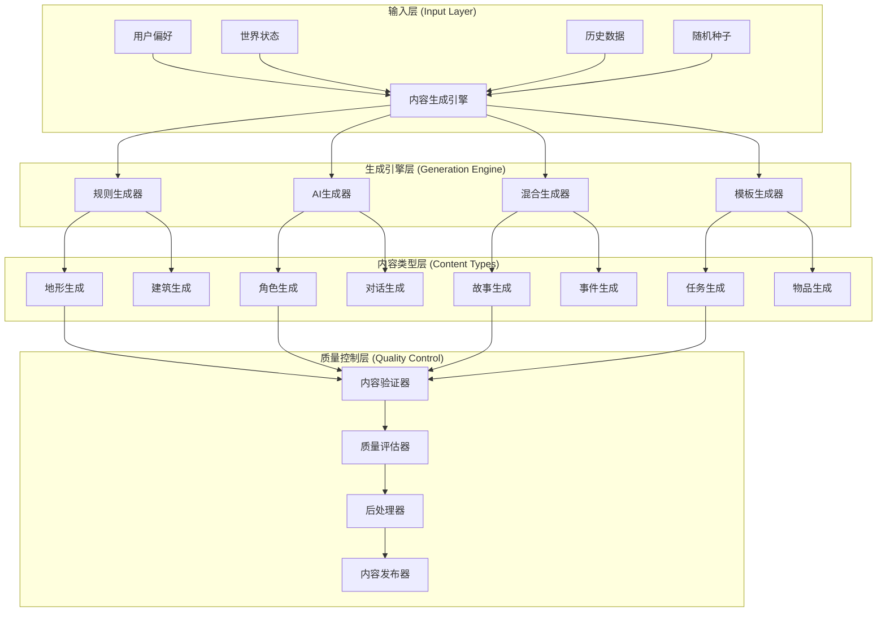

# 程序化内容生成系统

## 📋 概述

程序化内容生成（PCG）是构建动态、丰富AI世界的核心技术。本系统通过算法生成各种类型的内容，包括地形、建筑、角色、任务、对话、故事情节等，确保世界能够持续演进、保持新鲜感，并为每个用户提供独特的体验。

### 🎯 生成目标

- **动态演化**: 世界内容随时间持续变化和发展
- **个性化适配**: 根据用户偏好和行为生成定制内容
- **真实感**: 生成内容符合逻辑和现实规律
- **多样性**: 避免重复，保持内容的新鲜感
- **质量控制**: 确保生成内容的质量和可用性

## 🎨 内容生成架构

### 1. 生成系统架构



### 2. 核心系统实现

```gdscript
# script/generation/procedural_content_system.gd
extends Node

class_name ProceduralContentSystem
signal content_generated(content_type: String, content_id: String, content_data: Dictionary)
signal generation_failed(content_type: String, error: String)

enum ContentType {
    TERRAIN,        # 地形
    BUILDING,       # 建筑
    CHARACTER,      # 角色
    QUEST,          # 任务
    STORY,          # 故事
    DIALOGUE,       # 对话
    ITEM,           # 物品
    EVENT,          # 事件
    LOCATION,       # 地点
    MUSIC           # 音乐
}

enum GenerationMethod {
    RULE_BASED,     # 基于规则
    AI_ASSISTED,    # AI辅助
    TEMPLATE,       # 模板化
    HYBRID          # 混合方法
}

var content_generators: Dictionary = {}
var quality_controller: QualityController
var content_cache: ContentCache
var generation_history: GenerationHistory

func _ready():
    quality_controller = QualityController.new()
    content_cache = ContentCache.new()
    generation_history = GenerationHistory.new()

    add_child(quality_controller)
    add_child(content_cache)
    add_child(generation_history)

    _initialize_generators()

func _initialize_generators():
    """初始化内容生成器"""
    content_generators = {
        ContentType.TERRAIN: TerrainGenerator.new(),
        ContentType.BUILDING: BuildingGenerator.new(),
        ContentType.CHARACTER: CharacterGenerator.new(),
        ContentType.QUEST: QuestGenerator.new(),
        ContentType.STORY: StoryGenerator.new(),
        ContentType.DIALOGUE: DialogueGenerator.new(),
        ContentType.ITEM: ItemGenerator.new(),
        ContentType.EVENT: EventGenerator.new(),
        ContentType.LOCATION: LocationGenerator.new(),
        ContentType.MUSIC: MusicGenerator.new()
    }

    for generator in content_generators.values():
        add_child(generator)

func generate_content(content_type: ContentType, parameters: Dictionary = {},
                     method: GenerationMethod = GenerationMethod.HYBRID) -> Dictionary:
    """生成内容"""
    var content_id = _generate_content_id(content_type, parameters)

    # 检查缓存
    var cached_content = content_cache.get_content(content_id)
    if cached_content:
        return cached_content

    # 获取生成器
    var generator = content_generators.get(content_type)
    if not generator:
        generation_failed.emit(ContentType.keys()[content_type], "No generator available")
        return {"error": "No generator available"}

    # 生成内容
    var generation_request = GenerationRequest.new(
        content_id, content_type, parameters, method
    )

    var content_data = await generator.generate(generation_request)

    if content_data.has("error"):
        generation_failed.emit(ContentType.keys()[content_type], content_data["error"])
        return content_data

    # 质量控制
    var quality_result = quality_controller.validate_content(content_type, content_data)
    if not quality_result["passed"]:
        # 尝试重新生成
        content_data = await generator.generate(generation_request)
        quality_result = quality_controller.validate_content(content_type, content_data)

        if not quality_result["passed"]:
            generation_failed.emit(ContentType.keys()[content_type], "Quality check failed")
            return {"error": "Quality check failed", "quality_issues": quality_result["issues"]}

    # 后处理
    content_data = await _post_process_content(content_type, content_data)

    # 缓存内容
    content_cache.store_content(content_id, content_data)

    # 记录历史
    generation_history.record_generation(content_id, content_type, parameters, content_data)

    content_generated.emit(ContentType.keys()[content_type], content_id, content_data)

    return {
        "content_id": content_id,
        "content_type": ContentType.keys()[content_type],
        "content_data": content_data,
        "generation_method": GenerationMethod.keys()[method],
        "quality_score": quality_result["score"],
        "timestamp": Time.get_unix_time_from_system()
    }

func _generate_content_id(content_type: ContentType, parameters: Dictionary) -> String:
    """生成内容ID"""
    var id_string = ContentType.keys()[content_type]
    for key in parameters.keys():
        id_string += "_" + key + "_" + str(parameters[key])

    # 添加随机种子确保唯一性
    id_string += "_" + str(randi() % 1000000)

    return id_string.hash()

func _post_process_content(content_type: ContentType, content_data: Dictionary) -> Dictionary:
    """后处理生成的内容"""
    match content_type:
        ContentType.TERRAIN:
            return _post_process_terrain(content_data)
        ContentType.BUILDING:
            return _post_process_building(content_data)
        ContentType.CHARACTER:
            return _post_process_character(content_data)
        ContentType.QUEST:
            return _post_process_quest(content_data)
        _:
            return content_data

# 内容生成请求类
class GenerationRequest extends RefCounted:
    var content_id: String
    var content_type: ProceduralContentSystem.ContentType
    var parameters: Dictionary
    var method: ProceduralContentSystem.GenerationMethod
    var user_context: Dictionary
    var world_state: Dictionary

    func _init(cid: String, ct: ProceduralContentSystem.ContentType,
               params: Dictionary, m: ProceduralContentSystem.GenerationMethod):
        content_id = cid
        content_type = ct
        parameters = params
        method = m
        user_context = {}
        world_state = {}

# 基础生成器抽象类
class BaseGenerator extends Node:
    var generation_rules: Dictionary = {}
    var ai_integration: AIIntegration

    func _ready():
        ai_integration = AIIntegration.new()
        add_child(ai_integration)

    # 子类必须实现的方法
    func generate(request: GenerationRequest) -> Dictionary:
        push_error("generate() method must be implemented by subclass")
        return {"error": "Not implemented"}

    # 通用辅助方法
    func _apply_generation_rules(content_data: Dictionary, parameters: Dictionary) -> Dictionary:
        """应用生成规则"""
        for rule_name in generation_rules:
            var rule = generation_rules[rule_name]
            if rule["condition"].call(parameters):
                content_data = rule["action"].call(content_data, parameters)
        return content_data

    func _use_ai_assistance(content_type: String, parameters: Dictionary) -> Dictionary:
        """使用AI辅助生成"""
        return await ai_integration.generate_content(content_type, parameters)
```

## 🏗️ 地形与环境生成

### 1. 地形生成器

```gdscript
# script/generation/terrain_generator.gd
extends BaseGenerator

class_name TerrainGenerator

enum TerrainType {
    MOUNTAINS,      # 山地
    PLAINS,         # 平原
    FOREST,         # 森林
    DESERT,         # 沙漠
    OCEAN,          # 海洋
    RIVER,          # 河流
    LAKES,          # 湖泊
    ISLANDS         # 岛屿
}

func _ready():
    super._ready()
    _initialize_terrain_rules()

func _initialize_terrain_rules():
    """初始化地形生成规则"""
    generation_rules = {
        "elevation_consistency": {
            "condition": func(params): return true,
            "action": _apply_elevation_smoothing
        },
        "climate_appropriateness": {
            "condition": func(params): return params.has("climate"),
            "action": _adjust_terrain_for_climate
        },
        "realistic_water_flow": {
            "condition": func(params): return true,
            "action": _generate_realistic_water_flow
        }
    }

func generate(request: GenerationRequest) -> Dictionary:
    """生成地形"""
    var parameters = request.parameters
    var size = parameters.get("size", Vector2(512, 512))
    var terrain_type = parameters.get("type", TerrainType.PLAINS)
    var seed_value = parameters.get("seed", randi())

    # 设置随机种子
    seed(seed_value)

    # 生成高度图
    var height_map = _generate_height_map(size, terrain_type, parameters)

    # 生成生物群系
    var biome_map = _generate_biome_map(height_map, parameters)

    # 生成水体
    var water_data = _generate_water_features(height_map, parameters)

    # 生成植被分布
    var vegetation_map = _generate_vegetation_map(biome_map, parameters)

    # 构建地形数据
    var terrain_data = {
        "height_map": height_map,
        "biome_map": biome_map,
        "water_data": water_data,
        "vegetation_map": vegetation_map,
        "size": size,
        "terrain_type": terrain_type,
        "metadata": {
            "generation_seed": seed_value,
            "elevation_range": _calculate_elevation_range(height_map),
            "biome_distribution": _calculate_biome_distribution(biome_map)
        }
    }

    # 应用规则
    terrain_data = _apply_generation_rules(terrain_data, parameters)

    return terrain_data

func _generate_height_map(size: Vector2, terrain_type: TerrainType, parameters: Dictionary) -> PackedFloat32Array:
    """生成高度图"""
    var width = int(size.x)
    var height = int(size.y)
    var height_map = PackedFloat32Array()
    height_map.resize(width * height)

    match terrain_type:
        TerrainType.MOUNTAINS:
            _generate_mountain_terrain(height_map, width, height, parameters)
        TerrainType.PLAINS:
            _generate_plain_terrain(height_map, width, height, parameters)
        TerrainType.FOREST:
            _generate_forest_terrain(height_map, width, height, parameters)
        TerrainType.DESERT:
            _generate_desert_terrain(height_map, width, height, parameters)
        _:
            _generate_default_terrain(height_map, width, height, parameters)

    return height_map

func _generate_mountain_terrain(height_map: PackedFloat32Array, width: int, height: int, params: Dictionary):
    """生成山地地形"""
    var octaves = params.get("octaves", 6)
    var persistence = params.get("persistence", 0.5)
    var scale = params.get("scale", 100.0)

    # 使用多层噪声生成山地
    for y in range(height):
        for x in range(width):
            var elevation = 0.0
            var amplitude = 1.0
            var frequency = 1.0 / scale

            for octave in range(octaves):
                elevation += _noise_2d(x * frequency, y * frequency) * amplitude
                amplitude *= persistence
                frequency *= 2.0

            # 增强山地特征
            elevation = _enhance_mountain_features(elevation, x, y, width, height)

            # 归一化到0-1范围
            elevation = (elevation + 1.0) * 0.5
            elevation = pow(elevation, 1.5)  # 增加对比度

            height_map[y * width + x] = elevation

func _noise_2d(x: float, y: float) -> float:
    """2D噪声函数"""
    # 简化的Perlin噪声实现
    var xi = int(floor(x))
    var yi = int(floor(y))
    var xf = x - xi
    var yf = y - yi

    # 计算梯度
    var n00 = _gradient(xi, yi)
    var n10 = _gradient(xi + 1, yi)
    var n01 = _gradient(xi, yi + 1)
    var n11 = _gradient(xi + 1, yi + 1)

    # 插值
    var u = _fade(xf)
    var v = _fade(yf)

    var nx0 = _lerp(n00, n10, u)
    var nx1 = _lerp(n01, n11, u)
    var value = _lerp(nx0, nx1, v)

    return value

func _gradient(x: int, y: int) -> float:
    """梯度函数"""
    var n = x * 374761393 + y * 668265263
    n = (n << 13) ^ n
    return (1.0 - ((n * (n * n * 15731 + 789221) + 1376312589) & 0x7fffffff) / 1073741824.0)

func _fade(t: float) -> float:
    """淡入淡出函数"""
    return t * t * t * (t * (t * 6.0 - 15.0) + 10.0)

func _lerp(a: float, b: float, t: float) -> float:
    """线性插值"""
    return a + t * (b - a)

func _enhance_mountain_features(elevation: float, x: int, y: int, width: int, height: int) -> float:
    """增强山地特征"""
    # 添加山脊
    var ridge_factor = sin(x * 0.02) * cos(y * 0.03)
    elevation += ridge_factor * 0.3

    # 添加山谷
    var valley_factor = -pow((x - width/2) * (y - height/2) / (width * height), 2)
    elevation += valley_factor * 0.2

    return elevation

func _generate_biome_map(height_map: PackedFloat32Array, parameters: Dictionary) -> PackedByteArray:
    """生成生物群系地图"""
    var width = int(parameters.get("size", Vector2(512, 512)).x)
    var height = int(parameters.get("size", Vector2(512, 512)).y)
    var biome_map = PackedByteArray()
    biome_map.resize(width * height)

    var moisture_map = _generate_moisture_map(width, height, parameters)
    var temperature_map = _generate_temperature_map(width, height, parameters)

    for y in range(height):
        for x in range(width):
            var index = y * width + x
            var elevation = height_map[index]
            var moisture = moisture_map[index]
            var temperature = temperature_map[index]

            var biome = _determine_biome(elevation, moisture, temperature)
            biome_map[index] = biome

    return biome_map

func _determine_biome(elevation: float, moisture: float, temperature: float) -> int:
    """根据环境参数确定生物群系"""
    # 生物群系枚举
    enum Biome {
        OCEAN,           # 海洋
        BEACH,           # 海滩
        PLAINS,          # 平原
        FOREST,          # 森林
        DESERT,          # 沙漠
        TUNDRA,          # 苔原
        MOUNTAINS,       # 山地
        SWAMP,           # 沼泽
        RIVER            # 河流
    }

    if elevation < 0.3:
        return Biome.OCEAN
    elif elevation < 0.35:
        return Biome.BEACH
    elif elevation > 0.8:
        return Biome.MOUNTAINS
    elif temperature < 0.3:
        return Biome.TUNDRA
    elif moisture < 0.3:
        return Biome.DESERT
    elif moisture > 0.7 and elevation < 0.6:
        return Biome.SWAMP
    elif moisture > 0.5:
        return Biome.FOREST
    else:
        return Biome.PLAINS
```

### 2. 建筑生成器

```gdscript
# script/generation/building_generator.gd
extends BaseGenerator

class_name BuildingGenerator

enum BuildingType {
    RESIDENTIAL,     # 住宅
    COMMERCIAL,      # 商业
    INDUSTRIAL,      # 工业
    PUBLIC,          # 公共建筑
    ENTERTAINMENT,   # 娱乐建筑
    RELIGIOUS,       # 宗教建筑
    EDUCATIONAL,     # 教育建筑
    MEDICAL          # 医疗建筑
}

enum ArchitecturalStyle {
    MODERN,          # 现代风格
    CLASSICAL,       # 古典风格
    TRADITIONAL,     # 传统风格
    FUTURISTIC,      # 未来风格
    RUSTIC,          # 乡村风格
    MINIMALIST       # 极简风格
}

func generate(request: GenerationRequest) -> Dictionary:
    """生成建筑"""
    var parameters = request.parameters
    var building_type = parameters.get("type", BuildingType.RESIDENTIAL)
    var style = parameters.get("style", ArchitecturalStyle.MODERN)
    var size = parameters.get("size", Vector3(10, 8, 10))
    var location = parameters.get("location", Vector3.ZERO)

    # 生成建筑基础结构
    var foundation = _generate_foundation(size, location, parameters)

    # 生成楼层
    var floors = _generate_floors(building_type, style, size, parameters)

    # 生成屋顶
    var roof = _generate_roof(building_type, style, size, parameters)

    # 生成外墙
    var exterior = _generate_exterior(building_type, style, size, parameters)

    # 生成内部结构
    var interior = _generate_interior(building_type, size, parameters)

    # 生成装饰细节
    var decorations = _generate_decorations(building_type, style, parameters)

    var building_data = {
        "building_type": building_type,
        "architectural_style": style,
        "size": size,
        "location": location,
        "foundation": foundation,
        "floors": floors,
        "roof": roof,
        "exterior": exterior,
        "interior": interior,
        "decorations": decorations,
        "metadata": {
            "total_area": size.x * size.z,
            "floor_count": floors.size(),
            "room_count": _calculate_room_count(interior),
            "complexity_score": _calculate_complexity_score(floors, exterior, decorations)
        }
    }

    # 应用建筑规则
    building_data = _apply_generation_rules(building_data, parameters)

    return building_data

func _generate_floors(building_type: BuildingType, style: ArchitecturalStyle,
                     size: Vector3, parameters: Dictionary) -> Array[Dictionary]:
    """生成楼层"""
    var floors = []
    var floor_count = parameters.get("floor_count", _calculate_default_floors(building_type, size))

    for floor_index in range(floor_count):
        var floor_y = floor_index * size.y / floor_count
        var floor_data = {
            "floor_index": floor_index,
            "height": size.y / floor_count,
            "base_elevation": floor_y,
            "layout": _generate_floor_layout(building_type, floor_index, size, parameters),
            "windows": _generate_floor_windows(style, floor_index, size, parameters),
            "doors": _generate_floor_doors(building_type, floor_index, size, parameters),
            "balconies": _generate_balconies(building_type, floor_index, size, parameters)
        }
        floors.append(floor_data)

    return floors

func _generate_floor_layout(building_type: BuildingType, floor_index: int,
                           size: Vector3, parameters: Dictionary) -> Dictionary:
    """生成楼层平面布局"""
    var layout = {
        "rooms": [],
        "corridors": [],
        "stairs": null,
        "elevator": null
    }

    match building_type:
        BuildingType.RESIDENTIAL:
            layout = _generate_residential_layout(floor_index, size, parameters)
        BuildingType.COMMERCIAL:
            layout = _generate_commercial_layout(floor_index, size, parameters)
        BuildingType.PUBLIC:
            layout = _generate_public_layout(floor_index, size, parameters)
        _:
            layout = _generate_generic_layout(floor_index, size, parameters)

    return layout

func _generate_residential_layout(floor_index: int, size: Vector3, params: Dictionary) -> Dictionary:
    """生成住宅平面布局"""
    var layout = {
        "rooms": [],
        "corridors": [],
        "stairs": null,
        "elevator": null
    }

    var room_count = params.get("room_count", 3)
    var min_room_size = Vector2(3, 3)
    var max_room_size = Vector2(size.x * 0.6, size.z * 0.6)

    # 生成主要房间
    var room_types = ["living_room", "bedroom", "kitchen", "bathroom"]
    var used_area = 0.0
    var total_area = size.x * size.z

    for i in range(min(room_count, room_types.size())):
        var room_type = room_types[i]
        var room_size = Vector2(
            randf_range(min_room_size.x, max_room_size.x),
            randf_range(min_room_size.y, max_room_size.y)
        )
        var room_position = _find_room_position(room_size, layout["rooms"], size)

        var room = {
            "type": room_type,
            "size": room_size,
            "position": room_position,
            "area": room_size.x * room_size.y,
            "windows": _generate_room_windows(room_type, room_size, params)
        }

        layout["rooms"].append(room)
        used_area += room["area"]

    # 生成走廊连接房间
    if layout["rooms"].size() > 1:
        layout["corridors"] = _generate_corridors(layout["rooms"], size)

    # 添加楼梯（如果是多层）
    if floor_index > 0:
        layout["stairs"] = _generate_stairs(size, params)

    return layout

func _find_room_position(room_size: Vector2, existing_rooms: Array, building_size: Vector3) -> Vector2:
    """为新房间找到合适的位置"""
    var max_attempts = 50
    var margin = 1.0  # 房间间距

    for attempt in range(max_attempts):
        var position = Vector2(
            randf_range(margin, building_size.x - room_size.x - margin),
            randf_range(margin, building_size.z - room_size.y - margin)
        )

        # 检查是否与现有房间重叠
        var overlaps = false
        for existing_room in existing_rooms:
            if _rooms_overlap(position, room_size, existing_room["position"], existing_room["size"]):
                overlaps = true
                break

        if not overlaps:
            return position

    # 如果找不到合适位置，返回默认位置
    return Vector2(margin, margin)

func _rooms_overlap(pos1: Vector2, size1: Vector2, pos2: Vector2, size2: Vector2) -> bool:
    """检查两个房间是否重叠"""
    return not (pos1.x + size1.x <= pos2.x or pos2.x + size2.x <= pos1.x or
                pos1.y + size1.y <= pos2.y or pos2.y + size2.y <= pos1.y)
```

## 🎭 角色生成系统

### 1. AI角色生成器

```gdscript
# script/generation/character_generator.gd
extends BaseGenerator

class_name CharacterGenerator

enum CharacterRole {
    PROTAGONIST,    # 主角
    ANTAGONIST,     # 反派
    MENTOR,         # 导师
    COMPANION,      # 伙伴
    MERCHANT,       # 商人
    GUARD,          # 守卫
    VILLAGER,       # 村民
    EXPLORER,       # 探索者
    SCHOLAR,        # 学者
    ARTIST          # 艺术家
}

enum PersonalityTrait {
    BRAVE,          # 勇敢
    CAUTIOUS,       # 谨慎
    FRIENDLY,       # 友善
    HOSTILE,        # 敌对
    CURIOUS,        # 好奇
    INTELLIGENT,    # 聪明
    WISE,           # 智慧
    NAIVE,          # 天真
    AMBITIOUS,      # 野心
    HUMBLE          # 谦逊
}

func generate(request: GenerationRequest) -> Dictionary:
    """生成角色"""
    var parameters = request.parameters
    var character_role = parameters.get("role", CharacterRole.VILLAGER)
    var world_context = parameters.get("world_context", {})
    var user_preferences = parameters.get("user_preferences", {})

    # 生成基础身份信息
    var identity = await _generate_identity(character_role, world_context, user_preferences)

    # 生成性格特征
    var personality = _generate_personality(character_role, identity, parameters)

    # 生成外观
    var appearance = _generate_appearance(identity, personality, parameters)

    # 生成背景故事
    var background = await _generate_background_story(identity, personality, world_context)

    # 生成技能和能力
    var skills = _generate_skills(character_role, personality, background)

    # 生成关系网络
    var relationships = _generate_relationships(identity, character_role, world_context)

    # 生成对话风格
    var dialogue_style = _generate_dialogue_style(personality, background, character_role)

    var character_data = {
        "identity": identity,
        "personality": personality,
        "appearance": appearance,
        "background": background,
        "skills": skills,
        "relationships": relationships,
        "dialogue_style": dialogue_style,
        "role": character_role,
        "metadata": {
            "creation_time": Time.get_unix_time_from_system(),
            "complexity_score": _calculate_character_complexity(personality, background, skills),
            "uniqueness_score": _calculate_uniqueness_score(identity, personality)
        }
    }

    # 应用角色生成规则
    character_data = _apply_generation_rules(character_data, parameters)

    return character_data

func _generate_identity(role: CharacterRole, world_context: Dictionary,
                      user_preferences: Dictionary) -> Dictionary:
    """生成角色身份信息"""
    var name_generator = NameGenerator.new()
    var name = name_generator.generate_name(role, user_preferences)

    var age = _generate_age_for_role(role)
    var gender = _generate_gender(role, user_preferences)
    var occupation = _generate_occupation(role, age, world_context)
    var origin = _generate_origin(world_context)

    return {
        "name": name,
        "age": age,
        "gender": gender,
        "occupation": occupation,
        "origin": origin,
        "title": _generate_title(role, occupation),
        "faction": _generate_faction(role, world_context)
    }

func _generate_personality(role: CharacterRole, identity: Dictionary, parameters: Dictionary) -> Dictionary:
    """生成性格特征"""
    var personality = {
        "traits": [],
        "values": {},
        "motivations": [],
        "fears": [],
        "goals": []
    }

    # 基于角色生成主要性格特征
    var role_traits = _get_traits_for_role(role)
    var selected_traits = []

    # 选择3-5个主要性格特征
    var trait_count = randi_range(3, 5)
    for i in range(trait_count):
        var trait = role_traits[randi() % role_traits.size()]
        if trait not in selected_traits:
            selected_traits.append(trait)

    personality["traits"] = selected_traits

    # 生成价值观
    personality["values"] = _generate_values(selected_traits)

    # 生成动机
    personality["motivations"] = _generate_motivations(role, identity, selected_traits)

    # 生成恐惧
    personality["fears"] = _generate_fears(selected_traits, identity)

    # 生成目标
    personality["goals"] = _generate_goals(role, personality["motivations"])

    return personality

func _get_traits_for_role(role: CharacterRole) -> Array[PersonalityTrait]:
    """获取角色对应的性格特征"""
    match role:
        CharacterRole.PROTAGONIST:
            return [PersonalityTrait.BRAVE, PersonalityTrait.CURIOUS, PersonalityTrait.AMBITIOUS, PersonalityTrait.HUMBLE]
        CharacterRole.ANTAGONIST:
            return [PersonalityTrait.AMBITIOUS, PersonalityTrait.HOSTILE, PersonalityTrait.INTELLIGENT, PersonalityTrait.NAIVE]
        CharacterRole.MENTOR:
            return [PersonalityTrait.WISE, PersonalityTrait.INTELLIGENT, PersonalityTrait.FRIENDLY, PersonalityTrait.CAUTIOUS]
        CharacterRole.COMPANION:
            return [PersonalityTrait.FRIENDLY, PersonalityTrait.LOYAL, PersonalityTrait.CURIOUS, PersonalityTrait.HUMBLE]
        CharacterRole.MERCHANT:
            return [PersonalityTrait.AMBITIOUS, PersonalityTrait.INTELLIGENT, PersonalityTrait.FRIENDLY, PersonalityTrait.CAUTIOUS]
        CharacterRole.GUARD:
            return [PersonalityTrait.BRAVE, PersonalityTrait.CAUTIOUS, PersonalityTrait.LOYAL, PersonalityTrait.WISE]
        CharacterRole.VILLAGER:
            return [PersonalityTrait.FRIENDLY, PersonalityTrait.HUMBLE, PersonalityTrait.CAUTIOUS, PersonalityTrait.CURIOUS]
        CharacterRole.EXPLORER:
            return [PersonalityTrait.CURIOUS, PersonalityTrait.BRAVE, PersonalityTrait.AMBITIOUS, PersonalityTrait.WISE]
        CharacterRole.SCHOLAR:
            return [PersonalityTrait.INTELLIGENT, PersonalityTrait.WISE, PersonalityTrait.CAUTIOUS, PersonalityTrait.CURIOUS]
        CharacterRole.ARTIST:
            return [PersonalityTrait.CREATIVE, PersonalityTrait.CURIOUS, PersonalityTrait.FRIENDLY, PersonalityTrait.HUMBLE]
        _:
            return [PersonalityTrait.FRIENDLY, PersonalityTrait.CAUTIOUS, PersonalityTrait.CURIOUS]

func _generate_background_story(identity: Dictionary, personality: Dictionary, world_context: Dictionary) -> Dictionary:
    """生成背景故事"""
    var background = {
        "childhood": {},
        "adolescence": {},
        "adulthood": {},
        "key_events": [],
        "life_lessons": []
    }

    # 生成童年经历
    background["childhood"] = _generate_childhood_story(identity, personality)

    # 生成青少年经历
    background["adolescence"] = _generate_adolescence_story(identity, personality)

    # 生成成年经历
    background["adulthood"] = _generate_adulthood_story(identity, personality, world_context)

    # 生成关键事件
    background["key_events"] = _generate_key_events(identity, background)

    # 生成人生教训
    background["life_lessons"] = _generate_life_lessons(personality, background["key_events"])

    return background

func _generate_childhood_story(identity: Dictionary, personality: Dictionary) -> Dictionary:
    """生成童年故事"""
    var childhood = {
        "family_background": "",
        "early_environment": "",
        "formative_experiences": [],
        "early_signs": []
    }

    # 家庭背景
    var family_types = ["humble", "noble", "merchant", "scholar", "artisan", "farmer"]
    var family_type = family_types[randi() % family_types.size()]
    childhood["family_background"] = family_type

    # 早期环境
    var environments = ["urban", "rural", "coastal", "mountain", "forest", "desert"]
    childhood["early_environment"] = environments[randi() % environments.size()]

    # 形成性经历
    var experience_count = randi_range(1, 3)
    for i in range(experience_count):
        var experience = _generate_formative_experience(personality["traits"])
        childhood["formative_experiences"].append(experience)

    return childhood

# 姓名生成器
class NameGenerator extends RefCounted:
    var first_names = {
        "male": ["Alex", "Ben", "Charles", "David", "Ethan", "Frank", "George", "Henry", "Ian", "Jack"],
        "female": ["Alice", "Bella", "Clara", "Diana", "Emma", "Fiona", "Grace", "Helen", "Iris", "Julia"],
        "neutral": ["Alex", "Blake", "Casey", "Drew", "Ellis", "Finley", "Gray", "Harper", "Indigo", "Jordan"]
    }

    var last_names = [
        "Anderson", "Brown", "Clark", "Davis", "Evans", "Foster", "Garcia", "Hill", "Jones", "King",
        "Lee", "Miller", "Nelson", "Owen", "Patel", "Quinn", "Robinson", "Smith", "Taylor", "Wilson"
    ]

    func generate_name(role: CharacterRole, user_preferences: Dictionary) -> Dictionary:
        """生成姓名"""
        var gender = user_preferences.get("gender", "random")
        var culture = user_preferences.get("culture", "western")

        var first_name = ""
        var last_name = ""

        match gender:
            "male":
                first_name = first_names["male"][randi() % first_names["male"].size()]
            "female":
                first_name = first_names["female"][randi() % first_names["female"].size()]
            "neutral", "random":
                var name_pool = first_names["neutral"]
                if randi() % 2 == 0:
                    name_pool = first_names["male"] if randi() % 2 == 0 else first_names["female"]
                first_name = name_pool[randi() % name_pool.size()]

        last_name = last_names[randi() % last_names.size()]

        return {
            "first_name": first_name,
            "last_name": last_name,
            "full_name": first_name + " " + last_name,
            "nickname": _generate_nickname(first_name)
        }

    func _generate_nickname(first_name: String) -> String:
        """生成昵称"""
        # 简单的昵称生成逻辑
        if first_name.length() > 4:
            return first_name.substr(0, 3) + "y"
        return first_name
```

## 📚 任务与故事生成

### 1. 任务生成器

```gdscript
# script/generation/quest_generator.gd
extends BaseGenerator

class_name QuestGenerator

enum QuestType {
    MAIN,           # 主线任务
    SIDE,           # 支线任务
    DAILY,          # 日常任务
    EPIC,           # 史诗任务
    TUTORIAL,       # 教程任务
    HIDDEN,         # 隐藏任务
    CHAIN,          # 连锁任务
    TIMED           # 限时任务
}

enum QuestDifficulty {
    TRIVIAL,        # 微不足道
    EASY,           # 简单
    NORMAL,         # 普通
    HARD,           # 困难
    EPIC,           # 史诗
    LEGENDARY       # 传奇
}

func generate(request: GenerationRequest) -> Dictionary:
    """生成任务"""
    var parameters = request.parameters
    var quest_type = parameters.get("type", QuestType.SIDE)
    var difficulty = parameters.get("difficulty", QuestDifficulty.NORMAL)
    var player_level = parameters.get("player_level", 1)
    var world_context = parameters.get("world_context", {})

    # 生成任务基础信息
    var basic_info = _generate_quest_basic_info(quest_type, difficulty, world_context)

    # 生成任务目标
    var objectives = _generate_quest_objectives(basic_info, player_level, difficulty)

    # 生成任务故事
    var story = await _generate_quest_story(basic_info, objectives, world_context)

    # 生成奖励
    var rewards = _generate_quest_rewards(quest_type, difficulty, player_level)

    # 生成NPC信息
    var npcs = _generate_quest_npcs(basic_info, story)

    # 生成任务地点
    var locations = _generate_quest_locations(objectives, world_context)

    # 生成条件要求
    var requirements = _generate_quest_requirements(difficulty, player_level)

    var quest_data = {
        "basic_info": basic_info,
        "objectives": objectives,
        "story": story,
        "rewards": rewards,
        "npcs": npcs,
        "locations": locations,
        "requirements": requirements,
        "quest_type": quest_type,
        "difficulty": difficulty,
        "metadata": {
            "estimated_duration": _estimate_quest_duration(objectives),
            "complexity_score": _calculate_quest_complexity(objectives, story),
            "replayability": _calculate_replayability(basic_info, objectives)
        }
    }

    # 应用任务生成规则
    quest_data = _apply_generation_rules(quest_data, parameters)

    return quest_data

func _generate_quest_basic_info(quest_type: QuestType, difficulty: QuestDifficulty,
                               world_context: Dictionary) -> Dictionary:
    """生成任务基础信息"""
    var title_generator = QuestTitleGenerator.new()
    var title = title_generator.generate_title(quest_type, difficulty, world_context)

    var description = _generate_quest_description(quest_type, difficulty, title)
    var motivation = _generate_quest_motivation(quest_type, difficulty)

    return {
        "title": title,
        "description": description,
        "motivation": motivation,
        "quest_giver": "",  # 稍后由NPC生成器填充
        "quest_type": quest_type,
        "difficulty": difficulty,
        "tags": _generate_quest_tags(quest_type, difficulty)
    }

func _generate_quest_objectives(basic_info: Dictionary, player_level: int,
                                difficulty: QuestDifficulty) -> Array[Dictionary]:
    """生成任务目标"""
    var objectives = []
    var objective_count = _get_objective_count_for_difficulty(difficulty)

    # 生成主要目标
    var main_objective = _generate_main_objective(basic_info, player_level, difficulty)
    objectives.append(main_objective)

    # 生成次要目标
    for i in range(objective_count - 1):
        var secondary_objective = _generate_secondary_objective(basic_info, main_objective, player_level)
        objectives.append(secondary_objective)

    # 生成可选目标
    if difficulty >= QuestDifficulty.HARD:
        var optional_objective = _generate_optional_objective(basic_info, player_level)
        objectives.append(optional_objective)

    return objectives

func _generate_main_objective(basic_info: Dictionary, player_level: int,
                             difficulty: QuestDifficulty) -> Dictionary:
    """生成主要目标"""
    var objective_types = ["kill", "collect", "deliver", "explore", "escort", "protect", "solve"]
    var objective_type = objective_types[randi() % objective_types.size()]

    var objective = {
        "type": objective_type,
        "description": "",
        "target": "",
        "quantity": 0,
        "current_progress": 0,
        "is_optional": false,
        "is_main": true,
        "location": "",
        "time_limit": 0,
        "conditions": []
    }

    match objective_type:
        "kill":
            objective = _generate_kill_objective(objective, player_level, difficulty)
        "collect":
            objective = _generate_collect_objective(objective, player_level, difficulty)
        "deliver":
            objective = _generate_deliver_objective(objective, player_level, difficulty)
        "explore":
            objective = _generate_explore_objective(objective, player_level, difficulty)
        "escort":
            objective = _generate_escort_objective(objective, player_level, difficulty)
        "protect":
            objective = _generate_protect_objective(objective, player_level, difficulty)
        "solve":
            objective = _generate_solve_objective(objective, player_level, difficulty)

    return objective

func _generate_kill_objective(objective: Dictionary, player_level: int,
                             difficulty: QuestDifficulty) -> Dictionary:
    """生成击杀目标"""
    var enemy_generator = EnemyGenerator.new()
    var enemy = enemy_generator.generate_enemy(player_level, difficulty)

    objective["type"] = "kill"
    objective["target"] = enemy["name"]
    objective["quantity"] = _calculate_enemy_quantity(difficulty)
    objective["description"] = "消灭 %d 个 %s" % [objective["quantity"], enemy["name"]]
    objective["location"] = enemy["location"]
    objective["target_data"] = enemy

    return objective

func _generate_collect_objective(objective: Dictionary, player_level: int,
                                difficulty: QuestDifficulty) -> Dictionary:
    """生成收集目标"""
    var item_generator = ItemGenerator.new()
    var item = item_generator.generate_item(player_level, difficulty)

    objective["type"] = "collect"
    objective["target"] = item["name"]
    objective["quantity"] = _calculate_item_quantity(difficulty)
    objective["description"] = "收集 %d 个 %s" % [objective["quantity"], item["name"]]
    objective["location"] = item["found_location"]
    objective["target_data"] = item

    return objective

# 任务标题生成器
class QuestTitleGenerator extends RefCounted:
    var title_templates = {
        QuestType.MAIN: [
            "The %s of %s",
            "Rise of the %s",
            "The %s's Legacy",
            "The %s Prophecy"
        ],
        QuestType.SIDE: [
            "The %s's Request",
            "A %s Dilemma",
            "The Missing %s",
            "%s Troubles"
        ],
        QuestType.DAILY: [
            "Daily %s",
            "Routine %s",
            "Regular %s",
            "Standard %s"
        ],
        QuestType.EPIC: [
            "The %s Saga",
            "The %s Chronicles",
            "The Legend of %s",
            "The %s's Tale"
        ]
    }

    var adjectives = [
        "Lost", "Ancient", "Forgotten", "Hidden", "Mysterious", "Sacred", "Cursed", "Blessed",
        "Dark", "Light", "Broken", "Whole", "First", "Last", "Eternal", "Temporary"
    ]

    var nouns = [
        "Hero", "Warrior", "Mage", "Scholar", "Merchant", "King", "Queen", "Artifact",
        "Prophecy", "Secret", "Truth", "Lie", "Dream", "Nightmare", "Hope", "Despair"
    ]

    func generate_title(quest_type: QuestType, difficulty: QuestDifficulty,
                       world_context: Dictionary) -> String:
        """生成任务标题"""
        var templates = title_templates.get(quest_type, title_templates[QuestType.SIDE])
        var template = templates[randi() % templates.size()]

        var adjective = adjectives[randi() % adjectives.size()]
        var noun = nouns[randi() % nouns.size()]

        # 根据难度调整词汇
        if difficulty >= QuestDifficulty.EPIC:
            adjective = _get_epic_adjective()
            noun = _get_epic_noun()

        return template % [adjective, noun]

    func _get_epic_adjective() -> String:
        """获取史诗级形容词"""
        var epic_adjectives = ["Legendary", "Mythical", "Divine", "Demonic", "Ancient", "Eternal"]
        return epic_adjectives[randi() % epic_adjectives.size()]

    func _get_epic_noun() -> String:
        """获取史诗级名词"""
        var epic_nouns = ["Dragon", "God", "Demon", "Titan", "Immortal", "Prophecy"]
        return epic_nouns[randi() % epic_nouns.size()]
```

## 🎵 动态音乐生成

### 1. 音乐生成器

```gdscript
# script/generation/music_generator.gd
extends BaseGenerator

class_name MusicGenerator

enum MusicStyle {
    AMBIENT,        # 环境音乐
    CINEMATIC,      # 电影音乐
    BATTLE,         # 战斗音乐
    PEACEFUL,       # 和平音乐
    MYSTERIOUS,     # 神秘音乐
    EXCITING,       # 激动人心的音乐
    SAD,            # 悲伤音乐
    JOYFUL,         # 欢快音乐
    TENSE           # 紧张音乐
}

enum MusicalMood {
    HAPPY,          # 快乐
    SAD,            # 悲伤
    ANGRY,          # 愤怒
    CALM,           # 平静
    EXCITED,        # 兴奋
    MYSTERIOUS,     # 神秘
    ROMANTIC,       # 浪漫
    HEROIC,         # 英雄气概
    DARK,           # 黑暗
    SPIRITUAL       # 精神
}

func generate(request: GenerationRequest) -> Dictionary:
    """生成音乐"""
    var parameters = request.parameters
    var music_style = parameters.get("style", MusicStyle.AMBIENT)
    var mood = parameters.get("mood", MusicalMood.CALM)
    var duration = parameters.get("duration", 120.0)  # 2分钟
    var context = parameters.get("context", {})

    # 生成音乐结构
    var structure = _generate_musical_structure(music_style, mood, duration)

    # 生成旋律
    var melody = _generate_melody(music_style, mood, structure)

    # 生成和声
    var harmony = _generate_harmony(melody, music_style, mood)

    # 生成节奏
    var rhythm = _generate_rhythm(music_style, mood, structure)

    # 生成配器
    var instrumentation = _generate_instrumentation(music_style, mood, context)

    # 生成动态变化
    var dynamics = _generate_dynamics(structure, mood)

    var music_data = {
        "style": music_style,
        "mood": mood,
        "duration": duration,
        "structure": structure,
        "melody": melody,
        "harmony": harmony,
        "rhythm": rhythm,
        "instrumentation": instrumentation,
        "dynamics": dynamics,
        "metadata": {
            "tempo": _calculate_tempo(music_style, mood),
            "key_signature": _determine_key_signature(mood),
            "time_signature": _determine_time_signature(music_style),
            "complexity_score": _calculate_musical_complexity(structure, melody, harmony)
        }
    }

    # 应用音乐生成规则
    music_data = _apply_generation_rules(music_data, parameters)

    return music_data

func _generate_musical_structure(style: MusicStyle, mood: MusicalMood, duration: float) -> Dictionary:
    """生成音乐结构"""
    var structure = {
        "sections": [],
        "total_duration": duration,
        "section_count": 0
    }

    var section_types = ["intro", "verse", "chorus", "bridge", "outro"]
    var section_durations = _calculate_section_durations(style, duration)

    for i in range(section_types.size()):
        if section_durations[i] > 0:
            var section = {
                "type": section_types[i],
                "duration": section_durations[i],
                "start_time": _calculate_section_start_time(structure["sections"], section_durations, i),
                "measures": int(section_durations[i] * 2),  # 假设4/4拍，每分钟120拍
                "phrase_structure": _generate_phrase_structure(section_types[i])
            }
            structure["sections"].append(section)

    structure["section_count"] = structure["sections"].size()

    return structure

func _generate_melody(style: MusicStyle, mood: MusicalMood, structure: Dictionary) -> Dictionary:
    """生成旋律"""
    var melody = {
        "notes": [],
        "rhythms": [],
        "contour": [],
        "motifs": []
    }

    # 生成音阶
    var scale = _generate_scale_for_mood(mood)

    # 生成旋律轮廓
    var contour = _generate_melodic_contour(mood)

    # 为每个段落生成旋律
    for section in structure["sections"]:
        var section_melody = _generate_section_melody(section, scale, contour, mood)
        melody["notes"].append_array(section_melody["notes"])
        melody["rhythms"].append_array(section_melody["rhythms"])

    # 生成动机
    melody["motifs"] = _generate_melodic_motifs(melody["notes"], scale)

    return melody

func _generate_scale_for_mood(mood: MusicalMood) -> Array[int]:
    """为情绪生成音阶"""
    var scales = {
        MusicalMood.HAPPY: [0, 2, 4, 5, 7, 9, 11],      # 大调音阶
        MusicalMood.SAD: [0, 2, 3, 5, 7, 8, 10],         # 小调音阶
        MusicalMood.ANGRY: [0, 1, 3, 5, 6, 8, 10],        # 减音阶
        MusicalMood.CALM: [0, 2, 4, 5, 7, 9, 11],        # 大调音阶
        MusicalMood.EXCITED: [0, 2, 4, 6, 7, 9, 11],      # 增音阶
        MusicalMood.MYSTERIOUS: [0, 2, 3, 5, 6, 8, 10],     # 弗里几亚音阶
        MusicalMood.ROMANTIC: [0, 2, 4, 5, 7, 9, 11],      # 大调音阶
        MusicalMood.HEROIC: [0, 2, 4, 5, 7, 9, 11],        # 大调音阶
        MusicalMood.DARK: [0, 1, 3, 5, 6, 8, 10],          # 减音阶
        MusicalMood.SPIRITUAL: [0, 2, 4, 5, 7, 9, 11]      # 大调音阶
    }

    return scales.get(mood, scales[MusicMood.CALM])

func _generate_melodic_contour(mood: MusicalMood) -> Array[String]:
    """生成旋律轮廓"""
    var contours = {
        MusicalMood.HAPPY: ["up", "down", "up", "up"],
        MusicalMood.SAD: ["down", "down", "up", "down"],
        MusicalMood.ANGRY: ["up", "up", "down", "up"],
        MusicalMood.CALM: ["level", "up", "down", "level"],
        MusicalMood.EXCITED: ["up", "up", "up", "down"],
        MusicalMood.MYSTERIOUS: ["down", "up", "down", "up"],
        MusicalMood.ROMANTIC: ["up", "down", "up", "down"],
        MusicalMood.HEROIC: ["up", "up", "level", "up"],
        MusicalMood.DARK: ["down", "down", "down", "down"],
        MusicalMood.SPIRITUAL: ["up", "level", "up", "level"]
    }

    return contours.get(mood, ["level", "up", "down", "level"])

func _generate_instrumentation(style: MusicStyle, mood: MusicalMood, context: Dictionary) -> Dictionary:
    """生成配器"""
    var instrumentation = {
        "lead_instruments": [],
        "harmony_instruments": [],
        "rhythm_instruments": [],
        "percussion": [],
        "ambient_layers": []
    }

    # 根据风格选择主要乐器
    match style:
        MusicStyle.AMBIENT:
            instrumentation["lead_instruments"] = ["piano", "synth_pad"]
            instrumentation["harmony_instruments"] = ["strings", "choir"]
            instrumentation["ambient_layers"] = ["atmosphere", "texture"]

        MusicStyle.CINEMATIC:
            instrumentation["lead_instruments"] = ["orchestra", "choir"]
            instrumentation["harmony_instruments"] = ["brass", "strings", "woodwinds"]
            instrumentation["percussion"] = ["timpani", "cymbals"]

        MusicStyle.BATTLE:
            instrumentation["lead_instruments"] = ["electric_guitar", "brass"]
            instrumentation["harmony_instruments"] = ["distorted_guitar", "orchestra"]
            instrumentation["rhythm_instruments"] = ["drums", "bass"]
            instrumentation["percussion"] = ["explosions", "metal_impacts"]

        MusicStyle.PEACEFUL:
            instrumentation["lead_instruments"] = ["acoustic_guitar", "flute"]
            instrumentation["harmony_instruments"] = ["strings", "piano"]
            instrumentation["ambient_layers"] = ["nature_sounds", "soft_pad"]

    # 根据情绪调整配器
    _adjust_instrumentation_for_mood(instrumentation, mood)

    return instrumentation
```

## 🔍 质量控制系统

### 1. 内容质量验证器

```gdscript
# script/generation/quality_controller.gd
extends Node

class_name QualityController

var validation_rules: Dictionary = {}
var quality_metrics: Dictionary = {}

func _ready():
    _initialize_validation_rules()
    _initialize_quality_metrics()

func validate_content(content_type: ProceduralContentSystem.ContentType,
                     content_data: Dictionary) -> Dictionary:
    """验证内容质量"""
    var validation_result = {
        "passed": false,
        "score": 0.0,
        "issues": [],
        "suggestions": []
    }

    # 应用基础验证规则
    var basic_validation = _apply_basic_validation(content_type, content_data)
    validation_result["issues"].append_array(basic_validation["issues"])

    # 应用特定类型验证
    var type_validation = _apply_type_specific_validation(content_type, content_data)
    validation_result["issues"].append_array(type_validation["issues"])

    # 计算质量分数
    validation_result["score"] = _calculate_quality_score(validation_result["issues"])

    # 生成改进建议
    validation_result["suggestions"] = _generate_suggestions(validation_result["issues"])

    # 判断是否通过验证
    validation_result["passed"] = validation_result["score"] >= 0.7 and validation_result["issues"].size() < 3

    return validation_result

func _apply_basic_validation(content_type: ProceduralContentSystem.ContentType,
                          content_data: Dictionary) -> Dictionary:
    """应用基础验证规则"""
    var result = {"issues": []}

    # 检查数据完整性
    if not _validate_data_completeness(content_type, content_data):
        result["issues"].append({
            "severity": "critical",
            "type": "data_incomplete",
            "description": "Content data is incomplete or missing required fields"
        })

    # 检查数据一致性
    if not _validate_data_consistency(content_data):
        result["issues"].append({
            "severity": "high",
            "type": "data_inconsistent",
            "description": "Content data contains inconsistencies or contradictions"
        })

    # 检查逻辑合理性
    if not _validate_logical_consistency(content_type, content_data):
        result["issues"].append({
            "severity": "medium",
            "type": "logic_inconsistent",
            "description": "Content violates logical rules or constraints"
        })

    return result

func _validate_data_completeness(content_type: ProceduralContentSystem.ContentType,
                              content_data: Dictionary) -> bool:
    """验证数据完整性"""
    var required_fields = _get_required_fields_for_type(content_type)

    for field in required_fields:
        if not content_data.has(field):
            return false

    return true

func _get_required_fields_for_type(content_type: ProceduralContentSystem.ContentType) -> Array[String]:
    """获取内容类型必需的字段"""
    match content_type:
        ProceduralContentSystem.ContentType.CHARACTER:
            return ["identity", "personality", "appearance"]
        ProceduralContentSystem.ContentType.QUEST:
            return ["basic_info", "objectives", "rewards"]
        ProceduralContentSystem.ContentType.TERRAIN:
            return ["height_map", "size", "terrain_type"]
        ProceduralContentSystem.ContentType.BUILDING:
            return ["size", "location", "floors"]
        ProceduralContentSystem.ContentType.ITEM:
            return ["name", "type", "properties"]
        _:
            return []

func _calculate_quality_score(issues: Array) -> float:
    """计算质量分数"""
    var total_score = 1.0

    for issue in issues:
        var penalty = 0.0
        match issue["severity"]:
            "critical":
                penalty = 0.5
            "high":
                penalty = 0.3
            "medium":
                penalty = 0.1
            "low":
                penalty = 0.05

        total_score -= penalty

    return max(0.0, total_score)

func _generate_suggestions(issues: Array) -> Array[String]:
    """生成改进建议"""
    var suggestions = []

    for issue in issues:
        match issue["type"]:
            "data_incomplete":
                suggestions.append("Ensure all required fields are present in the content data")
            "data_inconsistent":
                suggestions.append("Review and resolve any data contradictions")
            "logic_inconsistent":
                suggestions.append("Check that the content follows logical rules")
            "quality_low":
                suggestions.append("Consider regenerating the content with different parameters")
            "repetitive":
                suggestions.append("Add more variety to reduce repetition")

    return suggestions
```

## 📈 实施路线图

### 阶段一：基础生成系统 (1-2个月)

```yaml
# implementation/phase1_basic_generation.yaml
phase1_foundation:
  timeline: "1-2个月"
  objectives:
    - "建立基础生成框架"
    - "实现核心内容类型生成器"
    - "搭建质量控制系统"
    - "开发缓存和存储系统"

  deliverables:
    generation_framework:
      - "基础生成器抽象类"
      - "内容类型定义"
      - "生成请求处理系统"
      - "结果验证系统"

    content_generators:
      - "地形生成器"
      - "基础角色生成器"
      - "简单任务生成器"
      - "基础物品生成器"

    quality_system:
      - "内容验证规则"
      - "质量评估指标"
      - "自动化测试"
      - "改进建议系统"

  success_metrics:
    - "生成成功率95%+"
    - "质量通过率90%+"
    - "生成速度<5秒"
    - "内容多样性80%+"
```

### 阶段二：高级生成功能 (3-4个月)

```yaml
# implementation/phase2_advanced_generation.yaml
phase2_advanced:
  timeline: "3-4个月"
  objectives:
    - "实现AI辅助生成"
    - "开发复杂内容生成器"
    - "建立个性化系统"
    - "优化生成质量"

  deliverables:
    ai_integration:
      - "AI内容生成接口"
      - "提示工程系统"
      - "AI质量评估"
      - "人机协作工作流"

    advanced_generators:
      - "复杂建筑生成器"
      - "故事生成器"
      - "音乐生成器"
      - "对话生成器"

    personalization:
      - "用户偏好分析"
      - "自适应生成参数"
      - "个性化内容推荐"
      - "动态调整系统"

  success_metrics:
    - "AI生成质量90%+"
    - "个性化准确率85%+"
    - "用户满意度90%+"
    - "内容真实感95%+"
```

### 阶段三：大规模部署 (5-6个月)

```yaml
# implementation/phase3_deployment.yaml
phase3_deployment:
  timeline: "5-6个月"
  objectives:
    - "实现分布式生成"
    - "优化性能和资源使用"
    - "建立开发者API"
    - "完善监控和分析"

  deliverables:
    scalability:
      - "分布式生成系统"
      - "负载均衡机制"
      - "资源优化管理"
      - "缓存优化策略"

    api_development:
      - "RESTful API接口"
      - "实时生成服务"
      - "开发者文档"
      - "SDK和工具"

    monitoring:
      - "性能监控系统"
      - "质量分析工具"
      - "用户行为分析"
      - "自动化报告"

  success_metrics:
    - "系统可扩展性10万+用户"
    - "API响应时间<100ms"
    - "生成效率提升5倍"
    - "开发者采用率80%+"
```

## 📊 关键绩效指标

### 1. 技术性能指标

| 指标类别 | 具体指标 | 目标值 | 测量频率 |
|---------|---------|-------|---------|
| **生成性能** | 生成速度 | <5秒 | 实时 |
| | 生成成功率 | >95% | 实时 |
| | 资源使用率 | <80% | 实时 |
| | 并发生成能力 | 1000+/秒 | 实时 |
| **质量指标** | 内容质量分数 | >0.8 | 每次生成 |
| | 多样性指数 | >0.7 | 每日 |
| | 逻辑一致性 | >90% | 每次生成 |
| | 用户满意度 | >4.5/5.0 | 月度 |

### 2. 业务价值指标

| 指标类别 | 具体指标 | 目标值 | 测量频率 |
|---------|---------|-------|---------|
| **用户参与** | 生成内容使用率 | >80% | 日度 |
| | 内容分享率 | >30% | 周度 |
| | 创作参与度 | >50% | 月度 |
| | 停留时间 | 2小时+/天 | 日度 |
| **创作价值** | 用户生成内容数量 | 持续增长 | 每周 |
| | 内容质量评分 | >4.0/5.0 | 月度 |
| | 创作效率提升 | 50%+ | 季度 |
| | 创作工具使用率 | >70% | 月度 |

---

**文档版本**: v1.0
**最后更新**: 2024-11-10
**维护者**: AI World 开发团队

这份程序化内容生成系统文档为构建动态、丰富的AI世界提供了完整的技术框架。通过多种生成算法、AI辅助技术和质量控制机制，确保世界能够持续演进、保持新鲜感，为每个用户提供独特的体验。