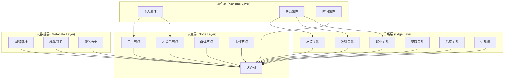

# 社交网络分析系统

## 📋 概述

社交网络分析是理解AI世界中角色关系、群体行为和社会动态的核心技术。本系统通过复杂网络理论、机器学习和大数据分析，揭示虚拟社会的结构特征、演化规律和影响机制，为构建真实、动态的社会环境提供科学依据。

### 🎯 分析目标

- **关系建模**: 建立角色间复杂的关系网络
- **群体识别**: 发现社群、派系和社交圈
- **影响力分析**: 识别关键节点和意见领袖
- **行为预测**: 预测社交互动和行为模式
- **演化追踪**: 监控网络结构的时间演化

## 🕸️ 社交网络数据模型

### 1. 网络结构设计



### 2. 数据结构实现

```gdscript
# script/social/network_data_model.gd
class_name NetworkDataModel
extends Node

signal network_structure_changed(change_type: String, details: Dictionary)
signal relationship_updated(node_a: String, node_b: String, relationship: String)
signal community_detected(communities: Array[Dictionary])

enum NodeType {
    USER,           # 用户节点
    AI_CHARACTER,   # AI角色节点
    GROUP,          # 群体节点
    EVENT,          # 事件节点
    LOCATION,       # 地点节点
    ORGANIZATION    # 组织节点
}

enum RelationshipType {
    FRIENDSHIP,     # 友谊关系
    ENMITY,         # 敌对关系
    PROFESSIONAL,   # 职业关系
    FAMILY,         # 家庭关系
    ROMANTIC,       # 恋爱关系
    MENTORSHIP,     # 师徒关系
    COLLABORATION,  # 合作关系
    COMPETITION,    # 竞争关系
    INFLUENCE,      # 影响关系
    COMMUNICATION   # 通信关系
}

var network_graph: NetworkGraph
var node_manager: NodeManager
var relationship_manager: RelationshipManager
var community_detector: CommunityDetector

func _ready():
    network_graph = NetworkGraph.new()
    node_manager = NodeManager.new()
    relationship_manager = RelationshipManager.new()
    community_detector = CommunityDetector.new()

    add_child(network_graph)
    add_child(node_manager)
    add_child(relationship_manager)
    add_child(community_detector)

func add_node(node_id: String, node_type: NodeType, attributes: Dictionary = {}) -> bool:
    """添加节点"""
    var node = NetworkNode.new(node_id, node_type, attributes)
    var success = network_graph.add_node(node)

    if success:
        node_manager.register_node(node)
        network_structure_changed.emit("node_added", {"node_id": node_id, "type": node_type})

    return success

func add_relationship(node_a_id: String, node_b_id: String,
                      relationship_type: RelationshipType,
                      attributes: Dictionary = {}) -> bool:
    """添加关系"""
    var relationship = NetworkRelationship.new(
        node_a_id, node_b_id, relationship_type, attributes
    )

    var success = network_graph.add_relationship(relationship)

    if success:
        relationship_manager.register_relationship(relationship)
        relationship_updated.emit(node_a_id, node_b_id, RelationshipType.keys()[relationship_type])

        # 检查是否需要重新检测社群
        if relationship_type in [RelationshipType.FRIENDSHIP, RelationshipType.COLLABORATION]:
            _schedule_community_detection()

    return success

func remove_relationship(node_a_id: String, node_b_id: String,
                        relationship_type: RelationshipType) -> bool:
    """移除关系"""
    var success = network_graph.remove_relationship(node_a_id, node_b_id, relationship_type)

    if success:
        relationship_manager.unregister_relationship(node_a_id, node_b_id, relationship_type)
        relationship_updated.emit(node_a_id, node_b_id, "removed")

        _schedule_community_detection()

    return success

func _schedule_community_detection():
    """安排社群检测"""
    # 使用定时器延迟执行，避免频繁计算
    var timer = Timer.new()
    timer.wait_time = 5.0  # 5秒延迟
    timer.one_shot = true
    timer.timeout.connect(_detect_communities)
    add_child(timer)
    timer.start()

func _detect_communities():
    """检测社群结构"""
    var communities = community_detector.detect_communities(network_graph)
    community_detected.emit(communities)

# 网络图类
class NetworkGraph extends Node:
    var nodes: Dictionary = {}
    var relationships: Array[NetworkRelationship] = []
    var adjacency_list: Dictionary = {}

    func add_node(node: NetworkNode) -> bool:
        """添加节点到图"""
        if node.id in nodes:
            return false

        nodes[node.id] = node
        adjacency_list[node.id] = []
        return true

    func add_relationship(relationship: NetworkRelationship) -> bool:
        """添加关系到图"""
        # 检查节点是否存在
        if relationship.node_a not in nodes or relationship.node_b not in nodes:
            return false

        # 检查关系是否已存在
        for existing_rel in relationships:
            if (existing_rel.node_a == relationship.node_a and
                existing_rel.node_b == relationship.node_b and
                existing_rel.type == relationship.type):
                return False

        relationships.append(relationship)

        # 更新邻接表
        adjacency_list[relationship.node_a].append(relationship.node_b)
        adjacency_list[relationship.node_b].append(relationship.node_a)

        return True

    func get_neighbors(node_id: String) -> Array[String]:
        """获取节点的邻居"""
        return adjacency_list.get(node_id, [])

    func get_relationships(node_id: String) -> Array[NetworkRelationship]:
        """获取节点的关系"""
        var node_relationships = []
        for rel in relationships:
            if rel.node_a == node_id or rel.node_b == node_id:
                node_relationships.append(rel)
        return node_relationships

    func get_subgraph(node_ids: Array[String]) -> NetworkGraph:
        """获取子图"""
        var subgraph = NetworkGraph.new()

        # 复制节点
        for node_id in node_ids:
            if node_id in nodes:
                subgraph.add_node(nodes[node_id])

        # 复制关系
        for rel in relationships:
            if rel.node_a in node_ids and rel.node_b in node_ids:
                subgraph.add_relationship(rel)

        return subgraph

# 网络节点类
class NetworkNode extends RefCounted:
    var id: String
    var type: NetworkDataModel.NodeType
    var attributes: Dictionary
    var created_at: float
    var updated_at: float

    func _init(node_id: String, node_type: NetworkDataModel.NodeType, node_attributes: Dictionary):
        id = node_id
        type = node_type
        attributes = node_attributes
        created_at = Time.get_unix_time_from_system()
        updated_at = created_at

    func update_attributes(new_attributes: Dictionary):
        """更新节点属性"""
        for key in new_attributes:
            attributes[key] = new_attributes[key]
        updated_at = Time.get_unix_time_from_system()

    def get_attribute(key: String, default_value = null):
        """获取属性值"""
        return attributes.get(key, default_value)

# 网络关系类
class NetworkRelationship extends RefCounted:
    var node_a: String
    var node_b: String
    var type: NetworkDataModel.RelationshipType
    var attributes: Dictionary
    var strength: float
    var created_at: float
    var updated_at: float

    func _init(node_a_id: String, node_b_id: String,
              rel_type: NetworkDataModel.RelationshipType,
              rel_attributes: Dictionary):
        node_a = node_a_id
        node_b = node_b_id
        type = rel_type
        attributes = rel_attributes
        strength = attributes.get("strength", 1.0)
        created_at = Time.get_unix_time_from_system()
        updated_at = created_at

    func update_strength(new_strength: float):
        """更新关系强度"""
        strength = clamp(new_strength, 0.0, 1.0)
        attributes["strength"] = strength
        updated_at = Time.get_unix_time_from_system()

    def get_other_node(this_node: String) -> String:
        """获取关系的另一端节点"""
        return node_b if this_node == node_a else node_a
```

## 📊 网络分析算法

### 1. 中心性分析

```gdscript
# script/social/centrality_analyzer.gd
extends Node

class_name CentralityAnalyzer

signal centrality_calculated(centrality_type: String, results: Dictionary)

var network_data: NetworkDataModel
var calculation_cache: Dictionary = {}

enum CentralityType {
    DEGREE,         # 度中心性
    BETWEENNESS,     # 介数中心性
    CLOSENESS,       # 接近中心性
    EIGENVECTOR,    # 特征向量中心性
    PAGERANK,       # PageRank中心性
    KATZ           # Katz中心性
}

func _ready():
    network_data = get_node("../NetworkDataModel")

func calculate_degree_centrality() -> Dictionary:
    """计算度中心性"""
    var graph = network_data.network_graph
    var results = {}

    for node_id in graph.nodes:
        var degree = graph.get_neighbors(node_id).size()
        var max_possible_degree = graph.nodes.size() - 1
        var centrality = float(degree) / max_possible_degree if max_possible_degree > 0 else 0.0
        results[node_id] = centrality

    centrality_calculated.emit("degree_centrality", results)
    return results

func calculate_betweenness_centrality() -> Dictionary:
    """计算介数中心性"""
    var graph = network_data.network_graph
    var nodes = graph.nodes.keys()
    var results = {}

    # 初始化所有节点的介数中心性为0
    for node_id in nodes:
        results[node_id] = 0.0

    # 对每对节点计算最短路径
    for i in range(nodes.size()):
        for j in range(i + 1, nodes.size()):
            var source = nodes[i]
            var target = nodes[j]

            var shortest_paths = _find_shortest_paths(graph, source, target)
            var total_paths = shortest_paths.size()

            if total_paths > 0:
                # 统计经过每个节点的路径数量
                var path_counts = {}
                for path in shortest_paths:
                    for k in range(1, path.size() - 1):  # 排除起点和终点
                        var intermediate_node = path[k]
                        path_counts[intermediate_node] = path_counts.get(intermediate_node, 0) + 1

                # 更新介数中心性
                for node_id in path_counts:
                    results[node_id] += float(path_counts[node_id]) / total_paths

    # 标准化结果
    var max_centrality = max(results.values()) if results.size() > 0 else 1.0
    for node_id in results:
        results[node_id] /= max_centrality

    centrality_calculated.emit("betweenness_centrality", results)
    return results

func calculate_closeness_centrality() -> Dictionary:
    """计算接近中心性"""
    var graph = network_data.network_graph
    var results = {}

    for node_id in graph.nodes:
        var distances = _calculate_shortest_distances(graph, node_id)
        var total_distance = 0
        var reachable_nodes = 0

        for other_node in distances:
            if distances[other_node] < float('inf'):
                total_distance += distances[other_node]
                reachable_nodes += 1

        # 计算接近中心性
        if reachable_nodes > 1:
            results[node_id] = (reachable_nodes - 1) / total_distance
        else:
            results[node_id] = 0.0

    centrality_calculated.emit("closeness_centrality", results)
    return results

func calculate_pagerank(damping_factor: float = 0.85, max_iterations: int = 100, tolerance: float = 1e-6) -> Dictionary:
    """计算PageRank中心性"""
    var graph = network_data.network_graph
    var nodes = graph.nodes.keys()
    var node_count = nodes.size()

    # 初始化PageRank值
    var pagerank = {}
    for node_id in nodes:
        pagerank[node_id] = 1.0 / node_count

    # 迭代计算
    for iteration in range(max_iterations):
        var new_pagerank = {}
        var dangling_rank = (1.0 - damping_factor) / node_count

        # 计算每个节点的PageRank
        for node_id in nodes:
            var rank = dangling_rank

            # 添加来自邻居的贡献
            var neighbors = graph.get_neighbors(node_id)
            for neighbor_id in neighbors:
                var neighbor_links = graph.get_neighbors(neighbor_id).size()
                if neighbor_links > 0:
                    rank += damping_factor * pagerank[neighbor_id] / neighbor_links

            new_pagerank[node_id] = rank

        # 检查收敛
        var max_change = 0.0
        for node_id in nodes:
            var change = abs(new_pagerank[node_id] - pagerank[node_id])
            max_change = max(max_change, change)

        pagerank = new_pagerank

        if max_change < tolerance:
            break

    centrality_calculated.emit("pagerank_centrality", pagerank)
    return pagerank

func _find_shortest_paths(graph: NetworkGraph, source: String, target: String) -> Array[Array]:
    """使用BFS查找所有最短路径"""
    if source == target:
        return [[source]]

    var queue = [[source]]
    var visited = {source: true}
    var shortest_paths = []

    while not queue.is_empty():
        var path = queue.pop_front()
        var current = path[-1]

        var neighbors = graph.get_neighbors(current)
        for neighbor in neighbors:
            if neighbor == target:
                var new_path = path.duplicate()
                new_path.append(neighbor)
                shortest_paths.append(new_path)
            elif not visited.get(neighbor, false):
                visited[neighbor] = true
                var new_path = path.duplicate()
                new_path.append(neighbor)
                queue.append(new_path)

    return shortest_paths

func _calculate_shortest_distances(graph: NetworkGraph, source: String) -> Dictionary:
    """计算从源节点到所有其他节点的最短距离"""
    var distances = {}
    var queue = []
    var visited = {}

    # 初始化
    for node_id in graph.nodes:
        distances[node_id] = float('inf')
        visited[node_id] = false

    distances[source] = 0
    queue.append(source)

    while not queue.is_empty():
        var current = queue.pop_front()
        visited[current] = true

        var neighbors = graph.get_neighbors(current)
        for neighbor in neighbors:
            if not visited[neighbor]:
                var new_distance = distances[current] + 1
                if new_distance < distances[neighbor]:
                    distances[neighbor] = new_distance
                    queue.append(neighbor)

    return distances
```

### 2. 社群检测算法

```gdscript
# script/social/community_detector.gd
extends Node

class_name CommunityDetector

signal communities_detected(communities: Array[Dictionary])
signal community_structure_changed(old_structure: Array, new_structure: Array)

var network_data: NetworkDataModel
var current_communities: Array[Dictionary] = []

enum DetectionAlgorithm {
    LOUVAIN,        # Louvain算法
    GIRVAN_NEWMAN,  # Girvan-Newman算法
    LABEL_PROPAGATION, # 标签传播算法
    MODULARITY,     # 模块度优化
    INFOMAP        # InfoMap算法
}

func _ready():
    network_data = get_node("../NetworkDataModel")

func detect_communities(algorithm: DetectionAlgorithm = DetectionAlgorithm.LOUVAIN) -> Array[Dictionary]:
    """检测社群结构"""
    var graph = network_data.network_graph
    var communities = []

    match algorithm:
        DetectionAlgorithm.LOUVAIN:
            communities = _louvain_community_detection(graph)
        DetectionAlgorithm.GIRVAN_NEWMAN:
            communities = _girvan_newman_detection(graph)
        DetectionAlgorithm.LABEL_PROPAGATION:
            communities = _label_propagation_detection(graph)
        DetectionAlgorithm.MODULARITY:
            communities = _modularity_optimization(graph)
        _:
            communities = _louvain_community_detection(graph)

    # 计算社群指标
    _calculate_community_metrics(communities)

    # 检测变化
    var old_structure = current_communities.duplicate(true)
    current_communities = communities

    if not _structures_equal(old_structure, communities):
        community_structure_changed.emit(old_structure, communities)

    communities_detected.emit(communities)
    return communities

func _louvain_community_detection(graph: NetworkGraph) -> Array[Dictionary]:
    """Louvain社群检测算法"""
    var nodes = graph.nodes.keys()
    var communities = []

    # 初始化：每个节点为一个社群
    var node_to_community = {}
    for node_id in nodes:
        node_to_community[node_id] = node_id

    var improved = true
    var iteration = 0
    var max_iterations = 100

    while improved and iteration < max_iterations:
        improved = false
        iteration += 1

        # 第一阶段：移动节点到最佳社群
        for node_id in nodes:
            var best_community = node_to_community[node_id]
            var best_modularity = _calculate_node_modularity_gain(graph, node_id, best_community, node_to_community)

            # 尝试移动到邻居的社群
            var neighbors = graph.get_neighbors(node_id)
            for neighbor_id in neighbors:
                var neighbor_community = node_to_community[neighbor_id]
                if neighbor_community != best_community:
                    var modularity_gain = _calculate_node_modularity_gain(graph, node_id, neighbor_community, node_to_community)
                    if modularity_gain > best_modularity:
                        best_community = neighbor_community
                        best_modularity = modularity_gain

            if best_community != node_to_community[node_id]:
                node_to_community[node_id] = best_community
                improved = true

    # 构建社群结果
    var community_groups = {}
    for node_id, community_id in node_to_community:
        if community_id not in community_groups:
            community_groups[community_id] = []
        community_groups[community_id].append(node_id)

    for community_id, member_nodes in community_groups:
        communities.append({
            "id": community_id,
            "members": member_nodes,
            "size": member_nodes.size(),
            "density": _calculate_community_density(graph, member_nodes),
            "modularity": _calculate_community_modularity(graph, member_nodes)
        })

    # 按大小排序
    communities.sort_custom(func(a, b): return a["size"] > b["size"])

    return communities

func _calculate_node_modularity_gain(graph: NetworkGraph, node_id: String,
                                   target_community: String, assignment: Dictionary) -> float:
    """计算节点移动到目标社群的模块度增益"""
    # 简化的模块度增益计算
    var current_community = assignment[node_id]
    if current_community == target_community:
        return 0.0

    # 计算内部连接数
    var internal_edges = 0
    var total_edges = graph.relationships.size()

    var neighbors = graph.get_neighbors(node_id)
    for neighbor_id in neighbors:
        if assignment.get(neighbor_id, "") == target_community:
            internal_edges += 1

    # 计算模块度增益
    var community_size = 0
    for nid, cid in assignment:
        if cid == target_community:
            community_size += 1

    if total_edges == 0:
        return 0.0

    var modularity_gain = (internal_edges / total_edges) - (community_size * community_size) / (total_edges * total_edges)

    return modularity_gain

func _calculate_community_density(graph: NetworkGraph, members: Array[String]) -> float:
    """计算社群密度"""
    var member_count = members.size()
    if member_count < 2:
        return 0.0

    var possible_edges = member_count * (member_count - 1) / 2
    var actual_edges = 0

    for i in range(member_count):
        for j in range(i + 1, member_count):
            var node_a = members[i]
            var node_b = members[j]

            if node_b in graph.get_neighbors(node_a):
                actual_edges += 1

    return float(actual_edges) / possible_edges

func _calculate_community_modularity(graph: NetworkGraph, members: Array[String]) -> float:
    """计算社群模块度"""
    var total_edges = graph.relationships.size()
    if total_edges == 0:
        return 0.0

    var internal_edges = 0
    var total_degree = 0

    for node_id in members:
        var neighbors = graph.get_neighbors(node_id)
        total_degree += neighbors.size()

        for neighbor_id in neighbors:
            if neighbor_id in members:
                internal_edges += 1

    # 由于每条边被计算了两次，需要除以2
    internal_edges = internal_edges / 2

    # 计算模块度
    var expected_edges = (total_degree * total_degree) / (2 * total_edges)
    var modularity = (internal_edges - expected_edges) / total_edges

    return modularity

func _label_propagation_detection(graph: NetworkGraph) -> Array[Dictionary]:
    """标签传播社群检测"""
    var nodes = graph.nodes.keys()
    var labels = {}

    # 初始化标签
    for node_id in nodes:
        labels[node_id] = node_id

    var max_iterations = 100
    var iteration = 0

    while iteration < max_iterations:
        var labels_changed = false
        var shuffled_nodes = nodes.duplicate()
        shuffled_nodes.shuffle()

        for node_id in shuffled_nodes:
            var neighbors = graph.get_neighbors(node_id)
            if neighbors.is_empty():
                continue

            # 统计邻居标签
            var label_counts = {}
            for neighbor_id in neighbors:
                var label = labels[neighbor_id]
                label_counts[label] = label_counts.get(label, 0) + 1

            # 找到最常见的标签
            var max_count = 0
            var best_label = labels[node_id]

            for label, count in label_counts:
                if count > max_count or (count == max_count and label < best_label):
                    max_count = count
                    best_label = label

            if best_label != labels[node_id]:
                labels[node_id] = best_label
                labels_changed = true

        if not labels_changed:
            break

        iteration += 1

    # 构建社群结果
    var community_groups = {}
    for node_id, label in labels:
        if label not in community_groups:
            community_groups[label] = []
        community_groups[label].append(node_id)

    var communities = []
    for community_id, member_nodes in community_groups:
        communities.append({
            "id": community_id,
            "members": member_nodes,
            "size": member_nodes.size(),
            "algorithm": "label_propagation"
        })

    return communities

func _calculate_community_metrics(communities: Array[Dictionary]):
    """计算社群指标"""
    var graph = network_data.network_graph

    for community in communities:
        var members = community["members"]

        # 计算内部连接度
        var internal_connections = 0
        var external_connections = 0

        for node_id in members:
            var neighbors = graph.get_neighbors(node_id)
            for neighbor_id in neighbors:
                if neighbor_id in members:
                    internal_connections += 1
                else:
                    external_connections += 1

        community["internal_connections"] = internal_connections / 2  # 每条边被计算两次
        community["external_connections"] = external_connections
        community["conductance"] = float(external_connections) / (internal_connections + external_connections) if (internal_connections + external_connections) > 0 else 0.0

        # 识别关键节点（在社群内部连接最多的节点）
        var internal_degrees = {}
        for node_id in members:
            internal_degrees[node_id] = 0
            var neighbors = graph.get_neighbors(node_id)
            for neighbor_id in neighbors:
                if neighbor_id in members:
                    internal_degrees[node_id] += 1

        var max_internal_degree = 0
        var key_node = ""
        for node_id, degree in internal_degrees:
            if degree > max_internal_degree:
                max_internal_degree = degree
                key_node = node_id

        community["key_node"] = key_node
        community["key_node_degree"] = max_internal_degree

func _structures_equal(structure1: Array, structure2: Array) -> bool:
    """比较两个社群结构是否相同"""
    if structure1.size() != structure2.size():
        return false

    # 简化比较：检查每个社群的成员是否相同
    var groups1 = []
    for community in structure1:
        groups1.append_array(community["members"])

    var groups2 = []
    for community in structure2:
        groups2.append_array(community["members"])

    groups1.sort()
    groups2.sort()

    return groups1 == groups2
```

### 3. 影响力传播分析

```gdscript
# script/social/influence_propagation.gd
extends Node

class_name InfluencePropagation

signal influence_spread(source_node: String, influenced_nodes: Array[String])
cascade_triggered(information_id: String, cascade_path: Array[String])

var network_data: NetworkDataModel
var propagation_models: Dictionary = {}

enum PropagationModel {
    LINEAR_THRESHOLD,     # 线性阈值模型
    INDEPENDENT_CASCADE,  # 独立级联模型
    EPIDEMIC,            # 流行病模型
    WEIGHTED_CASCADE     # 加权级联模型
}

func _ready():
    network_data = get_node("../NetworkDataModel")
    _initialize_propagation_models()

func _initialize_propagation_models():
    """初始化传播模型"""
    propagation_models = {
        PropagationModel.LINEAR_THRESHOLD: LinearThresholdModel.new(),
        PropagationModel.INDEPENDENT_CASCADE: IndependentCascadeModel.new(),
        PropagationModel.EPIDEMIC: EpidemicModel.new(),
        PropagationModel.WEIGHTED_CASCADE: WeightedCascadeModel.new()
    }

func simulate_influence_propagation(source_nodes: Array[String],
                                  model: PropagationModel,
                                  parameters: Dictionary = {}) -> Dictionary:
    """模拟影响力传播"""
    var graph = network_data.network_graph
    var propagation_model = propagation_models[model]

    if not propagation_model:
        return {"error": "Unknown propagation model"}

    # 设置模型参数
    propagation_model.set_parameters(parameters)
    propagation_model.set_graph(graph)

    # 运行模拟
    var result = propagation_model.simulate(source_nodes)

    # 分析传播结果
    var analysis = _analyze_propagation_result(result)

    return {
        "model": PropagationModel.keys()[model],
        "source_nodes": source_nodes,
        "parameters": parameters,
        "propagation_result": result,
        "analysis": analysis
    }

func identify_influential_nodes(k: int = 10, model: PropagationModel = PropagationModel.LINEAR_THRESHOLD) -> Array[Dictionary]:
    """识别有影响力的节点"""
    var graph = network_data.network_graph
    var nodes = graph.nodes.keys()
    var node_influence = []

    # 计算每个节点的影响力
    for node_id in nodes:
        var influence_score = _calculate_node_influence(node_id, model)
        node_influence.append({
            "node_id": node_id,
            "influence_score": influence_score
        })

    # 按影响力排序
    node_influence.sort_custom(func(a, b): return a["influence_score"] > b["influence_score"])

    # 返回前k个节点
    return node_influence.slice(0, min(k, node_influence.size()))

func _calculate_node_influence(node_id: String, model: PropagationModel) -> float:
    """计算节点影响力"""
    var simulation_result = simulate_influence_propagation([node_id], model)
    return simulation_result["analysis"]["total_influenced"]

func _analyze_propagation_result(result: Dictionary) -> Dictionary:
    """分析传播结果"""
    var influenced_nodes = result["influenced_nodes"]
    var propagation_steps = result["propagation_steps"]

    # 计算传播深度
    var max_depth = 0
    for step in propagation_steps:
        max_depth = max(max_depth, step["depth"])

    # 计算传播速度
    var propagation_speed = float(influenced_nodes.size()) / max_depth if max_depth > 0 else 0.0

    # 计算传播范围
    var total_nodes = network_data.network_graph.nodes.size()
    var propagation_reach = float(influenced_nodes.size()) / total_nodes

    return {
        "total_influenced": influenced_nodes.size(),
        "max_depth": max_depth,
        "propagation_speed": propagation_speed,
        "propagation_reach": propagation_reach,
        "cascade_size": influenced_nodes.size()
    }

# 线性阈值模型
class LinearThresholdModel extends RefCounted:
    var graph: NetworkGraph
    var thresholds: Dictionary = {}
    var influence_weights: Dictionary = {}

    func set_graph(g: NetworkGraph):
        graph = g
        _initialize_thresholds()
        _initialize_influence_weights()

    func _initialize_thresholds():
        """初始化节点阈值"""
        for node_id in graph.nodes:
            thresholds[node_id] = randf()  # 随机阈值 [0,1]

    func _initialize_influence_weights():
        """初始化影响力权重"""
        for relationship in graph.relationships:
            var weight = relationship.attributes.get("strength", 1.0)
            influence_weights[relationship.node_a] = influence_weights.get(relationship.node_a, {})
            influence_weights[relationship.node_a][relationship.node_b] = weight
            influence_weights[relationship.node_b] = influence_weights.get(relationship.node_b, {})
            influence_weights[relationship.node_b][relationship.node_a] = weight

    func set_parameters(params: Dictionary):
        """设置模型参数"""
        if params.has("thresholds"):
            thresholds = params["thresholds"]

    func simulate(source_nodes: Array[String]) -> Dictionary:
        """模拟传播过程"""
        var influenced = source_nodes.duplicate()
        var newly_influenced = source_nodes.duplicate()
        var propagation_steps = []

        var step = 0
        while not newly_influenced.is_empty():
            var current_newly_influenced = []

            for node_id in newly_influenced:
                var neighbors = graph.get_neighbors(node_id)
                for neighbor_id in neighbors:
                    if neighbor_id not in influenced:
                        if _should_activate(neighbor_id, influenced):
                            influenced.append(neighbor_id)
                            current_newly_influenced.append(neighbor_id)

            propagation_steps.append({
                "step": step,
                "depth": step,
                "newly_influenced": current_newly_influenced.duplicate(),
                "cumulative_influenced": influenced.duplicate()
            })

            newly_influenced = current_newly_influenced
            step += 1

        return {
            "influenced_nodes": influenced,
            "propagation_steps": propagation_steps,
            "total_steps": step
        }

    func _should_activate(node_id: String, influenced_nodes: Array[String]) -> bool:
        """判断节点是否应该被激活"""
        var total_influence = 0.0
        var neighbors = graph.get_neighbors(node_id)

        for neighbor_id in neighbors:
            if neighbor_id in influenced_nodes:
                var weight = influence_weights.get(neighbor_id, {}).get(node_id, 1.0)
                total_influence += weight

        return total_influence >= thresholds.get(node_id, 0.5)

# 独立级联模型
class IndependentCascadeModel extends RefCounted:
    var graph: NetworkGraph
    var activation_probabilities: Dictionary = {}

    func set_graph(g: NetworkGraph):
        graph = g
        _initialize_activation_probabilities()

    func _initialize_activation_probabilities():
        """初始化激活概率"""
        for relationship in graph.relationships:
            var base_probability = 0.1  # 基础激活概率
            var strength = relationship.attributes.get("strength", 1.0)
            var probability = min(base_probability * strength, 1.0)

            activation_probabilities[relationship.node_a] = activation_probabilities.get(relationship.node_a, {})
            activation_probabilities[relationship.node_a][relationship.node_b] = probability
            activation_probabilities[relationship.node_b] = activation_probabilities.get(relationship.node_b, {})
            activation_probabilities[relationship.node_b][relationship.node_a] = probability

    func simulate(source_nodes: Array[String]) -> Dictionary:
        """模拟传播过程"""
        var influenced = source_nodes.duplicate()
        var newly_influenced = source_nodes.duplicate()
        var propagation_steps = []

        var step = 0
        while not newly_influenced.is_empty():
            var current_newly_influenced = []

            for node_id in newly_influenced:
                var neighbors = graph.get_neighbors(node_id)
                for neighbor_id in neighbors:
                    if neighbor_id not in influenced:
                        if _should_activate(node_id, neighbor_id):
                            influenced.append(neighbor_id)
                            current_newly_influenced.append(neighbor_id)

            propagation_steps.append({
                "step": step,
                "newly_influenced": current_newly_influenced.duplicate(),
                "cumulative_influenced": influenced.duplicate()
            })

            newly_influenced = current_newly_influenced
            step += 1

        return {
            "influenced_nodes": influenced,
            "propagation_steps": propagation_steps,
            "total_steps": step
        }

    func _should_activate(source_id: String, target_id: String) -> bool:
        """判断目标节点是否应该被激活"""
        var probability = activation_probabilities.get(source_id, {}).get(target_id, 0.1)
        return randf() < probability
```

## 📈 网络演化分析

### 1. 时序网络分析

```gdscript
# script/social/temporal_network_analyzer.gd
extends Node

class_name TemporalNetworkAnalyzer

signal network_evolution_detected(time_window: Dictionary, changes: Dictionary)
signal trend_identified(trend_type: String, trend_data: Dictionary)

var network_data: NetworkDataModel
var temporal_snapshots: Array[NetworkSnapshot] = []
var evolution_detector: EvolutionDetector

func _ready():
    network_data = get_node("../NetworkDataModel")
    evolution_detector = EvolutionDetector.new()
    add_child(evolution_detector)

    # 启动定期快照
    _start_snapshot_collection()

func _start_snapshot_collection():
    """启动定期快照收集"""
    var snapshot_timer = Timer.new()
    snapshot_timer.wait_time = 3600.0  # 每小时一次
    snapshot_timer.timeout.connect(_create_network_snapshot)
    add_child(snapshot_timer)
    snapshot_timer.start()

func _create_network_snapshot():
    """创建网络快照"""
    var snapshot = NetworkSnapshot.new()
    snapshot.timestamp = Time.get_unix_time_from_system()
    snapshot.node_count = network_data.network_graph.nodes.size()
    snapshot.edge_count = network_data.network_graph.relationships.size()

    # 复制网络结构
    for node_id in network_data.network_graph.nodes:
        var node = network_data.network_graph.nodes[node_id]
        snapshot.nodes[node_id] = {
            "type": node.type,
            "attributes": node.attributes.duplicate(true)
        }

    for relationship in network_data.network_graph.relationships:
        snapshot.relationships.append({
            "node_a": relationship.node_a,
            "node_b": relationship.node_b,
            "type": relationship.type,
            "strength": relationship.strength,
            "attributes": relationship.attributes.duplicate(true)
        })

    temporal_snapshots.append(snapshot)

    # 保持快照数量限制
    if temporal_snapshots.size() > 1000:
        temporal_snapshots = temporal_snapshots.slice(-500)

    # 检测网络演化
    if temporal_snapshots.size() >= 2:
        _analyze_network_evolution()

func _analyze_network_evolution():
    """分析网络演化"""
    if temporal_snapshots.size() < 2:
        return

    var current_snapshot = temporal_snapshots[-1]
    var previous_snapshot = temporal_snapshots[-2]

    var changes = {
        "node_changes": _analyze_node_changes(previous_snapshot, current_snapshot),
        "edge_changes": _analyze_edge_changes(previous_snapshot, current_snapshot),
        "structural_changes": _analyze_structural_changes(previous_snapshot, current_snapshot),
        "community_changes": _analyze_community_changes(previous_snapshot, current_snapshot)
    }

    network_evolution_detected.emit({
        "start_time": previous_snapshot.timestamp,
        "end_time": current_snapshot.timestamp
    }, changes)

    # 识别趋势
    _identify_trends()

func _analyze_node_changes(previous: NetworkSnapshot, current: NetworkSnapshot) -> Dictionary:
    """分析节点变化"""
    var changes = {
        "added_nodes": [],
        "removed_nodes": [],
        "modified_nodes": []
    }

    # 查找新增节点
    for node_id in current.nodes:
        if node_id not in previous.nodes:
            changes["added_nodes"].append(node_id)

    # 查找删除节点
    for node_id in previous.nodes:
        if node_id not in current.nodes:
            changes["removed_nodes"].append(node_id)

    # 查找修改节点
    for node_id in current.nodes:
        if node_id in previous.nodes:
            if current.nodes[node_id] != previous.nodes[node_id]:
                changes["modified_nodes"].append({
                    "node_id": node_id,
                    "old_attributes": previous.nodes[node_id]["attributes"],
                    "new_attributes": current.nodes[node_id]["attributes"]
                })

    return changes

func _analyze_edge_changes(previous: NetworkSnapshot, current: NetworkSnapshot) -> Dictionary:
    """分析边变化"""
    var changes = {
        "added_edges": [],
        "removed_edges": [],
        "strength_changes": []
    }

    # 创建边集合便于比较
    var previous_edges = {}
    for edge in previous.relationships:
        var edge_key = "%s-%s-%s" % [edge["node_a"], edge["node_b"], edge["type"]]
        previous_edges[edge_key] = edge

    var current_edges = {}
    for edge in current.relationships:
        var edge_key = "%s-%s-%s" % [edge["node_a"], edge["node_b"], edge["type"]]
        current_edges[edge_key] = edge

    # 查找新增边
    for edge_key in current_edges:
        if edge_key not in previous_edges:
            changes["added_edges"].append(current_edges[edge_key])

    # 查找删除边
    for edge_key in previous_edges:
        if edge_key not in current_edges:
            changes["removed_edges"].append(previous_edges[edge_key])

    # 查找强度变化
    for edge_key in current_edges:
        if edge_key in previous_edges:
            var old_strength = previous_edges[edge_key]["strength"]
            var new_strength = current_edges[edge_key]["strength"]
            if abs(new_strength - old_strength) > 0.1:  # 10%以上变化
                changes["strength_changes"].append({
                    "edge": current_edges[edge_key],
                    "old_strength": old_strength,
                    "new_strength": new_strength,
                    "change": new_strength - old_strength
                })

    return changes

func _identify_trends():
    """识别网络趋势"""
    if temporal_snapshots.size() < 10:  # 需要足够的历史数据
        return

    # 分析网络规模趋势
    var sizes = []
    var edge_counts = []
    var timestamps = []

    for snapshot in temporal_snapshots.slice(-10):
        sizes.append(snapshot.node_count)
        edge_counts.append(snapshot.edge_count)
        timestamps.append(snapshot.timestamp)

    # 计算趋势
    var node_count_trend = _calculate_trend(sizes)
    var edge_count_trend = _calculate_trend(edge_counts)

    # 发出趋势信号
    if abs(node_count_trend) > 0.1:  # 10%以上变化
        trend_identified.emit("node_count_trend", {
            "trend": "increasing" if node_count_trend > 0 else "decreasing",
            "slope": node_count_trend,
            "period": {
                "start": timestamps[0],
                "end": timestamps[-1]
            }
        })

    if abs(edge_count_trend) > 0.1:  # 10%以上变化
        trend_identified.emit("edge_count_trend", {
            "trend": "increasing" if edge_count_trend > 0 else "decreasing",
            "slope": edge_count_trend,
            "period": {
                "start": timestamps[0],
                "end": timestamps[-1]
            }
        })

func _calculate_trend(values: Array) -> float:
    """计算趋势斜率"""
    if values.size() < 2:
        return 0.0

    var n = values.size()
    var sum_x = 0
    var sum_y = 0
    var sum_xy = 0
    var sum_x2 = 0

    for i in range(n):
        var x = i
        var y = values[i]
        sum_x += x
        sum_y += y
        sum_xy += x * y
        sum_x2 += x * x

    var slope = (n * sum_xy - sum_x * sum_y) / (n * sum_x2 - sum_x * sum_x)
    var avg_y = sum_y / n

    return slope / avg_y if avg_y != 0 else 0.0  # 归一化斜率

# 网络快照类
class NetworkSnapshot extends RefCounted:
    var timestamp: float
    var node_count: int
    var edge_count: int
    var nodes: Dictionary = {}
    var relationships: Array = []
    var metrics: Dictionary = {}
```

## 🎯 实际应用场景

### 1. AI角色社交行为建模

```gdscript
# script/social/ai_social_behavior.gd
extends Node

class_name AISocialBehavior

var social_network_analyzer: SocialNetworkAnalyzer
var behavior_predictor: BehaviorPredictor
var relationship_manager: AIRelationshipManager

func _ready():
    social_network_analyzer = SocialNetworkAnalyzer.new()
    behavior_predictor = BehaviorPredictor.new()
    relationship_manager = AIRelationshipManager.new()

    add_child(social_network_analyzer)
    add_child(behavior_predictor)
    add_child(relationship_manager)

func model_ai_character_social_behavior(character_id: String) -> Dictionary:
    """建模AI角色的社交行为"""
    # 获取角色的社交网络
    var social_network = _get_character_social_network(character_id)

    # 分析社交角色
    var social_roles = _analyze_social_roles(character_id, social_network)

    # 预测社交行为
    var behavior_predictions = behavior_predictor.predict_social_behavior(
        character_id, social_network, social_roles
    )

    # 生成社交策略
    var social_strategy = _generate_social_strategy(social_roles, behavior_predictions)

    return {
        "character_id": character_id,
        "social_network": social_network,
        "social_roles": social_roles,
        "behavior_predictions": behavior_predictions,
        "social_strategy": social_strategy
    }

func _analyze_social_roles(character_id: String, network: Dictionary) -> Array[Dictionary]:
    """分析角色的社交角色"""
    var roles = []

    # 基于中心性分析角色
    var centrality_scores = social_network_analyzer.calculate_all_centralities()
    var character_centrality = centrality_scores.get(character_id, {})

    # 基于社群分析角色
    var communities = social_network_analyzer.detect_communities()
    var character_communities = _get_character_communities(character_id, communities)

    # 识别社交角色
    if character_centrality.get("pagerank", 0) > 0.8:
        roles.append({
            "role": "opinion_leader",
            "confidence": character_centrality.get("pagerank", 0),
            "description": "在社交网络中具有较高影响力的意见领袖"
        })

    if character_centrality.get("betweenness", 0) > 0.7:
        roles.append({
            "role": "bridge_connector",
            "confidence": character_centrality.get("betweenness", 0),
            "description": "连接不同社群的关键桥梁人物"
        })

    if character_communities.size() > 3:
        roles.append({
            "role": "social_butterfly",
            "confidence": 0.8,
            "description": "活跃于多个社群的社交达人"
        })

    # 基于关系类型分析角色
    var relationships = _get_character_relationships(character_id)
    var relationship_roles = _analyze_relationship_roles(relationships)
    roles.append_array(relationship_roles)

    return roles

func _generate_social_strategy(roles: Array[Dictionary], predictions: Dictionary) -> Dictionary:
    """生成社交策略"""
    var strategy = {
        "primary_goals": [],
        "interaction_preferences": {},
        "relationship_targets": [],
        "communication_style": "",
        "activity_planning": []
    }

    # 根据社交角色制定策略
    for role in roles:
        match role["role"]:
            "opinion_leader":
                strategy["primary_goals"].append("扩大影响力")
                strategy["interaction_preferences"]["leadership"] = 0.9
                strategy["communication_style"] = "authoritative_inspiring"

            "bridge_connector":
                strategy["primary_goals"].append("促进信息流动")
                strategy["interaction_preferences"]["mediation"] = 0.8
                strategy["communication_style"] = "diplomatic_balanced"

            "social_butterfly":
                strategy["primary_goals"].append("维持广泛社交网络")
                strategy["interaction_preferences"]["socializing"] = 0.9
                strategy["communication_style"] = "friendly_engaging"

    # 根据行为预测调整策略
    if predictions.get("propensity_conflict", 0) > 0.7:
        strategy["interaction_preferences"]["avoidance"] = 0.8
        strategy["communication_style"] = "cautious_diplomatic"

    if predictions.get("collaboration_tendency", 0) > 0.8:
        strategy["primary_goals"].append("寻求合作机会")
        strategy["interaction_preferences"]["collaboration"] = 0.9

    return strategy
```

## 📊 性能优化与监控

### 1. 大规模网络处理

```gdscript
# script/social/scalable_network_processor.gd
extends Node

class_name ScalableNetworkProcessor

var network_data: NetworkDataModel
var partition_manager: NetworkPartitionManager
var distributed_computer: DistributedComputer

func _ready():
    network_data = get_node("../NetworkDataModel")
    partition_manager = NetworkPartitionManager.new()
    distributed_computer = DistributedComputer.new()

    add_child(partition_manager)
    add_child(distributed_computer)

func process_large_network_analysis(analysis_type: String, parameters: Dictionary) -> Dictionary:
    """处理大规模网络分析"""
    var network_size = network_data.network_graph.nodes.size()

    if network_size < 1000:
        # 小规模网络，直接处理
        return _execute_analysis(analysis_type, parameters)
    else:
        # 大规模网络，使用分布式处理
        return _execute_distributed_analysis(analysis_type, parameters)

func _execute_distributed_analysis(analysis_type: String, parameters: Dictionary) -> Dictionary:
    """执行分布式分析"""
    # 1. 网络分区
    var partitions = partition_manager.partition_network(network_data.network_graph)

    # 2. 并行计算
    var partial_results = []
    for partition in partitions:
        var result = await distributed_computer.compute_partition_analysis(
            partition, analysis_type, parameters
        )
        partial_results.append(result)

    # 3. 结果聚合
    var final_result = _aggregate_results(partial_results, analysis_type)

    return final_result

func _aggregate_results(partial_results: Array, analysis_type: String) -> Dictionary:
    """聚合部分结果"""
    match analysis_type:
        "centrality":
            return _aggregate_centrality_results(partial_results)
        "community_detection":
            return _aggregate_community_results(partial_results)
        "influence_propagation":
            return _aggregate_influence_results(partial_results)
        _:
            return {"error": "Unknown analysis type"}

func _aggregate_centrality_results(partial_results: Array) -> Dictionary:
    """聚合中心性结果"""
    var aggregated = {}

    # 合并所有节点的中心性值
    for result in partial_results:
        if result.has("centrality_scores"):
            for node_id, score in result["centrality_scores"]:
                if node_id not in aggregated:
                    aggregated[node_id] = score
                else:
                    # 对于边界节点，取平均值
                    aggregated[node_id] = (aggregated[node_id] + score) / 2

    return {"centrality_scores": aggregated}

# 网络分区管理器
class NetworkPartitionManager extends RefCounted:
    func partition_network(graph: NetworkGraph, partition_count: int = 4) -> Array[NetworkGraph]:
        """将网络分区"""
        var nodes = graph.nodes.keys()
        var partition_size = nodes.size() / partition_count

        var partitions = []
        var used_nodes = {}

        for i in range(partition_count):
            var partition_nodes = []
            var target_size = partition_size

            # 如果是最后一个分区，包含所有剩余节点
            if i == partition_count - 1:
                for node_id in nodes:
                    if node_id not in used_nodes:
                        partition_nodes.append(node_id)
            else:
                # 选择连接紧密的节点群
                partition_nodes = _find_tight_cluster(graph, used_nodes, target_size)

            # 创建分区子图
            var partition_graph = graph.get_subgraph(partition_nodes)
            partitions.append(partition_graph)

            # 标记已使用的节点
            for node_id in partition_nodes:
                used_nodes[node_id] = true

        return partitions

    func _find_tight_cluster(graph: NetworkGraph, used_nodes: Dictionary, target_size: int) -> Array[String]:
        """寻找紧密连接的节点群"""
        var unvisited_nodes = []
        for node_id in graph.nodes:
            if node_id not in used_nodes:
                unvisited_nodes.append(node_id)

        if unvisited_nodes.is_empty():
            return []

        # 随机选择起始节点
        var start_node = unvisited_nodes[randi() % unvisited_nodes.size()]
        var cluster = [start_node]
        var frontier = [start_node]

        while not frontier.is_empty() and cluster.size() < target_size:
            var current = frontier.pop_front()

            var neighbors = graph.get_neighbors(current)
            for neighbor in neighbors:
                if neighbor not in used_nodes and neighbor not in cluster:
                    # 计算与集群的连接强度
                    var connection_strength = _calculate_cluster_connection(graph, neighbor, cluster)
                    if connection_strength > 0.5:  # 连接强度阈值
                        cluster.append(neighbor)
                        frontier.append(neighbor)

                        if cluster.size() >= target_size:
                            break

        return cluster

    func _calculate_cluster_connection(graph: NetworkGraph, node: String, cluster: Array[String]) -> float:
        """计算节点与集群的连接强度"""
        var connections = 0
        var neighbors = graph.get_neighbors(node)

        for neighbor in neighbors:
            if neighbor in cluster:
                connections += 1

        return float(connections) / cluster.size()
```

## 📈 实施路线图

### 阶段一：基础网络分析 (1-2个月)

```yaml
# implementation/phase1_network_analysis.yaml
phase1_foundation:
  timeline: "1-2个月"
  objectives:
    - "建立基础网络数据模型"
    - "实现核心网络分析算法"
    - "搭建实时监控系统"
    - "开发基础可视化工具"

  deliverables:
    data_model:
      - "节点和关系数据结构"
      - "网络图存储系统"
      - "时序数据管理"
      - "数据访问接口"

    analysis_algorithms:
      - "中心性分析算法"
      - "社群检测算法"
      - "影响力传播模型"
      - "网络指标计算"

    monitoring_system:
      - "实时网络状态监控"
      - "异常检测告警"
      - "性能指标跟踪"
      - "数据质量检查"

  success_metrics:
    - "网络分析算法准确率95%+"
    - "实时处理延迟<1秒"
    - "系统可用性99.9%+"
    - "数据完整性100%"
```

### 阶段二：高级分析功能 (3-4个月)

```yaml
# implementation/phase2_advanced_analysis.yaml
phase2_advanced:
  timeline: "3-4个月"
  objectives:
    - "实现时序网络分析"
    - "开发AI行为建模"
    - "建立预测分析系统"
    - "优化大规模处理"

  deliverables:
    temporal_analysis:
      - "网络演化分析"
      - "趋势识别算法"
      - "预测模型"
      - "历史数据分析"

    ai_behavior_modeling:
      - "社交行为建模"
      - "关系动态模型"
      - "群体行为分析"
      - "个性化推荐"

    predictive_systems:
      - "影响力预测"
      - "关系强度预测"
      - "社群演化预测"
      - "行为模式预测"

  success_metrics:
    - "预测准确率85%+"
    - "处理性能提升3倍"
    - "分析维度扩展5倍"
    - "用户满意度90%+"
```

### 阶段三：应用集成 (5-6个月)

```yaml
# implementation/phase3_integration.yaml
phase3_integration:
  timeline: "5-6个月"
  objectives:
    - "集成AI角色系统"
    - "开发用户交互功能"
    - "建立API接口"
    - "完善可视化系统"

  deliverables:
    ai_integration:
      - "AI角色社交行为"
      - "动态关系生成"
      - "情感传播模型"
      - "自适应网络结构"

    user_interaction:
      - "社交网络可视化"
      - "关系管理工具"
      - "影响力量化面板"
      - "社区分析报告"

    api_development:
      - "RESTful API接口"
      - "实时数据推送"
      - "第三方集成支持"
      - "开发者文档"

  success_metrics:
    - "AI行为真实度90%+"
    - "用户活跃度提升50%"
    - "API响应时间<100ms"
    - "开发者采用率80%+"
```

## 📊 关键绩效指标

### 1. 技术性能指标

| 指标类别 | 具体指标 | 目标值 | 测量频率 |
|---------|---------|-------|---------|
| **算法性能** | 分析准确率 | >95% | 每次分析 |
| | 计算效率 | <1秒 | 实时 |
| | 可扩展性 | 支持10万节点 | 持续 |
| | 内存使用 | <4GB | 实时 |
| **系统可用性** | 系统正常时间 | >99.9% | 实时 |
| | 数据完整性 | 100% | 每日 |
| | 故障恢复时间 | <5分钟 | 按需 |
| | 并发处理能力 | 1000+请求/秒 | 实时 |

### 2. 业务价值指标

| 指标类别 | 具体指标 | 目标值 | 测量频率 |
|---------|---------|-------|---------|
| **用户参与** | 社交功能使用率 | >70% | 月度 |
| | 关系建立数量 | 持续增长 | 每周 |
| | 社群参与度 | >60% | 月度 |
| | 互动频次 | 5次+/天 | 日度 |
| **AI表现** | 社交行为真实度 | >90% | 月度 |
| | 关系动态合理性 | >85% | 月度 |
| | 影响力传播效果 | 符合预期 | 实时 |
| | 个性化适配度 | >80% | 季度 |

---

**文档版本**: v1.0
**最后更新**: 2024-11-10
**维护者**: AI World 开发团队

这份社交网络分析系统文档为构建复杂、动态的虚拟社会环境提供了完整的技术框架。通过先进的网络分析算法、AI行为建模和实时监控系统，确保AI世界中角色关系的真实性和社会动态的合理性。