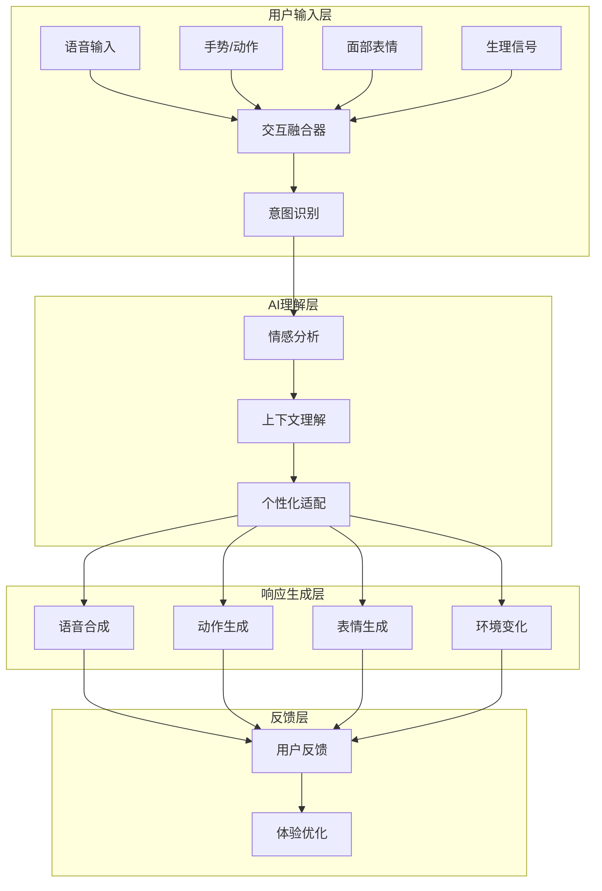

# AI 世界用户体验设计指南

## 📋 概述

用户体验（UX）设计是构建引人入胜 AI 虚拟世界的关键因素。本指南涵盖了从用户研究到界面设计、从交互模式到情感体验的完整设计体系，旨在创造自然、沉浸、富有情感共鸣的用户体验。

### 🎯 设计原则

- **自然交互**: 接近现实世界的交互方式，降低学习成本
- **情感连接**: 建立用户与AI角色的深层情感联系
- **沉浸体验**: 通过多感官刺激创造身临其境的感觉
- **个性化适配**: 根据用户偏好和行为模式自适应调整
- **无障碍设计**: 确保不同能力的用户都能享受体验

## 🎭 用户画像与场景分析

### 1. 核心用户画像

#### 1.1 探索型用户 (Explorer Persona)

```yaml
# personas/explorer.yaml
persona:
  name: "李明"
  age: 28
  occupation: "游戏设计师"
  experience: "资深游戏玩家，喜欢探索开放世界"
  motivations:
    - "发现新的故事和情节"
    - "与AI角色建立深度关系"
    - "探索世界的边界和秘密"
  pain_points:
    - "角色行为过于重复"
    - "缺乏真实感"
    - "交互方式不自然"
  goals:
    - "体验真正的虚拟人生"
    - "创造属于自己的故事"
    - "感受情感共鸣"

  interaction_preferences:
    voice_input: true
    text_chat: true
    gesture_control: true
    emotional_expression: high

  technical_profile:
    device: "高性能PC + VR设备"
    internet: "高速光纤"
    preferred_platform: "PC/VR"
```

#### 1.2 社交型用户 (Social Butterfly)

```yaml
# personas/social.yaml
persona:
  name: "王芳"
  age: 24
  occupation: "市场营销专员"
  experience: "重度社交媒体用户"
  motivations:
    - "结交虚拟朋友"
    - "分享生活体验"
    - "参与社区活动"
  pain_points:
    - "AI角色不够理解"
    - "对话不够流畅"
    - "缺乏共同话题"
  goals:
    - "建立虚拟社交网络"
    - "获得情感支持"
    - "体验不同的人生"
```

#### 1.3 创作型用户 (Creator)

```yaml
# personas/creator.yaml
persona:
  name: "张伟"
  age: 32
  occupation: "独立游戏开发者"
  experience: "喜欢创造和定制内容"
  motivations:
    - "设计独特的角色"
    - "创造故事情节"
    - "定制虚拟环境"
  pain_points:
    - "创作工具复杂"
    - "缺乏灵活性"
    - "分享机制不完善"
  goals:
    - "实现创意想法"
    - "获得社区认可"
    - "影响世界发展"
```

### 2. 使用场景矩阵

| 场景类型 | 用户目标 | 交互模式 | 情感需求 | 技术要求 |
|---------|---------|---------|---------|---------|
| 日常交流 | 与AI角色聊天 | 语音/文本 | 陪伴感 | 实时语音识别 |
| 冒险探索 | 发现世界秘密 | 行走/交互 | 好奇心 | 3D渲染/物理引擎 |
| 情感支持 | 获得情感安慰 | 倾听/表达 | 安全感 | 情感识别/共情AI |
| 创作表达 | 创造内容 | 设计/编辑 | 成就感 | 创作工具/分享系统 |
| 社交活动 | 参与集体活动 | 协作/竞争 | 归属感 | 多人同步/社交系统 |

## 🎨 交互设计体系

### 1. 多模态交互框架



### 2. 自然语言交互设计

#### 2.1 对话系统设计

```python
# systems/conversation/conversation_designer.py
from typing import Dict, List, Optional
from enum import Enum

class ConversationType(Enum):
    CASUAL_CHAT = "casual_chat"
    EMOTIONAL_SUPPORT = "emotional_support"
    INFORMATION_SEEKING = "information_seeking"
    TASK_ORIENTED = "task_oriented"
    CREATIVE_COLLABORATION = "creative_collaboration"

class ConversationDesigner:
    def __init__(self):
        self.conversation_templates = {}
        self.persona_adapters = {}
        self.context_managers = {}

    def design_conversation_flow(self, conversation_type: ConversationType,
                               user_persona: Dict, context: Dict) -> Dict:
        """设计对话流程"""
        flow = {
            "type": conversation_type.value,
            "stages": self._create_conversation_stages(conversation_type),
            "adaptations": self._get_persona_adaptations(user_persona),
            "context_integration": self._integrate_context(context),
            "emotional_tone": self._determine_emotional_tone(conversation_type, user_persona)
        }

        return flow

    def _create_conversation_stages(self, conv_type: ConversationType) -> List[Dict]:
        """创建对话阶段"""
        stage_templates = {
            ConversationType.CASUAL_CHAT: [
                {"stage": "greeting", "purpose": "建立联系", "duration": "30-60s"},
                {"stage": "ice_breaker", "purpose": "开启话题", "duration": "60-120s"},
                {"stage": "deepening", "purpose": "深化交流", "duration": "120-300s"},
                {"stage": "closure", "purpose": "自然结束", "duration": "30-60s"}
            ],
            ConversationType.EMOTIONAL_SUPPORT: [
                {"stage": "emotional_detection", "purpose": "情感识别", "duration": "30s"},
                {"stage": "empathetic_response", "purpose": "共情回应", "duration": "60s"},
                {"stage": "supportive_guidance", "purpose": "支持引导", "duration": "180-300s"},
                {"stage": "reassurance", "purpose": "安抚鼓励", "duration": "60s"}
            ],
            ConversationType.CREATIVE_COLLABORATION: [
                {"stage": "idea_generation", "purpose": "创意生成", "duration": "120-300s"},
                {"stage": "concept_development", "purpose": "概念发展", "duration": "300-600s"},
                {"stage": "refinement", "purpose": "精炼完善", "duration": "180-300s"},
                {"stage": "implementation", "purpose": "实现落地", "duration": "300s+"}
            ]
        }

        return stage_templates.get(conv_type, [])

    def _get_persona_adaptations(self, user_persona: Dict) -> Dict:
        """获取用户画像适配"""
        adaptations = {}

        # 根据年龄调整语言风格
        age = user_persona.get("age", 25)
        if age < 25:
            adaptations["language_style"] = "casual, energetic"
        elif age < 35:
            adaptations["language_style"] = "balanced, professional"
        else:
            adaptations["language_style"] = "mature, thoughtful"

        # 根据经验调整交互复杂度
        experience = user_persona.get("experience", "")
        if "资深" in experience or "expert" in experience.lower():
            adaptations["complexity_level"] = "advanced"
            adaptations["explanation_needed"] = "minimal"
        else:
            adaptations["complexity_level"] = "beginner_friendly"
            adaptations["explanation_needed"] = "detailed"

        # 根据动机调整内容重点
        motivations = user_persona.get("motivations", [])
        if any("情感" in m or "emotion" in m.lower() for m in motivations):
            adaptations["focus_area"] = "emotional_connection"
        elif any("探索" in m or "explor" in m.lower() for m in motivations):
            adaptations["focus_area"] = "discovery_adventure"
        elif any("社交" in m or "social" in m.lower() for m in motivations):
            adaptations["focus_area"] = "community_interaction"

        return adaptations

class EmotionalIntelligenceDesigner:
    def __init__(self):
        self.emotion_models = {}
        self.response_strategies = {}

    def design_emotional_response(self, user_emotion: Dict,
                                character_personality: Dict,
                                context: Dict) -> Dict:
        """设计情感响应策略"""
        response_strategy = {
            "detected_emotion": user_emotion.get("dominant", "neutral"),
            "emotion_intensity": user_emotion.get("intensity", 0.5),
            "response_style": self._determine_response_style(user_emotion, character_personality),
            "verbal_response": self._generate_verbal_response(user_emotion, character_personality),
            "non_verbal_response": self._generate_non_verbal_response(user_emotion, character_personality),
            "follow_up_actions": self._plan_follow_up_actions(user_emotion, context)
        }

        return response_strategy

    def _determine_response_style(self, user_emotion: Dict,
                                character_personality: Dict) -> str:
        """确定响应风格"""
        dominant_emotion = user_emotion.get("dominant", "neutral")
        character_empathy = character_personality.get("empathy", 0.5)

        if dominant_emotion in ["sad", "depressed", "lonely"]:
            if character_empathy > 0.7:
                return "deeply_empathetic"
            elif character_empathy > 0.4:
                return "supportive"
            else:
                return "encouraging"

        elif dominant_emotion in ["happy", "excited", "joyful"]:
            return "enthusiastic"

        elif dominant_emotion in ["angry", "frustrated", "annoyed"]:
            return "calming_reassuring"

        elif dominant_emotion in ["anxious", "worried", "nervous"]:
            return "soothing_supportive"

        else:
            return "neutral_warm"

    def _generate_verbal_response(self, user_emotion: Dict,
                                character_personality: Dict) -> Dict:
        """生成语言响应"""
        templates = {
            "sad": {
                "opening": ["我能感受到你现在心情不太好", "看起来你遇到了一些困扰", "想和我聊聊吗？"],
                "support": ["我在这里陪着你", "不管发生什么，我都会支持你", "慢慢来，不着急"],
                "questions": ["是什么让你感到难过？", "有什么我可以帮助你的吗？", "需要我为你做些什么吗？"]
            },
            "happy": {
                "opening": ["你看起来很开心！", "看到你这样高兴我也很快乐", "有什么好事发生吗？"],
                "sharing": ["太好了！和我分享一下吧", "你的快乐也感染了我", "继续保持这样的好心情"],
                "celebration": ["为你感到高兴！", "这真是太棒了", "值得庆祝"]
            }
        }

        emotion = user_emotion.get("dominant", "neutral")
        return templates.get(emotion, {"opening": ["你好"], "support": ["我在"], "questions": ["怎么了？"]})
```

### 3. 手势与身体语言设计

```gdscript
# script/interaction/gesture_system.gd
class_name GestureSystem
extends Node

signal gesture_detected(gesture: String, confidence: float)
signal gesture_completed(gesture: String)

enum GestureType {
    WAVE,
    POINT,
    THUMBS_UP,
    SHRUG,
    NOD,
    SHAKE_HEAD,
    HUG,
    HANDSHAKE,
    PEACE,
    HEART
}

var gesture_recognizer: GestureRecognizer
var animation_player: AnimationPlayer
var character_body: CharacterBody3D

func _ready():
    gesture_recognizer = GestureRecognizer.new()
    animation_player = $AnimationPlayer
    character_body = get_parent()

    # 连接信号
    gesture_recognizer.gesture_detected.connect(_on_gesture_detected)

func recognize_gesture(motion_data: Dictionary) -> String:
    """识别手势"""
    var gesture_type = gesture_recognizer.recognize(motion_data)

    if gesture_type != "":
        gesture_detected.emit(gesture_type, motion_data.get("confidence", 0.0))

    return gesture_type

func execute_gesture(gesture_type: String, target_character: Node = null):
    """执行手势动画"""
    match gesture_type:
        "wave":
            _play_wave_animation(target_character)
        "thumbs_up":
            _play_thumbs_up_animation()
        "hug":
            _play_hug_animation(target_character)
        "point":
            _play_point_animation(target_character)
        _:
            print(f"Unknown gesture: {gesture_type}")

func _play_wave_animation(target: Node = null):
    """播放挥手动画"""
    if target:
        # 朝向目标
        character_body.look_at(target.global_position, Vector3.UP)

    animation_player.play("wave")
    await animation_player.animation_finished

    gesture_completed.emit("wave")

func _play_hug_animation(target: Node):
    """播放拥抱动画"""
    if not target:
        return

    # 移动到拥抱距离
    var distance = character_body.global_position.distance_to(target.global_position)
    if distance > 2.0:
        # 播放接近动画
        await _move_to_target(target, 1.5)

    # 播放拥抱动画
    animation_player.play("hug")

    # 触发情感连接
    if target.has_method("receive_hug"):
        await target.receive_hug(get_parent())

# 手势识别器
class GestureRecognizer:
    var motion_history: Array[Dictionary] = []
    var max_history_size = 30

    func recognize(motion_data: Dictionary) -> String:
        """识别手势模式"""
        motion_history.append(motion_data)

        if motion_history.size() > max_history_size:
            motion_history.pop_front()

        # 分析手势模式
        if _is_wave_pattern():
            return "wave"
        elif _is_thumbs_up_pattern():
            return "thumbs_up"
        elif _is_point_pattern():
            return "point"
        elif _is_hug_pattern():
            return "hug"

        return ""

    func _is_wave_pattern() -> bool:
        """检测挥手模式"""
        if motion_history.size() < 20:
            return false

        # 简化实现：检查手腕的左右摆动
        var positions = []
        for data in motion_history.slice(-20):
            positions.append(data.get("wrist_position", Vector3.ZERO))

        # 检查是否有左右摆动
        var direction_changes = 0
        var last_direction = 0

        for i in range(1, positions.size()):
            var current_direction = positions[i].x - positions[i-1].x
            if last_direction != 0 and sign(current_direction) != sign(last_direction):
                direction_changes += 1
            last_direction = current_direction

        return direction_changes >= 3

    func _is_hug_pattern() -> bool:
        """检测拥抱模式"""
        if motion_history.size() < 30:
            return false

        # 检查手臂是否向前张开然后合拢
        var arm_spread = []
        for data in motion_history.slice(-30):
            var left_hand = data.get("left_hand_position", Vector3.ZERO)
            var right_hand = data.get("right_hand_position", Vector3.ZERO)
            arm_spread.append(left_hand.distance_to(right_hand))

        # 查找先张开再合拢的模式
        var max_spread = arm_spread.max()
        var min_spread = arm_spread.min()

        return max_spread > 1.5 and min_spread < 0.8
```

## 🖥️ 界面设计系统

### 1. 自适应UI框架

```gdscript
# script/ui/adaptive_ui_system.gd
class_name AdaptiveUISystem
extends Control

@export var min_scale: float = 0.8
@export var max_scale: float = 1.5
@export var adaptive_elements: Array[Control] = []

var current_scale: float = 1.0
var user_preferences: Dictionary = {}
var accessibility_settings: Dictionary = {}

func _ready():
    _load_user_preferences()
    _setup_accessibility()
    _adapt_to_device()

func adapt_to_user(user_profile: Dictionary):
    """根据用户画像调整UI"""
    user_preferences = user_profile.get("ui_preferences", {})

    # 调整字体大小
    if user_preferences.has("font_size"):
        _adjust_font_size(user_preferences["font_size"])

    # 调整色彩对比度
    if user_preferences.has("contrast_level"):
        _adjust_contrast(user_preferences["contrast_level"])

    # 调整交互密度
    if user_preferences.has("interaction_density"):
        _adjust_interaction_density(user_preferences["interaction_density"])

func _adjust_font_size(size_level: String):
    """调整字体大小"""
    var size_multipliers = {
        "small": 0.8,
        "medium": 1.0,
        "large": 1.2,
        "extra_large": 1.5
    }

    var multiplier = size_multipliers.get(size_level, 1.0)

    for element in adaptive_elements:
        if element.has_method("set_font_size"):
            element.set_font_size(element.get("base_font_size", 16) * multiplier)

func _adjust_contrast(contrast_level: String):
    """调整色彩对比度"""
    var contrast_schemes = {
        "normal": {
            "background": Color.WHITE,
            "text": Color.BLACK,
            "accent": Color.BLUE
        },
        "high": {
            "background": Color.BLACK,
            "text": Color.WHITE,
            "accent": Color.YELLOW
        },
        "reduced": {
            "background": Color(0.95, 0.95, 0.95),
            "text": Color(0.2, 0.2, 0.2),
            "accent": Color(0.3, 0.5, 0.8)
        }
    }

    var scheme = contrast_schemes.get(contrast_level, contrast_schemes["normal"])

    for element in adaptive_elements:
        if element.has_method("apply_color_scheme"):
            element.apply_color_scheme(scheme)

# 情感化UI组件
class EmotionalUIComponent extends Control:
    var emotion_state: String = "neutral"
    var transition_duration: float = 0.5
    var animation_player: AnimationPlayer

    func _ready():
        animation_player = AnimationPlayer.new()
        add_child(animation_player)
        _create_emotion_animations()

    func update_emotion(new_emotion: String):
        """更新情感状态"""
        if new_emotion == emotion_state:
            return

        _play_emotion_transition(emotion_state, new_emotion)
        emotion_state = new_emotion

    func _create_emotion_animations():
        """创建情感动画"""
        var emotions = ["happy", "sad", "excited", "calm", "worried"]

        for emotion in emotions:
            var animation = Animation.new()
            var track_index = animation.add_track(Animation.TYPE_VALUE)

            # 设置动画路径
            animation.track_set_path(track_index, ".:modulate")
            animation.track_set_interpolation_type(track_index, Animation.INTERPOLATION_LINEAR)

            # 添加关键帧
            var emotion_colors = {
                "happy": Color(1.0, 0.9, 0.7),
                "sad": Color(0.7, 0.8, 1.0),
                "excited": Color(1.0, 0.7, 0.7),
                "calm": Color(0.8, 0.9, 1.0),
                "worried": Color(0.9, 0.8, 0.7)
            }

            var target_color = emotion_colors.get(emotion, Color.WHITE)
            animation.track_insert_key(track_index, 0.0, Color.WHITE)
            animation.track_insert_key(track_index, transition_duration, target_color)

            animation_player.add_animation(emotion + "_transition", animation)
```

### 2. 沉浸式界面设计

```gdscript
# script/ui/immersive_interface.gd
extends Control

class_name ImmersiveInterface
var world_space_ui: bool = true
var gaze_interaction: bool = true
var voice_commands: bool = true

@onready var interaction_ray: RayCast3D = $InteractionRay
@onready var voice_recognizer: VoiceRecognizer = $VoiceRecognizer
@onready var haptic_feedback: HapticFeedback = $HapticFeedback

func _ready():
    if world_space_ui:
        _setup_world_space_ui()

    if gaze_interaction:
        _setup_gaze_interaction()

    if voice_commands:
        _setup_voice_commands()

func _setup_world_space_ui():
    """设置世界空间UI"""
    # 将UI元素放置在3D空间中
    var ui_plane = MeshInstance3D.new()
    var quad_mesh = QuadMesh.new()
    quad_mesh.size = Vector2(2.0, 1.5)
    ui_plane.mesh = quad_mesh

    # 设置材质
    var material = StandardMaterial3D.new()
    material.transparency = BaseMaterial3D.TRANSPARENCY_ALPHA
    material.albedo_color = Color(1.0, 1.0, 1.0, 0.8)
    ui_plane.material_override = material

    add_child(ui_plane)

    # 将UI作为纹理渲染到平面上
    var viewport = SubViewport.new()
    viewport.size = Vector2i(800, 600)
    viewport.transparent_bg = true

    var ui_texture = viewport.get_texture()
    material.albedo_texture = ui_texture

    # 将UI元素添加到viewport
    var ui_content = preload("res://ui/UIContent.tscn").instantiate()
    viewport.add_child(ui_content)

func _setup_gaze_interaction():
    """设置凝视交互"""
    interaction_ray.target_position = Vector3.FORWARD * 10.0

    # 添加凝视计时器
    var gaze_timer = Timer.new()
    gaze_timer.wait_time = 2.0  # 2秒凝视激活
    gaze_timer.one_shot = true
    add_child(gaze_timer)

func _process(_delta):
    if gaze_interaction:
        _handle_gaze_interaction()

func _handle_gaze_interaction():
    """处理凝视交互"""
    if interaction_ray.is_colliding():
        var collider = interaction_ray.get_collider()

        if collider.has_method("on_gaze_enter"):
            collider.on_gaze_enter()

        # 检查凝视时间
        if not gaze_timer.is_stopped():
            if collider == gaze_timer.get_meta("target"):
                gaze_timer.start()  # 重新计时
        else:
            gaze_timer.set_meta("target", collider)
            gaze_timer.start()
    else:
        if not gaze_timer.is_stopped():
            var target = gaze_timer.get_meta("target")
            if target and target.has_method("on_gaze_exit"):
                target.on_gaze_exit()
            gaze_timer.stop()

func _setup_voice_commands():
    """设置语音命令"""
    voice_recognizer.command_recognized.connect(_on_voice_command)

    var commands = {
        "打开菜单": "open_menu",
        "关闭菜单": "close_menu",
        "返回": "go_back",
        "确认": "confirm",
        "取消": "cancel",
        "帮助": "show_help"
    }

    voice_recognizer.set_commands(commands)

func _on_voice_command(command: String, confidence: float):
    """处理语音命令"""
    if confidence < 0.7:  # 置信度阈值
        return

    match command:
        "open_menu":
            _show_menu()
        "close_menu":
            _hide_menu()
        "show_help":
            _show_help()

func _show_menu():
    """显示菜单"""
    var menu = preload("res://ui/ImmersiveMenu.tscn").instantiate()
    add_child(menu)

    # 添加触觉反馈
    haptic_feedback.play_pattern("menu_open")

# 语音识别器
class VoiceRecognizer extends Node:
    signal command_recognized(command: String, confidence: float)

    var recognizer: SpeechRecognizer
    var command_patterns: Dictionary = {}

    func _ready():
        recognizer = SpeechRecognizer.new()
        add_child(recognizer)
        recognizer.recognition_completed.connect(_on_recognition_completed)

    func set_commands(commands: Dictionary):
        """设置语音命令"""
        command_patterns = commands

    func _on_recognition_completed(text: String, confidence: float):
        """处理识别结果"""
        for pattern, command in command_patterns.items():
            if _matches_command(text, pattern):
                command_recognized.emit(command, confidence)
                break

    func _matches_command(text: String, pattern: String) -> bool:
        """匹配命令模式"""
        # 简化实现：使用字符串包含匹配
        return pattern in text
```

## 🎮 沉浸式体验设计

### 1. 环境音效系统

```gdscript
# script/audio/immersive_audio.gd
class_name ImmersiveAudioSystem
extends Node

@onready var audio_player_3d: AudioStreamPlayer3D = $AudioPlayer3D
@onready var ambient_zone: AudioStreamPlayer3D = $AmbientZone
@onready var voice_player: AudioStreamPlayer3D = $VoicePlayer

var audio_zones: Dictionary = {}
var sound_events: Dictionary = {}

func _ready():
    _setup_audio_zones()
    _setup_sound_events()

func enter_audio_zone(zone_name: String):
    """进入音频区域"""
    if zone_name in audio_zones:
        var zone = audio_zones[zone_name]
        _crossfade_ambient(zone.ambient_sound, zone.volume, zone.fade_time)

func play_character_voice(character_position: Vector3, voice_clip: AudioStream):
    """播放角色语音"""
    voice_player.global_position = character_position
    voice_player.stream = voice_clip
    voice_player.play()

func play_environmental_sound(sound_name: String, position: Vector3):
    """播放环境音效"""
    var sound_player = AudioStreamPlayer3D.new()
    sound_player.global_position = position
    sound_player.stream = load(sound_events[sound_name])
    add_child(sound_player)
    sound_player.play()

    # 自动清理
    await sound_player.finished
    sound_player.queue_free()

func _setup_audio_zones():
    """设置音频区域"""
    audio_zones = {
        "office": {
            "ambient_sound": preload("res://audio/ambient/office.ogg"),
            "volume": -10.0,
            "fade_time": 2.0,
            "reverb_preset": "medium_room"
        },
        "garden": {
            "ambient_sound": preload("res://audio/ambient/garden.ogg"),
            "volume": -8.0,
            "fade_time": 3.0,
            "reverb_preset": "forest"
        },
        "cafe": {
            "ambient_sound": preload("res://audio/ambient/cafe.ogg"),
            "volume": -12.0,
            "fade_time": 1.5,
            "reverb_preset": "small_room"
        }
    }

func _crossfade_ambient(new_sound: AudioStream, target_volume: float, fade_time: float):
    """交叉淡入淡出环境音"""
    var tween = create_tween()

    # 淡出当前音效
    tween.tween_property(ambient_zone, "volume_db", -60.0, fade_time * 0.5)

    # 在中点更换音效
    tween.tween_callback(func():
        ambient_zone.stream = new_sound
        ambient_zone.play()
    )

    # 淡入新音效
    tween.tween_property(ambient_zone, "volume_db", target_volume, fade_time * 0.5)
```

### 2. 触觉反馈系统

```gdscript
# script/haptic/haptic_system.gd
class_name HapticSystem
extends Node

var haptic_devices: Array[HapticDevice] = []
var feedback_patterns: Dictionary = {}

func _ready():
    _discover_haptic_devices()
    _load_feedback_patterns()

func register_haptic_device(device: HapticDevice):
    """注册触觉设备"""
    haptic_devices.append(device)

func play_pattern(pattern_name: String, intensity: float = 1.0):
    """播放触觉模式"""
    if pattern_name not in feedback_patterns:
        return

    var pattern = feedback_patterns[pattern_name]
    for device in haptic_devices:
        device.play_pattern(pattern, intensity)

func create_emotional_haptic_feedback(emotion: Dictionary):
    """创建情感触觉反馈"""
    var dominant_emotion = emotion.get("dominant", "neutral")
    var intensity = emotion.get("intensity", 0.5)

    var emotion_patterns = {
        "happy": "joy_pulse",
        "sad": "gentle_warmth",
        "excited": "energetic_vibration",
        "calm": "soft_rumble",
        "worried": "nervous_tremor",
        "love": "heartbeat_rhythm"
    }

    var pattern = emotion_patterns.get(dominant_emotion, "neutral")
    play_pattern(pattern, intensity)

func _load_feedback_patterns():
    """加载触觉模式"""
    feedback_patterns = {
        "joy_pulse": [
            {"frequency": 100, "amplitude": 0.8, "duration": 0.1},
            {"frequency": 150, "amplitude": 1.0, "duration": 0.2},
            {"frequency": 80, "amplitude": 0.6, "duration": 0.1}
        ],
        "gentle_warmth": [
            {"frequency": 40, "amplitude": 0.4, "duration": 2.0}
        ],
        "energetic_vibration": [
            {"frequency": 200, "amplitude": 1.0, "duration": 0.05},
            {"frequency": 150, "amplitude": 0.8, "duration": 0.05},
            {"frequency": 100, "amplitude": 0.6, "duration": 0.05}
        ],
        "heartbeat_rhythm": [
            {"frequency": 60, "amplitude": 0.7, "duration": 0.3},
            {"frequency": 0, "amplitude": 0.0, "duration": 0.2},
            {"frequency": 60, "amplitude": 0.7, "duration": 0.3},
            {"frequency": 0, "amplitude": 0.0, "duration": 0.2}
        ]
    }

# 触觉设备抽象
class HapticDevice extends Node:
    func play_pattern(pattern: Array, intensity: float):
        """播放触觉模式"""
        pass

    func stop():
        """停止触觉反馈"""
        pass

class VRControllerHaptic extends HapticDevice:
    var controller: XRController3D

    func _init(ctrl: XRController3D):
        controller = ctrl

    func play_pattern(pattern: Array, intensity: float):
        for pulse in pattern:
            controller.send_haptic_impulse(
                pulse.frequency,
                pulse.amplitude * intensity,
                pulse.duration
            )
            await get_tree().create_timer(pulse.duration).timeout
```

## 📊 用户体验评估体系

### 1. 数据收集框架

```python
# systems/analytics/ux_analytics.py
from typing import Dict, List, Any, Optional
from dataclasses import dataclass
from enum import Enum
import time
import asyncio

class MetricType(Enum):
    ENGAGEMENT = "engagement"
    SATISFACTION = "satisfaction"
    USABILITY = "usability"
    IMMERSION = "immersion"
    ACCESSIBILITY = "accessibility"

@dataclass
class UXEvent:
    user_id: str
    session_id: str
    event_type: str
    timestamp: float
    context: Dict[str, Any]
    metrics: Dict[str, float]

class UXAnalytics:
    def __init__(self):
        self.event_buffer: List[UXEvent] = []
        self.session_data: Dict[str, Dict] = {}
        self.metrics_calculators = {}

    def track_interaction(self, user_id: str, session_id: str,
                         interaction_type: str, context: Dict = None):
        """跟踪用户交互"""
        event = UXEvent(
            user_id=user_id,
            session_id=session_id,
            event_type="interaction",
            timestamp=time.time(),
            context=context or {},
            metrics={"interaction_type": interaction_type}
        )

        self._add_event(event)

    def track_emotion(self, user_id: str, session_id: str,
                     emotion: Dict, context: Dict = None):
        """跟踪情感变化"""
        event = UXEvent(
            user_id=user_id,
            session_id=session_id,
            event_type="emotion",
            timestamp=time.time(),
            context=context or {},
            metrics={
                "dominant_emotion": emotion.get("dominant", "neutral"),
                "emotion_intensity": emotion.get("intensity", 0.0),
                "valence": emotion.get("valence", 0.0),
                "arousal": emotion.get("arousal", 0.0)
            }
        )

        self._add_event(event)

    def track_engagement(self, user_id: str, session_id: str,
                        engagement_metrics: Dict):
        """跟踪参与度"""
        event = UXEvent(
            user_id=user_id,
            session_id=session_id,
            event_type="engagement",
            timestamp=time.time(),
            context={},
            metrics=engagement_metrics
        )

        self._add_event(event)

    def calculate_session_metrics(self, session_id: str) -> Dict[str, float]:
        """计算会话指标"""
        session_events = [e for e in self.event_buffer if e.session_id == session_id]

        if not session_events:
            return {}

        # 会话时长
        session_duration = session_events[-1].timestamp - session_events[0].timestamp

        # 交互频率
        interaction_events = [e for e in session_events if e.event_type == "interaction"]
        interaction_frequency = len(interaction_events) / max(session_duration / 60, 1)

        # 情感变化
        emotion_events = [e for e in session_events if e.event_type == "emotion"]
        emotion_variance = self._calculate_emotion_variance(emotion_events)

        # 沉浸度指标
        immersion_score = self._calculate_immersion_score(session_events)

        return {
            "session_duration": session_duration,
            "interaction_frequency": interaction_frequency,
            "emotion_variance": emotion_variance,
            "immersion_score": immersion_score,
            "total_events": len(session_events)
        }

    def _calculate_emotion_variance(self, emotion_events: List[UXEvent]) -> float:
        """计算情感变化方差"""
        if len(emotion_events) < 2:
            return 0.0

        valences = [e.metrics.get("valence", 0.0) for e in emotion_events]
        arousals = [e.metrics.get("arousal", 0.0) for e in emotion_events]

        valence_variance = self._calculate_variance(valences)
        arousal_variance = self._calculate_variance(arousals)

        return (valence_variance + arousal_variance) / 2

    def _calculate_immersion_score(self, events: List[UXEvent]) -> float:
        """计算沉浸度得分"""
        # 基于多个因子计算沉浸度
        session_duration = events[-1].timestamp - events[0].timestamp if events else 0

        # 长时间会话得分
        duration_score = min(session_duration / 3600, 1.0)  # 最高1小时

        # 交互多样性得分
        interaction_types = set()
        for event in events:
            if event.event_type == "interaction":
                interaction_types.add(event.metrics.get("interaction_type", ""))
        diversity_score = min(len(interaction_types) / 10, 1.0)

        # 情感参与得分
        emotion_events = [e for e in events if e.event_type == "emotion"]
        emotional_engagement = len(emotion_events) / max(len(events), 1)

        # 综合得分
        immersion_score = (
            duration_score * 0.3 +
            diversity_score * 0.4 +
            emotional_engagement * 0.3
        )

        return immersion_score

    def _calculate_variance(self, values: List[float]) -> float:
        """计算方差"""
        if not values:
            return 0.0

        mean = sum(values) / len(values)
        variance = sum((x - mean) ** 2 for x in values) / len(values)
        return variance

    def _add_event(self, event: UXEvent):
        """添加事件到缓冲区"""
        self.event_buffer.append(event)

        # 保持缓冲区大小
        if len(self.event_buffer) > 10000:
            self.event_buffer = self.event_buffer[-5000:]

# A/B测试框架
class ABTestFramework:
    def __init__(self):
        self.active_tests = {}
        self.user_assignments = {}

    def create_test(self, test_id: str, variants: List[Dict],
                   traffic_percentage: float = 100.0):
        """创建A/B测试"""
        self.active_tests[test_id] = {
            "variants": variants,
            "traffic_percentage": traffic_percentage,
            "participants": {},
            "results": {variant["id"]: {"conversions": 0, "exposures": 0}
                       for variant in variants}
        }

    def assign_variant(self, user_id: str, test_id: str) -> Optional[str]:
        """为用户分配测试变体"""
        if test_id not in self.active_tests:
            return None

        test = self.active_tests[test_id]

        # 检查是否已分配
        if user_id in self.user_assignments:
            return self.user_assignments[user_id].get(test_id)

        # 流量控制
        import random
        if random.random() * 100 > test["traffic_percentage"]:
            return None

        # 分配变体
        variant = random.choice(test["variants"])

        if user_id not in self.user_assignments:
            self.user_assignments[user_id] = {}
        self.user_assignments[user_id][test_id] = variant["id"]

        # 记录曝光
        test["results"][variant["id"]]["exposures"] += 1

        return variant["id"]

    def record_conversion(self, user_id: str, test_id: str):
        """记录转化"""
        if test_id not in self.active_tests:
            return

        variant_id = self.user_assignments.get(user_id, {}).get(test_id)
        if variant_id:
            self.active_tests[test_id]["results"][variant_id]["conversions"] += 1

    def get_test_results(self, test_id: str) -> Dict:
        """获取测试结果"""
        if test_id not in self.active_tests:
            return {}

        test = self.active_tests[test_id]
        results = {}

        for variant_id, data in test["results"].items():
            conversion_rate = (data["conversions"] / max(data["exposures"], 1)) * 100
            results[variant_id] = {
                "conversion_rate": conversion_rate,
                "conversions": data["conversions"],
                "exposures": data["exposures"]
            }

        return results
```

### 2. 用户反馈系统

```gdscript
# script/feedback/feedback_system.gd
extends Node

signal feedback_submitted(feedback: Dictionary)
signal feedback_rating_changed(rating: int)

@onready var feedback_panel: Control = $FeedbackPanel
@onready var rating_container: HBoxContainer = $FeedbackPanel/VBoxContainer/RatingContainer
@onready var comment_text: TextEdit = $FeedbackPanel/VBoxContainer/CommentText
@onready var submit_button: Button = $FeedbackPanel/VBoxContainer/SubmitButton

var current_rating: int = 0
var feedback_context: Dictionary = {}

func _ready():
    _setup_rating_buttons()
    submit_button.pressed.connect(_on_submit_pressed)

func request_feedback(context: Dictionary):
    """请求用户反馈"""
    feedback_context = context
    feedback_panel.show()

    # 根据上下文调整反馈界面
    _adapt_feedback_panel(context)

func _setup_rating_buttons():
    """设置评分按钮"""
    for i in range(5):
        var star_button = Button.new()
        star_button.text = "⭐"
        star_button.pressed.connect(_on_rating_pressed.bind(i + 1))
        rating_container.add_child(star_button)

func _on_rating_pressed(rating: int):
    """评分按钮点击"""
    current_rating = rating
    _update_star_display(rating)
    feedback_rating_changed.emit(rating)

func _update_star_display(rating: int):
    """更新星级显示"""
    for i in range(rating_container.get_child_count()):
        var star = rating_container.get_child(i) as Button
        star.text = "⭐" if i < rating else "☆"

func _on_submit_pressed():
    """提交反馈"""
    var feedback = {
        "rating": current_rating,
        "comment": comment_text.text,
        "context": feedback_context,
        "timestamp": Time.get_unix_time_from_system(),
        "session_data": _get_session_data()
    }

    feedback_submitted.emit(feedback)

    # 重置界面
    _reset_feedback_panel()

    # 感谢用户
    _show_thank_you_message()

func _adapt_feedback_panel(context: Dictionary):
    """根据上下文调整反馈面板"""
    var feedback_type = context.get("type", "general")

    match feedback_type:
        "interaction":
            _show_interaction_feedback()
        "emotion":
            _show_emotion_feedback()
        "usability":
            _show_usability_feedback()
        "immersion":
            _show_immersion_feedback()

func _show_interaction_feedback():
    """显示交互反馈"""
    # 添加交互相关的问题
    var interaction_questions = [
        "角色理解你的意图吗？",
        "响应是否及时？",
        "交互方式是否自然？"
    ]
    _add_custom_questions(interaction_questions)

func _get_session_data() -> Dictionary:
    """获取会话数据"""
    return {
        "session_duration": Time.get_ticks_msec() / 1000,
        "interaction_count": get_node("/root/InteractionManager").get_interaction_count(),
        "emotion_changes": get_node("/root/EmotionTracker").get_emotion_history()
    }

# 快速反馈组件
class QuickFeedback extends Control:
    @export var feedback_types: Array[String] = ["👍", "❤️", "😊", "🤔", "😞"]

    signal quick_feedback_selected(type: String)

    func _ready():
        _create_feedback_buttons()

    func _create_feedback_buttons():
        """创建快速反馈按钮"""
        var container = HBoxContainer.new()
        add_child(container)

        for feedback_type in feedback_types:
            var button = Button.new()
            button.text = feedback_type
            button.custom_minimum_size = Vector2(50, 50)
            button.pressed.connect(_on_quick_feedback.bind(feedback_type))
            container.add_child(button)

    func _on_quick_feedback(feedback_type: String):
        """快速反馈选择"""
        quick_feedback_selected.emit(feedback_type)

        # 提供视觉反馈
        _show_feedback_animation(feedback_type)

    func _show_feedback_animation(feedback_type: String):
        """显示反馈动画"""
        var tween = create_tween()
        tween.tween_property(self, "scale", Vector2(1.2, 1.2), 0.1)
        tween.tween_property(self, "scale", Vector2(1.0, 1.0), 0.1)
```

## 🚀 未来趋势与创新

### 1. 脑机接口集成

```python
# systems/bci/bci_integration.py
import asyncio
import numpy as np
from typing import Dict, List, Optional

class BCIInterface:
    def __init__(self):
        self.eeg_processor = EEGProcessor()
        self.intent_classifier = IntentClassifier()
        self.emotion_decoder = EmotionDecoder()

    async def process_brain_signals(self, eeg_data: np.ndarray) -> Dict:
        """处理脑电信号"""
        # 预处理
        processed_eeg = await self.eeg_processor.preprocess(eeg_data)

        # 特征提取
        features = await self.eeg_processor.extract_features(processed_eeg)

        # 意图识别
        intent = await self.intent_classifier.classify_intent(features)

        # 情感解码
        emotion = await self.emotion_decoder.decode_emotion(features)

        return {
            "intent": intent,
            "emotion": emotion,
            "confidence": self._calculate_confidence(features),
            "mental_state": await self._infer_mental_state(features)
        }

    async def adapt_interface_to_mental_state(self, mental_state: Dict):
        """根据精神状态调整界面"""
        attention_level = mental_state.get("attention", 0.5)
        cognitive_load = mental_state.get("cognitive_load", 0.5)

        if cognitive_load > 0.8:
            # 简化界面，减少认知负担
            return {"ui_complexity": "minimal", "interaction_speed": "slow"}
        elif attention_level < 0.3:
            # 增强提示，重新吸引注意力
            return {"ui_complexity": "enhanced", "interaction_speed": "normal"}
        else:
            # 正常界面
            return {"ui_complexity": "normal", "interaction_speed": "normal"}

class EmotionDecoder:
    def __init__(self):
        self.emotion_models = self._load_emotion_models()

    async def decode_emotion(self, eeg_features: np.ndarray) -> Dict:
        """解码情感状态"""
        # 使用EEG频段特征解码情感
        alpha_power = self._calculate_band_power(eeg_features, 8, 12)
        beta_power = self._calculate_band_power(eeg_features, 13, 30)
        theta_power = self._calculate_band_power(eeg_features, 4, 7)

        # 基于脑电指标推断情感
        valence = self._calculate_valence(alpha_power, beta_power)
        arousal = self._calculate_arousal(beta_power, theta_power)

        return {
            "valence": valence,
            "arousal": arousal,
            "dominant_emotion": self._map_to_emotion(valence, arousal)
        }
```

### 2. 全息投影与AR集成

```gdscript
# script/ar/holographic_interface.gd
extends Node3D

class_name HolographicInterface
var hologram_projector: HologramProjector
var ar_tracking: ARTrackingSystem
var gesture_interface: GestureInterface

func _ready():
    hologram_projector = HologramProjector.new()
    ar_tracking = ARTrackingSystem.new()
    gesture_interface = GestureInterface.new()

    add_child(hologram_projector)
    add_child(ar_tracking)
    add_child(gesture_interface)

func create_hologram_character(character_data: Dictionary) -> HologramCharacter:
    """创建全息角色"""
    var hologram = HologramCharacter.new(character_data)
    hologram_projector.add_hologram(hologram)
    return hologram

func enable_ar_mode():
    """启用AR模式"""
    ar_tracking.start_tracking()
    hologram_projector.set_projection_mode(HologramProjector.ProjectionMode.AR)

func overlay_hologram_on_reality(hologram: HologramCharacter, world_position: Vector3):
    """将全息图叠加到现实世界"""
    var real_world_position = ar_tracking.track_world_position(world_position)
    hologram.set_global_position(real_world_position)
    hologram.set_visible(true)

# 全息角色
class HologramCharacter extends Node3D:
    var character_data: Dictionary
    var particle_system: GPUParticles3D
    var light_source: OmniLight3D
    var voice_emitter: AudioStreamPlayer3D

    func _init(data: Dictionary):
        character_data = data
        _setup_hologram_appearance()

    func _setup_hologram_appearance():
        """设置全息外观"""
        # 粒子系统创建全息效果
        particle_system = GPUParticles3D.new()
        particle_system.process_material = _create_hologram_material()
        add_child(particle_system)

        # 光源增强视觉效果
        light_source = OmniLight3D.new()
        light_source.light_color = Color.CYAN
        light_source.light_energy = 2.0
        add_child(light_source)

        # 语音发射器
        voice_emitter = AudioStreamPlayer3D.new()
        add_child(voice_emitter)

    func speak_with_hologram_effect(text: String):
        """带全息效果的语音播放"""
        # 播放语音
        voice_emitter.stream = await _synthesize_voice(text)
        voice_emitter.play()

        # 添加全息波动效果
        _create_hologram_wave()

    func _create_hologram_wave():
        """创建全息波动效果"""
        var tween = create_tween()
        tween.tween_property(light_source, "light_energy", 5.0, 0.1)
        tween.tween_property(light_source, "light_energy", 2.0, 0.3)
```

## 📝 最佳实践总结

### 1. 设计原则应用

- **一致性**: 保持交互模式在整个体验中的一致性
- **反馈及时**: 为每个用户操作提供及时清晰的反馈
- **容错性**: 允许用户犯错并提供恢复机制
- **个性化**: 根据用户偏好调整体验
- **可访问性**: 确保所有用户都能访问核心功能

### 2. 性能优化

- **响应时间**: 保持界面响应时间 < 100ms
- **流畅度**: 维持60 FPS的渲染帧率
- **资源加载**: 实现异步加载和预加载机制
- **内存管理**: 优化纹理和音频资源的内存使用

### 3. 用户隐私保护

- **数据最小化**: 只收集必要的用户数据
- **透明度**: 明确告知数据收集和使用方式
- **控制权**: 给用户对数据的完全控制权
- **安全性**: 保护用户数据不被泄露

---

**文档版本**: v1.0
**最后更新**: 2024-11-10
**维护者**: AI World 开发团队

这份用户体验设计指南提供了从用户研究到界面设计的完整体系，帮助构建真正引人入胜的AI虚拟世界体验。通过多模态交互、情感化设计和沉浸式技术，为用户创造难忘的虚拟体验。